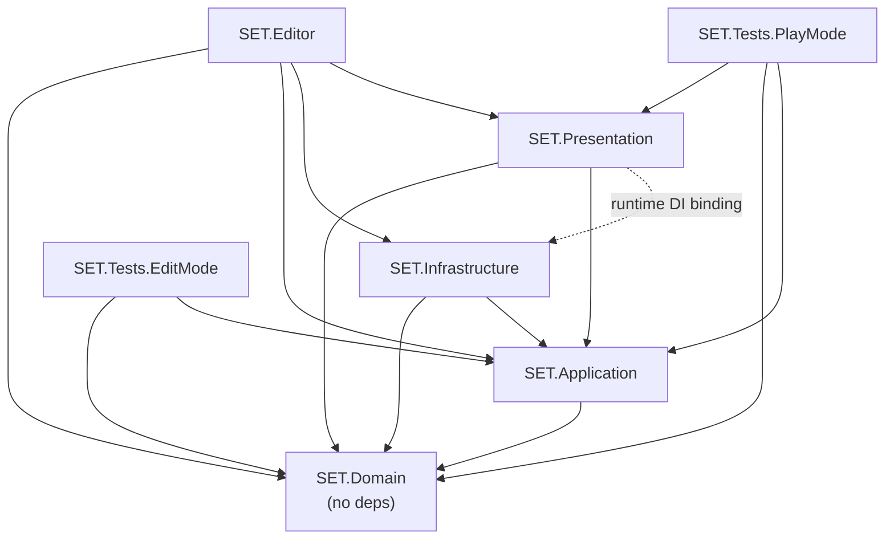

Unity's Assembly Definition (`.asmdef`) system lets you split a project into multiple compiled assemblies instead of one monolithic blob. SET: 3D Edition uses this to make Clean Architecture boundaries **physical**: if you try to reference a layer you're not allowed to touch, the compiler refuses to build. You get a hard error at compile time — not a confusing runtime bug discovered two weeks later.

This page explains the seven assemblies planned for the project, the rules they encode, and how the Editor tooling enforces them automatically.

<Info>
All seven assemblies described here are **planned** for the pre-production project layout. The folder structure and `.asmdef` files are being established as foundational scaffolding before feature implementation begins.
</Info>

---

## Why Assembly Definitions?

Without asmdefs, all scripts in `Assets/` compile into a single assembly. Any class can reference any other class and Unity will happily let it happen. Clean Architecture becomes a *convention* that only survives peer pressure and code reviews.

With asmdefs, the dependency rules are enforced by the C# compiler itself:

- A class in `SET.Domain` physically **cannot** call into `SET.Application` — the assembly reference simply does not exist, so the compiler never finds the type.
- A class in `SET.Application` physically **cannot** call `UnityEngine.GameObject` — same reason.
- Violations produce a **compiler error**, not a runtime exception. You find out immediately, on your own machine, before anything reaches a PR.

The mental model: **asmdefs are compile-time architecture tests that run on every build**.

---

## The Seven Assemblies

| Assembly | Path | References | Purpose |
|---|---|---|---|
| `SET.Domain` | `_Project/Domain/` | None | Pure C# entities, value objects, domain service interfaces, enums |
| `SET.Application` | `_Project/Application/` | `SET.Domain` | Use-cases, state machine, command handlers, application-level interfaces |
| `SET.Infrastructure` | `_Project/Infrastructure/` | `SET.Domain`, `SET.Application` | Nakama, local save, audio, and platform adapters |
| `SET.Presentation` | `_Project/Presentation/` | `SET.Domain`, `SET.Application` | MonoBehaviours, Views, ViewModels, Bootstrap composition root |
| `SET.Editor` | `_Editor/` | All production assemblies | Editor tools, validators, build scripts — excluded from player builds |
| `SET.Tests.EditMode` | `_Tests/EditMode/` | As needed per test | Domain and Application unit tests; run without entering Play Mode |
| `SET.Tests.PlayMode` | `_Tests/PlayMode/` | `SET.Presentation`, `SET.Domain`, `SET.Application` | Integration tests that require a running Unity player loop |

---

## The Critical Rule: Presentation ≠ Infrastructure

`SET.Presentation` does **not** reference `SET.Infrastructure`. At all. No exceptions.

This is the single most important constraint in the assembly graph. It means MonoBehaviours and ViewModels can only call interfaces declared in `SET.Application` — they never know whether the implementation behind those interfaces is Nakama, a local stub, or a future cloud service.

Infrastructure implementations are **bound at runtime** by the VContainer composition root that lives in the Bootstrap scene. The Bootstrap scene is the only place in the entire codebase where a concrete infrastructure type is ever named. See [Dependency Injection with VContainer](/architecture/di-vcontainer) for how this wiring works.

---

## Dependency Graph



Solid arrows are **compile-time references** declared in the `.asmdef` file. The dashed arrow is a **runtime-only binding** performed by VContainer — `SET.Presentation` has zero compile-time knowledge of `SET.Infrastructure`.

---

## What Lives in Each Assembly

Understanding which interfaces and types belong to which assembly is essential before adding new code. The table below lists the key planned types:

| Assembly | Key Planned Types |
|---|---|
| `SET.Domain` | `Card`, `Board`, `Deck`, `Player`, `SetResult`, `ISetValidator`, `IAIScanner`, `MatchState` |
| `SET.Application` | `GameSession`, `IMatchOrchestrator`, `IGameStateProvider`, `GameStateSnapshot`, `IMultiplayerService`, `ILeaderboardService`, `ILocalSaveService`, `IAudioService`, `IInputHandler`, `IViewPresenter` |
| `SET.Infrastructure` | `NakamaMultiplayerService`, `NakamaLeaderboardService`, `LocalSaveService`, `AudioService` |
| `SET.Presentation` | `MatchViewModel`, `HudTopView`, `BoardView`, `CardView`, `TouchInputHandler`, `GameLifetimeScope` |

### Application-Layer Interface Surfaces

The following interfaces are declared in `SET.Application` and implemented in `SET.Infrastructure` or `SET.Presentation`. They represent the public API surface that crosses the assembly boundary at runtime via DI:

**`IMultiplayerService`** — Network adapter for Nakama realtime matches:
- `ConnectAsync(string matchId)` — establishes the realtime socket connection to a match
- `SendClaim(int[] cardIds)` — sends a SET claim to the authoritative server
- `Messages` — `IObservable<ServerMessage>` stream of incoming server messages
- `Disconnect()` — cleanly closes the socket and cleans up state

**`IInputHandler`** — Translates platform input into abstract game commands:
- `CommandStream` — `IObservable<IGameCommand>` stream; downstream consumers never poll
- `Enable()` — activates input processing (called when the board becomes interactive)
- `Disable()` — suspends input processing during animations or locked states

**`ILeaderboardService`** — Leaderboard access via Nakama:
- `GetTopEntries(int count)` — returns the top-N leaderboard entries
- `SubmitScore(long score)` — submits the local player's score after a match

**`ILocalSaveService`** — Persistent offline storage:
- `SaveAsync<T>(string key, T data)` — serialises and writes data to local storage
- `LoadAsync<T>(string key)` — reads and deserialises data from local storage

**`IAudioService`** — Playback control for the audio system:
- `PlaySfx(string clipId)` — plays a one-shot sound effect
- `PlayMusic(string trackId)` — starts looping background music
- `SetMusicVolume(float volume)` — adjusts music volume (0–1)
- `SetSfxVolume(float volume)` — adjusts sound effects volume (0–1)

**`IViewPresenter`** — High-level screen presentation commands consumed by the Application layer:
- `ShowBoard()` — transitions to and initialises the game board view
- `UpdateHud(GameStateSnapshot snapshot)` — refreshes all HUD elements from the latest snapshot
- `PlaySetAnimation(bool wasValid, int[] cardIds)` — triggers the valid or invalid SET animation
- `ShowMatchResult(MatchResultData result)` — presents the post-match result overlay
- `ShowToast(string message)` — displays a transient toast notification

---

## What an Asmdef File Looks Like

Each assembly is represented by a single `.asmdef` JSON file placed at the root of its folder. Here is the planned file for `SET.Application`:

```json
{
  "name": "SET.Application",
  "references": [
    "SET.Domain"
  ],
  "includePlatforms": [],
  "excludePlatforms": [],
  "allowUnsafeCode": false,
  "overrideReferences": false,
  "precompiledReferences": [],
  "autoReferenced": false,
  "defineConstraints": [],
  "versionDefines": []
}
```

Key fields:

| Field | What it does |
|---|---|
| `"name"` | The assembly name. Must match exactly what other `.asmdef` files put in their `"references"` array. |
| `"references"` | The only assemblies this one is allowed to depend on. Keep this list as short as possible. |
| `"autoReferenced": false` | **Critical — see common mistakes below.** Prevents this assembly from leaking into every other assembly in the project. |
| `"excludePlatforms"` | Used by `SET.Editor` to exclude itself from player builds. |

The `SET.Editor` asmdef additionally includes `"includePlatforms": ["Editor"]` so Unity strips it from any build that targets Android.

---

## Editor Validation

<Info>
The Editor validator script described here is **planned** (pre-production). The rule it enforces is active design intent, not yet automated.
</Info>

A custom Editor script in `SET.Editor` will run at build time and scan every `.cs` file inside `_Project/Domain/` and `_Project/Application/`. It looks for two banned using directives:

```csharp
// These two lines are forbidden in SET.Domain and SET.Application:
using UnityEngine;
using Nakama;
```

If either is found, the script calls `BuildFailedException` and the build stops with a message identifying the exact file and line. This catches the case where a developer adds a quick `Debug.Log` to a Domain class and accidentally introduces a Unity dependency — an error that the asmdef itself won't catch, because `UnityEngine` types are always available.

---

## What Happens When You Violate a Boundary

If you add a reference that isn't allowed — say you try to call `NakamaMultiplayerService` directly from a ViewModel in `SET.Presentation` — the compiler emits:

```
error CS0246: The type or namespace name 'NakamaMultiplayerService' 
could not be found (are you missing a using directive or an assembly reference?)
```

This is **intentional**. The error message is telling you that the type is invisible from this assembly. The fix is not to add the reference — it is to move your code to the correct layer or use the interface that already exists in `SET.Application`.

---

## Implementation Checklist

Use this checklist when adding a new assembly or adding code to an existing one:

- [ ] `.asmdef` file created at the root of the layer folder with the correct `"name"` field
- [ ] `"autoReferenced": false` on all `SET.*` assemblies
- [ ] `"references"` list contains only the assemblies this layer is permitted to depend on (see dependency graph above)
- [ ] No `using UnityEngine;` in `SET.Domain` or `SET.Application`
- [ ] No `using Nakama;` in `SET.Domain` or `SET.Application`
- [ ] `SET.Presentation` does **not** list `SET.Infrastructure` in its `"references"`
- [ ] `SET.Editor` includes `"includePlatforms": ["Editor"]` to exclude it from Android builds
- [ ] New interfaces that cross layer boundaries are declared in `SET.Application`, not in the implementing assembly
- [ ] Test assemblies reference only the assemblies required by the tests they contain

---

## Common Mistakes

<Warning>
**Never enable `Auto Referenced` on inner assemblies.** If `SET.Domain` has `"autoReferenced": true`, it becomes visible to every assembly in the project — including Unity's default assembly. This breaks the isolation that asmdefs are supposed to provide. Always keep `"autoReferenced": false` on all `SET.*` assemblies.
</Warning>

**Putting Editor-only code in a non-Editor assembly.** Anything that uses `UnityEditor` types (`AssetDatabase`, `EditorGUILayout`, etc.) must live in `SET.Editor` or a dedicated Editor subfolder with its own asmdef. If it ends up in `SET.Presentation`, the build for Android will fail with a missing type error.

**Using a `MonoBehaviour` in Domain or Application.** Even though `UnityEngine.MonoBehaviour` technically compiles without the full Unity editor, it drags in Unity lifecycle coupling. Pure C# classes in the inner layers should have normal constructors. The moment you find yourself making a Domain class inherit `MonoBehaviour`, something has gone wrong with the design.

**Naming mismatches.** The `"name"` field in a `.asmdef` must exactly match the string used in another assembly's `"references"` array. A typo silently fails to create the reference — Unity won't warn you; the type just won't be found.

---

## A Useful Mental Check

Whenever you are about to add a reference to an assembly's `"references"` list, ask:

> *Does this reference point inward (toward Domain) or outward (toward Infrastructure/Presentation)?*

References must always point **inward**. If you find yourself needing `SET.Application` to reference `SET.Infrastructure`, you have an abstraction in the wrong place. The interface for that behaviour belongs in `SET.Application`; only the concrete implementation belongs in `SET.Infrastructure`.

---

## Related Pages

<CardGroup cols={2}>
  <Card title="Clean Architecture Layers" icon="layer-group" href="/architecture/layers">
    The responsibilities of Domain, Application, Infrastructure, and Presentation explained in depth.
  </Card>
  <Card title="Dependency Injection with VContainer" icon="plug" href="/architecture/di-vcontainer">
    How the Bootstrap composition root wires Infrastructure implementations to Application interfaces at runtime.
  </Card>
  <Card title="Project Overview" icon="map" href="/architecture/overview">
    The big-picture system map showing all client and server components.
  </Card>
  <Card title="Engineering Standards & Patterns" icon="book" href="/standards/patterns">
    The full pattern toolbox, banned anti-patterns, and code review checklists.
  </Card>
</CardGroup>
