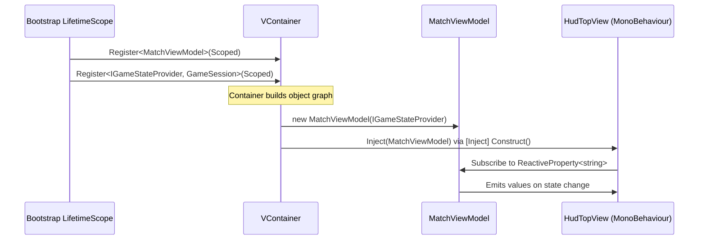

Every system in SET: 3D Edition — `GameSession`, `SetValidator`, `NakamaMultiplayerService`, every ViewModel — declares the things it needs as **constructor parameters**. It never reaches out and grabs them. This is Dependency Injection (DI), and it is the mechanism that makes Clean Architecture actually work at runtime rather than just on paper.

VContainer is the DI framework the project uses. This page explains why, how registrations work, what the lifetime rules are, and which patterns are permanently off-limits.

<Info>
The VContainer composition root and all registration code described here are **planned** for the pre-production implementation phase.
</Info>

---

## Why Dependency Injection?

Without DI, a class that needs a `SetValidator` creates one itself:

```csharp
// ❌ Without DI — hidden coupling
public class GameSession
{
    SetValidator _validator = new SetValidator(); // hardwired concrete type
}
```

This makes the class untestable (you cannot swap in a mock) and couples it tightly to one specific implementation. You cannot change how validation works without editing `GameSession`.

With DI:

```csharp
// ✅ With DI — declared dependency, injected externally
public class GameSession
{
    readonly ISetValidator _validator;

    public GameSession(ISetValidator validator)
    {
        _validator = validator; // caller provides the implementation
    }
}
```

Now `GameSession` depends on the *abstraction* `ISetValidator`, not any concrete class. In tests you pass a mock. In production the DI container passes the real `SetValidator`. `GameSession` itself never changes.

---

## Why VContainer?

VContainer was chosen over alternatives (Zenject, manual DI, service locator) for three reasons:

1. **Constructor injection as the default.** VContainer resolves pure C# classes entirely through their constructors, with no magic attributes required. This aligns perfectly with Domain and Application classes that have no Unity dependencies.
2. **Performance.** VContainer generates IL at startup rather than using reflection on every resolve call, making runtime overhead negligible.
3. **Explicit registration.** All bindings live in one place (the `LifetimeScope`). There is no ambient service locator — you cannot accidentally resolve something from a random call site.

---

## The Non-Negotiable Rule

<Warning>
**Never use `FindObjectOfType`, `GetComponent` across objects, or static singleton `Instance` properties.** Every dependency must enter a class through its constructor or a `[Inject]`-attributed method. If you cannot inject it, the design needs to change — not the rule.
</Warning>

---

## Constructor Injection for Pure C# Classes

Domain and Application classes use plain constructor injection with no Unity or VContainer attributes needed:

```csharp
// SET.Domain — stateless, no constructor arguments required
public class SetValidator : ISetValidator
{
    public SetResult Validate(Card a, Card b, Card c)
    {
        // pure logic, no Unity, no Nakama
    }
}

// SET.Application — declares its dependencies explicitly
public class GameSession : IMatchOrchestrator, IGameStateProvider
{
    readonly ISetValidator _validator;
    readonly IAIScanner _aiScanner;

    public GameSession(ISetValidator validator, IAIScanner aiScanner)
    {
        _validator = validator;
        _aiScanner = aiScanner;
    }
}
```

VContainer reads the constructor signature and resolves each parameter from its registered bindings automatically. No attribute annotations, no base class, no magic.

---

## The Composition Root: Bootstrap Scene

The composition root is a `LifetimeScope` MonoBehaviour that lives in the `Bootstrap.unity` scene. It is the **only place in the entire codebase** where concrete types are named. Everything outside this file sees only interfaces.

```csharp
// Assets/_Project/Presentation/Bootstrap/GameLifetimeScope.cs
// (SET.Presentation assembly)

public class GameLifetimeScope : LifetimeScope
{
    protected override void Configure(IContainerBuilder builder)
    {
        // ── Domain ───────────────────────────────────────────────
        builder.Register<ISetValidator, SetValidator>(Lifetime.Singleton);

        // ── Application ──────────────────────────────────────────
        builder.Register<IAIScanner, AIScanner>(Lifetime.Transient);
        builder.Register<IMatchOrchestrator, GameSession>(Lifetime.Scoped);
        // GameSession implements two interfaces — register the second
        // pointing at the same instance so both resolve the same object
        builder.RegisterInstance<IGameStateProvider>(
            /* resolved from container after first registration */);

        // ── Infrastructure ────────────────────────────────────────
        // NOTE: Infrastructure is registered HERE, in Presentation's
        // Bootstrap. SET.Presentation has no compile-time reference to
        // SET.Infrastructure — VContainer resolves it via reflection at
        // startup using the concrete type names listed only in this file.
        builder.Register<IMultiplayerService,  NakamaMultiplayerService>(Lifetime.Scoped);
        builder.Register<ILocalSaveService,    LocalSaveService>(Lifetime.Singleton);
        builder.Register<IAudioService,        AudioService>(Lifetime.Singleton);

        // ── Presentation ViewModels ───────────────────────────────
        builder.Register<MatchViewModel>(Lifetime.Scoped);
    }
}
```

<Info>
The Bootstrap scene is loaded first and persists for the entire session. Other scenes (MainMenu, GameBoard) are loaded additively and inherit the container.
</Info>

---

## Lifetime Rules

Choosing the wrong lifetime is a common source of subtle bugs. Use this table as a guide:

| Lifetime | Meaning | Examples in SET: 3D Edition |
|---|---|---|
| `Singleton` | One instance for the entire application session | `SetValidator`, `AudioService`, `LocalSaveService` |
| `Scoped` | One instance per container scope (e.g., per match) | `GameSession`, `NakamaMultiplayerService`, `MatchViewModel` |
| `Transient` | A brand-new instance every time the type is resolved | `AIScanner` (independent state per creation) |

**Rules of thumb:**
- Stateless services with no mutable fields → **Singleton**.
- Objects that own match state and must be shared across multiple consumers within a match → **Scoped**.
- Objects that should not share state between consumers → **Transient**.

<Warning>
Do not register a `Transient` service into a `Singleton`. The singleton will capture a single transient instance at construction time and hold it forever, effectively making it a singleton anyway. This is called a *captive dependency* and causes stale state bugs.
</Warning>

---

## Injecting into MonoBehaviours

MonoBehaviours cannot receive constructor injection because Unity controls their instantiation lifecycle. Instead, VContainer supports a `[Inject]`-attributed method, conventionally named `Construct`:

```csharp
// SET.Presentation — HUD View
public class HudTopView : MonoBehaviour
{
    [SerializeField] TMP_Text _scoreText;
    [SerializeField] TMP_Text _deckCountText;

    MatchViewModel _vm;
    readonly CompositeDisposable _disposables = new();

    [Inject]
    public void Construct(MatchViewModel vm)
    {
        _vm = vm;
    }

    void Start()
    {
        _vm.PlayerScoreText
            .Subscribe(t => _scoreText.text = t)
            .AddTo(_disposables);

        _vm.DeckCount
            .Subscribe(c => _deckCountText.text = $"Deck: {c}")
            .AddTo(_disposables);
    }

    void OnDestroy() => _disposables.Dispose();
}
```

VContainer calls `Construct` after instantiation but before `Start`, so by the time Unity calls `Start` all dependencies are already set. Never use `Awake` to access injected fields — injection may not have occurred yet.

---

## How Views Get Their ViewModels

The flow from container registration to a running View looks like this:



---

## Testing With DI: No Container Needed

One of the biggest benefits of constructor injection is that you never need the DI container in unit tests. Simply instantiate the class directly and pass in mocks:

```csharp
// SET.Tests.EditMode — GameSessionTests.cs
[Test]
public void ValidSet_IncreasesPlayerScore()
{
    // Arrange — construct dependencies manually with NSubstitute mocks
    var mockValidator = Substitute.For<ISetValidator>();
    var mockScanner   = Substitute.For<IAIScanner>();

    mockValidator.Validate(default, default, default)
        .ReturnsForAnyArgs(new SetResult { IsValid = true });

    var session = new GameSession(mockValidator, mockScanner);

    // Act
    session.HandleCommand(new ClaimSelectedCommand(new[] { 0, 1, 2 }));

    // Assert
    Assert.AreEqual(1, session.CurrentSnapshot.Players[0].Score);
}
```

No `LifetimeScope`, no `GameObject`, no Play Mode required. Because Domain and Application classes have no Unity dependencies, the test runs in milliseconds inside the Unity Test Runner's EditMode runner.

---

## Banned Patterns and Their Replacements

| Banned | Why | Replacement |
|---|---|---|
| `FindObjectOfType<T>()` | Hidden coupling; fails silently if the object isn't in the scene | Constructor injection or `[Inject]` method |
| `GetComponent<T>()` across unrelated objects | Creates brittle scene-structure dependency | Inject via container |
| `static MySingleton.Instance` | Global mutable state, untestable, order-dependent | `Lifetime.Singleton` registration in `LifetimeScope` |
| `new ConcreteService()` inside Application or Domain | Hardwires implementation; defeats DI | Register a factory or let the container resolve it |
| Service Locator (`Container.Resolve<T>()` at call sites) | Hides dependencies; runtime errors instead of compile errors | Declare the dependency in the constructor |

---

## Common Mistakes

**Forgetting `[Inject]` on a MonoBehaviour method.** VContainer will not call the method, the field stays `null`, and you get a `NullReferenceException` in `Start`. Always verify that the method has the attribute.

**Resolving from the wrong scope.** If `MatchViewModel` is registered as `Scoped` but you resolve it from the root scope (which has `Singleton`-equivalent lifetime), you get a captive dependency. Create child scopes for per-match objects.

**Calling injected fields in `Awake`.** VContainer runs injection after Unity calls `Awake` but before `Start`. Access injected dependencies only in `Start` or later, or in the `Construct` method itself.

**Registering both an interface and its implementation separately with different lifetimes.** For example, registering `GameSession` as `Transient` and `IMatchOrchestrator` as `Singleton` pointing to `GameSession` will create two separate instances. Use `RegisterEntryPoint` or ensure a single registration covers all interfaces the type implements.

---

## Related Pages

<CardGroup cols={2}>
  <Card title="Assembly Definitions" icon="boxes-stacked" href="/architecture/asmdefs">
    How asmdefs enforce the compile-time boundary that makes this DI pattern safe.
  </Card>
  <Card title="Reactive UI with R3" icon="wave-square" href="/architecture/reactive-ui">
    How ViewModels subscribe to GameSession observables and drive UI updates.
  </Card>
  <Card title="Clean Architecture Layers" icon="layer-group" href="/architecture/layers">
    The full responsibilities of each layer and what belongs where.
  </Card>
  <Card title="Engineering Standards & Patterns" icon="book" href="/standards/patterns">
    The complete banned-pattern catalogue and code review checklist.
  </Card>
</CardGroup>
