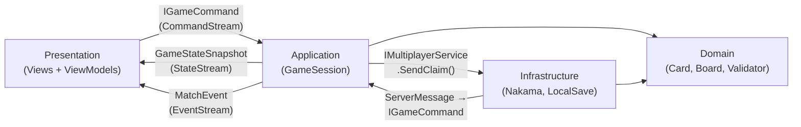

Understanding which layer owns a given type — and which layers it is forbidden from knowing about — is the single most important architectural skill for working on SET: 3D Edition. This page defines each layer's ownership contract precisely, shows the interfaces that cross layer boundaries, and explains how state and commands flow through the system at runtime.

<Warning>
  **Pre-production** — The interfaces and class signatures shown here reflect the intended design. Concrete implementations may be stubs or not yet exist. Check the repository for current implementation status.
</Warning>

## Key responsibilities

This page owns three outcomes for every engineer reading it:

| Responsibility | Detail |
|---------------|--------|
| **Ownership contracts** | Define precisely what each layer may contain, what it must not contain, and why |
| **Interface literacy** | Show every cross-layer interface so contributors know exactly what to implement and what to consume |
| **Communication patterns** | Document how state and commands flow at runtime so no one invents an ad-hoc coupling |

---

## Why layer ownership matters

Without clear ownership, coupling accumulates in ways that are easy to introduce and expensive to remove. A MonoBehaviour that reaches directly into `NakamaMultiplayerService` works fine until you need to test that MonoBehaviour — at which point you discover you can't do it without a running Nakama server. A Domain class that references `UnityEngine.Debug` works fine until you try to port the validation logic to a Nakama server runtime — at which point it won't compile.

Layer boundaries are what make AI, local, and online multiplayer modes run the same code path. They are not bureaucratic overhead; they are the mechanism by which the project's "one core, three modes" goal is achievable.

---

## Domain layer — `SET.Domain`

The innermost layer. Contains everything needed to represent and validate a game of SET with zero external dependencies. If a type can be expressed purely in C# without importing any third-party package, it belongs here.

### What Domain owns

| Subfolder | Types |
|-----------|-------|
| `Entities/` | `Card`, `Board`, `CardSlot`, `Deck`, `Player`, `Match` |
| `ValueObjects/` | `CardAttributes`, `GameRules`, `SetResult`, `CardId` |
| `Services/` | `ISetValidator`, `IAIScanner` |
| `Enums/` | `Number`, `Shape`, `Color`, `Shading`, `MatchState`, `PenaltyMode` |

#### ISetValidator — the core domain service *(Planned)*

```csharp
public interface ISetValidator
{
    SetResult Validate(IReadOnlyList<Card> threeCards);
    IReadOnlyList<Card[]> FindAllSets(IReadOnlyList<Card> boardCards);
    bool AnySetExists(IReadOnlyList<Card> boardCards);
}
```

`Validate` checks whether exactly three cards form a valid Set. `FindAllSets` returns every valid Set on the current board — used by the hint system and AI scanner. `AnySetExists` is a fast early-exit check used before board expansion decisions.

### Rules

- **Zero external dependencies** — no `using UnityEngine;`, no `using Nakama;`, no `using R3;`. The `.asmdef` file for `SET.Domain` lists no references.
- **All value objects are immutable** — `CardAttributes`, `GameRules`, and `SetResult` are `readonly struct` types that implement `IEquatable<T>`. They cannot be mutated after construction.
- **`Match` is the aggregate root** — code outside the Domain layer interacts with game state exclusively through `Match`'s public API. No external class reaches into `Board` or `Deck` directly by bypassing `Match`.
- **`SetValidator` is a stateless domain service** — it is deterministic, has no side effects, and is safe to call in parallel. The same implementation is used for client-side hint display, local validation in single-player, and server-side authoritative validation in multiplayer.

### Card identity

Each of the 81 cards has a unique `CardId` in the range 0–80, computed from its attributes:

```
CardId = (Number - 1) × 27 + Shape × 9 + Color × 3 + Shading
```

This formula guarantees uniqueness and makes card lookup O(1) via array indexing.

### What Domain is forbidden from doing

- Referencing `UnityEngine`, `Nakama`, `R3`, or any third-party package
- Holding mutable state in value objects
- Throwing exceptions to represent invalid game inputs (use `SetResult.IsValid = false` instead)
- Knowing that `GameSession` or any application-layer orchestrator exists

---

## Application layer — `SET.Application`

The orchestration layer. `GameSession` lives here — it is the central state machine for a match. Application code coordinates Domain objects in response to commands and emits the results as observable streams. It depends only on `SET.Domain`.

### What Application owns

| Subfolder | Types |
|-----------|-------|
| `Sessions/` | `GameSession` *(implements `IMatchOrchestrator` + `IGameStateProvider`)* |
| `Commands/` | `IGameCommand`, `SelectCardCommand`, `DeselectCardCommand`, `ClaimSelectedCommand` |
| `State/` | `GameStateSnapshot`, `MatchEvent` hierarchy, `PlayerSnapshot` |
| `Services/` | `IMultiplayerService`, `ILeaderboardService`, `ILocalSaveService`, `IAudioService`, `IInputHandler` |
| `Factories/` | `IMatchFactory`, `IDeckFactory` |

### GameSession — the central state machine

`GameSession` is the heart of a match. It receives `IGameCommand` objects, transitions the `MatchState` enum, coordinates `Board`, `Deck`, and `ISetValidator`, and emits the updated state and events as R3 observables.

Constructor injection signature — `GameSession` never constructs its dependencies itself:

```csharp
public sealed class GameSession : IMatchOrchestrator, IGameStateProvider
{
    public GameSession(
        ISetValidator validator,
        IAIScanner    aiScanner)
    { ... }
}
```

### IMatchOrchestrator — the command entry point

```csharp
public interface IMatchOrchestrator
{
    void StartMatch(GameRules rules, Player[] players, Deck initialDeck);
    void HandleCommand(IGameCommand command);
}
```

`HandleCommand` is the single entry point for all game input — card selections, claim attempts, forfeit requests. The `IGameCommand` type hierarchy models each action as a distinct, serialisable value object.

### IGameStateProvider — the observable output

```csharp
public interface IGameStateProvider
{
    IObservable<GameStateSnapshot> StateStream { get; }
    IObservable<MatchEvent>        EventStream { get; }
}
```

`StateStream` emits a full `GameStateSnapshot` every time any game state changes. `EventStream` emits discrete semantic events — `SetClaimed`, `BoardRefilled`, `PenaltyApplied`, `MatchEnded` — that Presentation uses to trigger animations and audio cues.

### Online multiplayer separation

`GameSession` does **not** call `IMultiplayerService` directly. In online multiplayer *(Planned)*, a separate `OnlineMatchController` (which lives in Infrastructure) acts as the bridge: it translates incoming `IObservable<ServerMessage>` messages from Nakama into `IGameCommand` objects and forwards them to `GameSession` via `HandleCommand`. This separation ensures `GameSession` is identical whether running locally or in network-mirror mode.

### What Application is forbidden from doing

- Referencing `UnityEngine`, `Nakama`, or `R3` concretely (R3's `IObservable<T>` interface from `System.Reactive` or R3's own namespace is acceptable for stream type declarations)
- Instantiating `NakamaMultiplayerService` or any Infrastructure class
- Knowing how commands originate (touch input vs. network message vs. AI — all arrive identically as `IGameCommand`)
- Calling UI code or modifying visual state directly

---

## Infrastructure layer — `SET.Infrastructure`

Implements every interface defined in Application that requires an external SDK, file system access, or platform API. Infrastructure is allowed to reference both `SET.Domain` and `SET.Application` (to know the interfaces it must implement), as well as Unity Engine APIs and the Nakama SDK.

### What Infrastructure owns

| Subfolder | Types |
|-----------|-------|
| `Nakama/` | `NakamaMultiplayerService`, `NakamaMatchmaker`, `NakamaLeaderboardService` |
| `LocalSave/` | `LocalSaveService` |
| `Platform/` | `PlatformService` *(Google Play Games Services)* |
| `Audio/` | `AudioService` |
| `Serialization/` | JSON converters, save-data DTOs |

### Key adapter interfaces

```csharp
public interface IMultiplayerService
{
    Task                          ConnectAsync(string matchId);
    void                          SendClaim(int[] cardIds);
    IObservable<ServerMessage>    Messages { get; }
    void                          Disconnect();
}

public interface ILeaderboardService
{
    Task<LeaderboardEntry[]> GetTopEntries(string leaderboardId, int count);
    Task                     SubmitScore(string leaderboardId, long score);
}

public interface ILocalSaveService
{
    Task    SaveAsync<T>(string key, T data);
    Task<T> LoadAsync<T>(string key);
}
```

### The Nakama boundary rule

All Nakama SDK types (`IMatch`, `IApiUser`, `IMatchData`, etc.) must be converted into plain domain DTOs **before** they are passed to Application or Domain. Infrastructure classes are the only ones that may hold references to Nakama types. This ensures that if the backend changes from Nakama to another service, Application and Domain are untouched.

### What Infrastructure is forbidden from doing

- Being referenced at compile time by `SET.Presentation` (Presentation knows only the interfaces)
- Passing raw Nakama types to Application or Domain
- Containing game logic — Infrastructure is plumbing, not rules

---

## Presentation layer — `SET.Presentation`

Everything Unity-dependent: MonoBehaviours, R3 ViewModels, scene prefabs, VFX controllers, and the DI composition root. Presentation depends on Domain and Application but has no compile-time reference to Infrastructure — it receives Infrastructure implementations via VContainer at runtime.

### What Presentation owns

| Subfolder | Types |
|-----------|-------|
| `Views/` | `CardView`, `BoardView`, `HudTopView`, `HudBottomView`, `ClaimZoneView` |
| `ViewModels/` | `MatchViewModel` and supporting ViewModels |
| `Input/` | `TouchInputHandler` *(implements `IInputHandler`)* |
| `VFX/` | Animation controllers, particle triggers, material property drivers |
| `Bootstrap/` | VContainer `LifetimeScope` composition root |

### MonoBehaviours are thin views

Every MonoBehaviour in Presentation must be a pure view. It binds UI elements to ViewModel reactive properties in `Start()` or `Awake()`, and disposes subscriptions in `OnDestroy()`. Zero game logic.

Example ViewModel binding pattern:

```csharp
public sealed class HudTopView : MonoBehaviour
{
    [SerializeField] private TMP_Text _scoreText;
    [SerializeField] private TMP_Text _deckCountText;

    private readonly CompositeDisposable _disposables = new();

    public void Bind(MatchViewModel vm)
    {
        vm.PlayerScoreText
            .Subscribe(t => _scoreText.text = t)
            .AddTo(_disposables);

        vm.DeckCountText
            .Subscribe(t => _deckCountText.text = t)
            .AddTo(_disposables);
    }

    private void OnDestroy() => _disposables.Dispose();
}
```

### TouchInputHandler — input as commands

`TouchInputHandler` translates Unity touch events into `IGameCommand` objects and makes them available as an `IObservable<IGameCommand>` stream that `GameSession` subscribes to via `IInputHandler`. Input is **pushed** — the handler fires when the user acts, not when the game polls.

### Bootstrap — the composition root

The `Bootstrap` scene contains one `LifetimeScope` MonoBehaviour that registers all DI bindings. It is the only place in the entire codebase where concrete Infrastructure types are named — everywhere else, code depends on interfaces.

```csharp
// Conceptual example — actual registration syntax follows VContainer conventions
protected override void Configure(IContainerBuilder builder)
{
    builder.Register<SetValidator>(Lifetime.Singleton).As<ISetValidator>();
    builder.Register<NakamaMultiplayerService>(Lifetime.Singleton).As<IMultiplayerService>();
    builder.Register<LocalSaveService>(Lifetime.Singleton).As<ILocalSaveService>();
    builder.Register<GameSession>(Lifetime.Singleton).As<IMatchOrchestrator, IGameStateProvider>();
}
```

### What Presentation is forbidden from doing

- Referencing `SET.Infrastructure` at compile time
- Containing game rules, scoring logic, or state transition decisions
- Calling `ISetValidator.Validate()` directly (validation results arrive via `StateStream`)
- Using `FindObjectOfType`, `GameObject.Find`, or static singletons

---

## Cross-layer communication summary

All runtime communication between layers follows these four patterns:

| Direction | Mechanism | Example |
|-----------|-----------|---------|
| Application → Presentation | `IObservable<GameStateSnapshot>` (R3 push) | Board layout changes, score updates |
| Application → Presentation | `IObservable<MatchEvent>` (R3 push) | `SetClaimed` triggers VFX animation |
| Presentation → Application | `IInputHandler.CommandStream` (`IObservable<IGameCommand>` push) | Tap on card → `SelectCardCommand` |
| Application → Infrastructure | Method call on interface | `IMultiplayerService.SendClaim(cardIds)` |
| Infrastructure → Application | `IObservable<ServerMessage>` translated to `IGameCommand` | Nakama server verdict → `HandleCommand` |



---

## Implementation checklist

Use this checklist when adding a new cross-layer feature:

- [ ] **New domain type?** Add it to `_Project/Domain/` with no external references
- [ ] **New application interface?** Define it in `_Project/Application/Services/` — Infrastructure implements it, Presentation consumes it
- [ ] **New Infrastructure implementation?** Implement the Application interface in `_Project/Infrastructure/` and register it in Bootstrap
- [ ] **New Presentation view?** Create a thin MonoBehaviour in `_Project/Presentation/Views/` and a ViewModel in `_Project/Presentation/ViewModels/`; bind with R3 and dispose in `OnDestroy()`
- [ ] **No `using UnityEngine;` in Domain or Application**
- [ ] **No `using Nakama;` in Domain, Application, or Presentation**
- [ ] **Unit tests for any new Domain or Application logic** in `_Tests/EditMode/`

---

## Common mistakes

<Warning>
  **Cross-layer mistakes to watch for:**

  - **Adding `using UnityEngine;` to Domain or Application** — if you find yourself doing this, stop and reconsider which layer the type belongs in. Domain and Application must compile without Unity.
  - **Calling `NakamaMultiplayerService` methods from Presentation** — Presentation holds an `IMultiplayerService` reference supplied by VContainer; it never knows the concrete type.
  - **Handling a `MatchEvent` by running game logic in a View** — MatchEvents trigger VFX and audio cues. They do not trigger score recalculations or board-state changes. Game logic stays in `GameSession`.
  - **Putting `async Task` Nakama calls in Application** — Infrastructure handles the async Nakama SDK calls and converts results into synchronous domain types or `IObservable<T>` streams before passing them to Application.
  - **Forgetting to dispose R3 subscriptions** — every `Subscribe()` call in a MonoBehaviour must be stored in a `CompositeDisposable` and disposed in `OnDestroy()`. Undisposed subscriptions cause memory leaks and phantom callbacks after scene unload.
</Warning>

---

## Related pages

<CardGroup cols={2}>
  <Card title="Architecture Overview" icon="layer-group" href="/architecture/overview">
    The four-layer model, dependency graph, and client-server mode switching.
  </Card>
  <Card title="Repo Tour" icon="folder-tree" href="/onboarding/repo-tour">
    Physical folder structure and assembly definition map.
  </Card>
  <Card title="DI with VContainer" icon="wand-magic-sparkles" href="/architecture/di-vcontainer">
    How Bootstrap wires all layer interfaces to their concrete implementations.
  </Card>
  <Card title="Reactive UI Pipeline" icon="arrow-right-arrow-left" href="/architecture/reactive-ui">
    R3 observable streams, ViewModel patterns, and subscription lifecycle.
  </Card>
</CardGroup>
