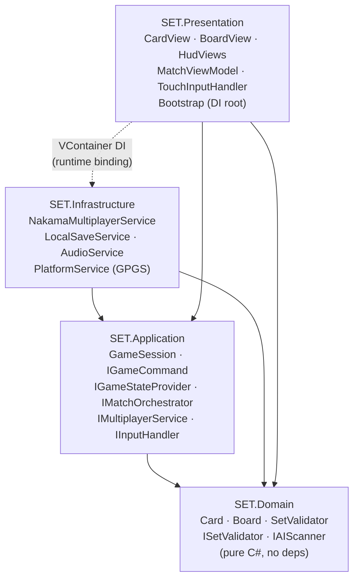
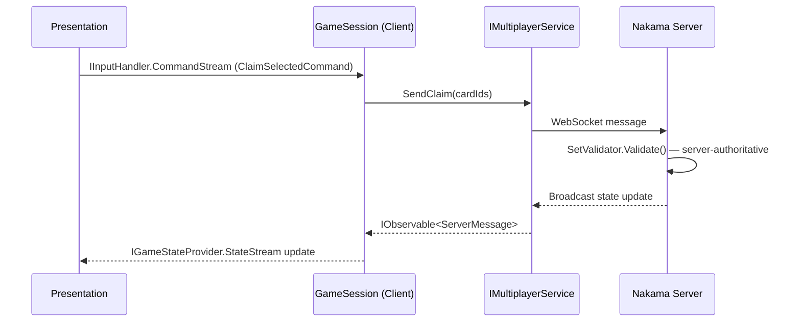

SET: 3D Edition is built on Clean Architecture — a layered design where the game's core rules live in a pure C# centre that knows nothing about Unity, Nakama, or any UI framework. Each outer layer adds one kind of concern (orchestration, infrastructure, presentation) and depends only on the layers inside it, never outside. The result is a codebase where game logic is fast to test, straightforward to reason about, and identical whether it's running locally against an AI opponent or being evaluated server-side during an online match.

<Warning>
  **Pre-production** — SET: 3D Edition is currently in pre-production. The architecture described here is the intended design. Individual systems are stubs or not yet implemented. Features marked **Planned** have not been built.
</Warning>

## Why this architecture

Three game modes (Single Player, Online Multiplayer, Pass & Play) sharing one codebase creates a real engineering problem: if game logic is entangled with Unity MonoBehaviours, the multiplayer client can't share that logic with the Nakama server. If UI code reaches directly into networking classes, you can't unit-test score calculation without spinning up a Nakama instance.

The layered architecture solves this by enforcing one rule:

> **Dependencies always point inward.** Outer layers know about inner layers. Inner layers know nothing about outer layers.

Domain knows nothing. Application knows only Domain. Infrastructure and Presentation both know Domain and Application, but neither knows the other — they are wired together at runtime by VContainer's DI container inside the Bootstrap scene.

---

## The four layers

```
┌─────────────────────────────────────────────────────┐
│  Presentation                                        │
│  Unity MonoBehaviours, R3 ViewModels, VFX           │
│  ┌─────────────────────────────────────────────┐    │
│  │  Infrastructure                              │    │
│  │  Nakama SDK, LocalSave, AudioService, GPGS  │    │
│  │  ┌───────────────────────────────────────┐  │    │
│  │  │  Application                          │  │    │
│  │  │  GameSession, Commands, Interfaces    │  │    │
│  │  │  ┌─────────────────────────────────┐ │  │    │
│  │  │  │  Domain                         │ │  │    │
│  │  │  │  Card, Board, SetValidator       │ │  │    │
│  │  │  └─────────────────────────────────┘ │  │    │
│  │  └───────────────────────────────────────┘  │    │
│  └─────────────────────────────────────────────┘    │
└─────────────────────────────────────────────────────┘
```

| Layer | Assembly | Key types | External dependencies |
|-------|----------|-----------|----------------------|
| **Domain** | `SET.Domain` | `Card`, `Board`, `Deck`, `Match`, `ISetValidator` | **None** — pure C# |
| **Application** | `SET.Application` | `GameSession`, `IGameCommand`, `GameStateSnapshot`, `IMultiplayerService` | `SET.Domain` only |
| **Infrastructure** | `SET.Infrastructure` | `NakamaMultiplayerService`, `LocalSaveService`, `AudioService` | Domain, Application, Nakama SDK, UnityEngine |
| **Presentation** | `SET.Presentation` | `CardView`, `MatchViewModel`, `TouchInputHandler`, `Bootstrap` | Domain, Application, R3, UnityEngine |

---

## Full dependency graph



The dashed line from Presentation to Infrastructure is not a compile-time reference. At startup, Bootstrap's VContainer `LifetimeScope` registers `NakamaMultiplayerService` as the implementation of `IMultiplayerService`. `GameSession` receives `IMultiplayerService` via its constructor and never sees the concrete type.

---

## Client-server model

The same four-layer architecture runs in all three game modes. What changes between modes is which infrastructure implementations are registered in the DI container.

| Mode | State authority | Nakama required |
|------|----------------|-----------------|
| **Single Player** | Client (`GameSession` owns simulation) | No |
| **Pass & Play** | Client (`GameSession` owns simulation) | No |
| **Online Multiplayer** (Planned) | Nakama server (`GameSession` mirrors server state) | Yes |

In **local modes**, `GameSession` acts as the single source of truth. It calls `ISetValidator.Validate()` directly and produces the authoritative result.

In **online multiplayer** *(Planned)*, `GameSession` is a mirror. The client sends raw card IDs to Nakama via `IMultiplayerService.SendClaim()`; the server runs its own instance of the same Set validation logic and broadcasts the authoritative result back. The client `GameSession` applies that result and emits the reactive state update. The client **never** produces the authoritative verdict in a multiplayer match.



---

## Three reactive streams

Application and Presentation communicate exclusively through three observable streams. Neither side polls, and neither calls the other directly.

| Stream | Direction | Type | Purpose |
|--------|-----------|------|---------|
| `IGameStateProvider.StateStream` | Application → Presentation | `IObservable<GameStateSnapshot>` | Full game state snapshot on every change (scores, board layout, deck count, match phase) |
| `IGameStateProvider.EventStream` | Application → Presentation | `IObservable<MatchEvent>` | Discrete events — `SetClaimed`, `BoardRefilled`, `PenaltyApplied`, `MatchEnded` |
| `IInputHandler.CommandStream` | Presentation → Application | `IObservable<IGameCommand>` | User intent expressed as commands — `SelectCardCommand`, `ClaimSelectedCommand` |

ViewModels in Presentation subscribe to `StateStream` and `EventStream`. `TouchInputHandler` pushes `IGameCommand` objects into `CommandStream`. `GameSession` subscribes to `CommandStream` and pushes into `StateStream` / `EventStream`. No component ever calls back across the boundary it owns.

---

## Technology stack

| Layer | Technology | Notes |
|-------|-----------|-------|
| Domain | Pure C# | No external packages whatsoever |
| Application | C# + R3 (observable interfaces) | R3 used for `IObservable<T>` stream definitions |
| Infrastructure | Nakama .NET SDK, Unity `AudioSource`, Newtonsoft.Json | All external SDKs isolated here |
| Presentation | Unity uGUI + R3 reactive bindings + VContainer | All MonoBehaviours live here |
| DI / Composition | VContainer | Constructor injection only — no `FindObjectOfType` |
| Testing | Unity Test Framework + NSubstitute | EditMode for Domain/Application; PlayMode for integration |
| Backend *(Planned)* | Nakama 3.x (self-hosted or Heroic Labs Cloud) | Authoritative match handler, leaderboards, cloud save |

---

## Non-negotiable rules

These rules come from the Hard Boundaries document and are enforced by asmdef compile-time checks and CI validators:

<AccordionGroup>
  <Accordion title="Domain and Application never reference UnityEngine or Nakama">
    `SET.Domain` and `SET.Application` have no Unity or Nakama package references in their `.asmdef` files. Any attempt to `using UnityEngine;` in these assemblies is a compile error. This keeps game logic fully testable outside the Unity editor and portable to the Nakama server runtime.
  </Accordion>

  <Accordion title="Multiplayer is server-authoritative — client never validates Sets">
    In online matches, the client sends card IDs and waits for the server verdict. There is no `ValidateSet()` method on the client-side online session interface — only `SendClaim()`. This prevents race conditions and makes cheating impossible at the protocol level.
  </Accordion>

  <Accordion title="No UI polling in Update()">
    All UI state changes flow through R3 observable subscriptions. `MonoBehaviour.Update()` is reserved for visual animation only (card movement along a path, for example). No game-state reads in `Update()`.
  </Accordion>

  <Accordion title="VContainer constructor injection throughout">
    No `FindObjectOfType`, no `GetComponent<T>()` for services, no static singletons. Every dependency is declared in a constructor parameter and wired by VContainer's `LifetimeScope` in the Bootstrap scene.
  </Accordion>
</AccordionGroup>

---

## Common mistakes

<Warning>
  **Architecture-level mistakes to avoid:**

  - **Putting game logic in MonoBehaviours** — MonoBehaviours are thin views. Validation, scoring, and state transition logic live in Domain and Application.
  - **Calling `SetValidator` from Presentation** — Presentation can read the result of a validation from `StateStream`, but it never runs validation itself. Commands flow in, state flows out.
  - **Bypassing the DI container** — If you're writing `new NakamaMultiplayerService(...)` inside a MonoBehaviour, you're bypassing the composition root. Register it in Bootstrap and receive it via constructor injection.
  - **Creating a God class in Application** — `GameSession` is large but bounded. Resist the urge to expand it into a class that knows about audio, UI transitions, or platform services. Those belong in Infrastructure or Presentation.
</Warning>

---

## Related pages

<CardGroup cols={2}>
  <Card title="Layer Responsibilities" icon="layer-group" href="/architecture/layers">
    Detailed ownership rules, forbidden dependencies, and communication contracts per layer.
  </Card>
  <Card title="Assembly Definitions" icon="puzzle-piece" href="/architecture/asmdefs">
    How `.asmdef` files enforce the dependency graph at compile time.
  </Card>
  <Card title="DI with VContainer" icon="wand-magic-sparkles" href="/architecture/di-vcontainer">
    How Bootstrap wires interfaces to implementations and how to register new services.
  </Card>
  <Card title="Reactive UI Pipeline" icon="arrow-right-arrow-left" href="/architecture/reactive-ui">
    R3 observable streams, ViewModel patterns, and subscription lifecycle management.
  </Card>
</CardGroup>
