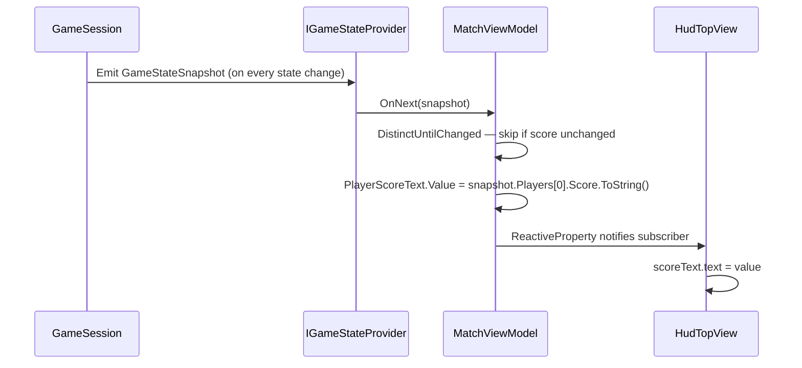

The HUD score counter, the deck count badge, the card selection indicator, the AI thinking pulse — every piece of live UI in SET: 3D Edition is driven by the same mechanism: a reactive stream of state snapshots flows out of `GameSession`, ViewModels transform it into display-ready values, and Views subscribe to those values. When a value changes, the UI updates. When nothing changes, nothing runs.

There is no `Update()` polling. No "forgot to sync this field" bug class. And crucially, the same Presentation code works identically whether the match is Single Player, Pass & Play, or online Multiplayer — the UI has no idea which mode is active.

<Info>
The R3 reactive pipeline described here is **planned** for the pre-production implementation phase. The architecture and patterns are established design intent.
</Info>

---

## Why Reactive UI?

The traditional Unity approach to live UI is polling:

```csharp
// ❌ Polling — runs every frame, regardless of whether anything changed
void Update()
{
    scoreText.text = _gameSession.GetScore().ToString();
    deckCountText.text = _gameSession.GetDeckCount().ToString();
}
```

This has three problems:
1. **CPU waste.** It runs every frame even when the score hasn't changed.
2. **Hidden coupling.** `Update()` reaches into `_gameSession` directly, creating a tight dependency between the View and the Game Session's public API.
3. **Multi-mode fragility.** When Multiplayer gets added, the session's API changes and every polling call needs updating.

The reactive approach inverts this. `GameSession` *pushes* state. Views *subscribe* once and are notified only when something actually changes:

```csharp
// ✅ Reactive — runs only when the score value changes
_vm.PlayerScoreText
    .Subscribe(t => scoreText.text = t)
    .AddTo(_disposables);
```

---

## The R3 Library

SET: 3D Edition uses **R3** (by Cysharp), the successor to UniRx, purpose-built for Unity. It provides:

| R3 Type | Purpose |
|---|---|
| `ReactiveProperty<T>` | A value that notifies subscribers when it changes. The backbone of ViewModel bindings. |
| `Subject<T>` | A stream you can push values into manually. Used inside `GameSession` to emit snapshots. |
| `Observable<T>` | The read-only stream interface that ViewModels and Views subscribe to. |
| `CompositeDisposable` | Collects subscriptions so they can all be cancelled at once in `OnDestroy`. |
| Operators: `DistinctUntilChanged`, `Select`, `Where`, `ThrottleFirst`, `ObserveOnMainThread` | Standard reactive operators for filtering, transforming, and controlling streams. |

---

## The MVVM Pattern in SET: 3D Edition

The project uses a three-tier Model-View-ViewModel (MVVM) pattern adapted for Unity:

```
┌─────────────────────────────────────────┐
│  Application Layer                       │
│  GameSession  ─►  IGameStateProvider     │
│                      │                   │
│              StateStream (IObservable)   │
└──────────────────────┼──────────────────┘
                       │ subscribe
┌──────────────────────▼──────────────────┐
│  Presentation Layer — ViewModel          │
│  MatchViewModel                          │
│  ReactiveProperty<string> PlayerScore    │
│  ReactiveProperty<int>    DeckCount      │
│  ReactiveProperty<bool>   IsBoardLocked  │
└──────────────────────┬──────────────────┘
                       │ subscribe
┌──────────────────────▼──────────────────┐
│  Presentation Layer — View               │
│  HudTopView (MonoBehaviour)              │
│  scoreText.text  ◄── PlayerScore         │
│  deckCountText   ◄── DeckCount           │
└─────────────────────────────────────────┘
```

| Tier | Type | Role |
|---|---|---|
| **Model** | `GameStateSnapshot` | Immutable data-transfer object emitted by `GameSession` on every state change |
| **ViewModel** | Pure C# class | Subscribes to `IGameStateProvider.StateStream`, transforms snapshot fields into display-ready `ReactiveProperty<T>` values |
| **View** | `MonoBehaviour` | Subscribes to ViewModel properties and updates Unity UI components; contains zero game logic |

---

## Data Flow



Commands flow in the opposite direction:

```
HudView button tap  →  IInputHandler.CommandStream  →  GameSession.HandleCommand
```

Views never call `GameSession` methods directly. Input becomes a command and is handled by the Application layer.

---

## Key Interface: IInputHandler

Input in SET: 3D Edition is abstracted through `IInputHandler`, declared in `SET.Application` and implemented by `TouchInputHandler` in `SET.Presentation`. This keeps the Application layer completely independent of Unity's input system.

```csharp
// SET.Application — interface declaration
public interface IInputHandler
{
    /// <summary>Observable stream of commands produced by player input.</summary>
    IObservable<IGameCommand> CommandStream { get; }

    /// <summary>Activates input processing — call when the board becomes interactive.</summary>
    void Enable();

    /// <summary>Suspends input processing — call during animations or locked states.</summary>
    void Disable();
}
```

`TouchInputHandler` translates Unity touch events into `SelectCardCommand`, `ClaimSelectedCommand`, and other `IGameCommand` implementations, then pushes them onto `CommandStream`. `GameSession` subscribes once at startup — it never polls for input.

---

## Key Interface: IViewPresenter

High-level screen transitions and game-board state updates are coordinated through `IViewPresenter`, declared in `SET.Application`:

```csharp
// SET.Application — interface declaration
public interface IViewPresenter
{
    /// <summary>Transitions to and initialises the game board view.</summary>
    void ShowBoard();

    /// <summary>Refreshes all HUD elements from the latest game state snapshot.</summary>
    void UpdateHud(GameStateSnapshot snapshot);

    /// <summary>Triggers the valid or invalid SET card animation.</summary>
    void PlaySetAnimation(bool wasValid, int[] cardIds);

    /// <summary>Presents the post-match result overlay with final scores and stats.</summary>
    void ShowMatchResult(MatchResultData result);

    /// <summary>Displays a transient toast notification (e.g. "No SET — dealing more cards").</summary>
    void ShowToast(string message);
}
```

`ScreenPresenter` in `SET.Presentation` implements this interface. The Application layer calls it to trigger screen-level events without having any knowledge of Unity's scene system or uGUI components.

---

## Example ViewModel

```csharp
// Assets/_Project/Presentation/ViewModels/MatchViewModel.cs
// (SET.Presentation assembly)

public class MatchViewModel : IDisposable
{
    // One ReactiveProperty per UI field
    public ReactiveProperty<string> PlayerScoreText { get; } = new("0");
    public ReactiveProperty<int>    DeckCount       { get; } = new(81);
    public ReactiveProperty<bool>   IsBoardLocked   { get; } = new(false);

    readonly CompositeDisposable _disposables = new();

    public MatchViewModel(IGameStateProvider stateProvider)
    {
        stateProvider.StateStream
            // Only process a new snapshot if the player's score actually changed.
            // GameSession emits on every state change — DistinctUntilChanged
            // prevents unnecessary UI work for unrelated changes.
            .DistinctUntilChanged(s => s.Players[0].Score)
            .Subscribe(snapshot =>
            {
                PlayerScoreText.Value = snapshot.Players[0].Score.ToString();
                DeckCount.Value       = snapshot.DeckCount;
                IsBoardLocked.Value   = snapshot.CurrentState != MatchState.BoardIdle;
            })
            .AddTo(_disposables);
    }

    public void Dispose() => _disposables.Dispose();
}
```

The ViewModel has **no Unity dependencies**. It is a plain C# class you can construct and test in an EditMode test without ever entering Play Mode.

---

## Example View

```csharp
// Assets/_Project/Presentation/Views/HudTopView.cs
// (SET.Presentation assembly)

public class HudTopView : MonoBehaviour
{
    [SerializeField] TMP_Text _scoreText;
    [SerializeField] TMP_Text _deckCountText;

    MatchViewModel _vm;
    readonly CompositeDisposable _disposables = new();

    // VContainer calls this before Start() — see di-vcontainer page
    [Inject]
    public void Construct(MatchViewModel vm) => _vm = vm;

    void Start()
    {
        _vm.PlayerScoreText
            .Subscribe(t => _scoreText.text = t)
            .AddTo(_disposables);

        _vm.DeckCount
            .Subscribe(c => _deckCountText.text = $"Deck: {c}")
            .AddTo(_disposables);
    }

    void OnDestroy() => _disposables.Dispose();
}
```

The View contains **zero game logic**. It wires component references to ViewModel properties and nothing else.

---

## Why DistinctUntilChanged Matters

`GameSession` emits a fresh `GameStateSnapshot` on *every* state change — card selection, score update, deck count change, board lock, anything. A ViewModel subscribed to the raw stream would re-run its update logic on every single emission, even if the specific field it cares about did not change.

`DistinctUntilChanged` short-circuits the subscription when the projected value has not changed:

```csharp
// Only update score-related properties when the score itself changes
stateProvider.StateStream
    .DistinctUntilChanged(s => s.Players[0].Score)
    .Subscribe(snapshot => PlayerScoreText.Value = snapshot.Players[0].Score.ToString());
```

Use a separate subscription with its own `DistinctUntilChanged` for each logically independent field. This keeps each binding cheap and ensures UI components are only touched when their data actually changes.

---

## R3 Use Cases Across the Game

| Use Case | R3 Application |
|---|---|
| Card selection stream | `Observable<CardData>.Buffer(3)` accumulates three card taps, then triggers validation |
| Board state changes | `ReactiveProperty<IReadOnlyList<CardData>>` auto-updates all card Views whenever the board changes |
| Nakama realtime events | Server messages are wrapped as `Observable<ServerMessage>` and merged with local input streams |
| AI decision timing | `Observable.Timer(delay)` reacts to board `ReactiveProperty` changes and fires the AI claim after the configured delay |
| Input debounce | `ThrottleFirst()` prevents double-taps; `Debounce()` batches rapid selection changes |
| UI counter bindings | Score, deck count, and streak counters are all `ReactiveProperty<int>` with a single `.Subscribe` per text component |

The last row is the key takeaway for UI work: **every numeric counter on screen maps to one `ReactiveProperty<int>` on a ViewModel**. If you are writing a loop or checking a value in `Update()`, you are doing it wrong.

---

## The Mode-Agnostic Benefit

Single Player, Pass & Play, and Multiplayer all feed the **same** reactive pipeline:

```
[Local SetValidator / AI] ─┐
[Pass & Play Input]         ├──► GameSession ──► IGameStateProvider.StateStream ──► MatchViewModel ──► UI
[Nakama Server messages] ──┘
```

`MatchViewModel` and every View subscribe to `IGameStateProvider`. They never inspect whether the underlying session is networked or local. Adding a new game mode means providing a different `IGameStateProvider` implementation — the entire Presentation layer continues to work unchanged.

---

## One-Shot Events: Animations and Toasts

Not everything is a continuously-updated value. Some things happen once — a valid SET is claimed, a card flies to the score counter. These use a separate `EventStream` on `IGameStateProvider`:

```csharp
// In MatchViewModel constructor — subscribing to discrete events
stateProvider.EventStream
    .OfType<SetClaimedEvent>()
    .Subscribe(e => TriggerSetAnimation(e.WasValid, e.CardIds))
    .AddTo(_disposables);

stateProvider.EventStream
    .OfType<BoardExpandedEvent>()
    .Subscribe(_ => ShowNoSetToast())
    .AddTo(_disposables);
```

`OfType<T>()` filters the event stream to only the event type you care about. The subscription fires exactly once per event, not once per frame.

---

## Threading Rule

Nakama delivers network callbacks on a background thread. **Never update a `ReactiveProperty` or call `OnNext` on a `Subject` from a background thread** — Unity's rendering and uGUI are not thread-safe.

Marshal all network callbacks to the main thread before touching any game or UI state:

```csharp
// In NakamaMultiplayerService (SET.Infrastructure)
_nakamaSocket.ReceivedMatchState
    .ObserveOnMainThread()  // ← marshal to Unity main thread
    .Subscribe(state => _stateSubject.OnNext(ParseState(state)))
    .AddTo(_disposables);
```

If you see a `UnityException: get_isActiveAndEnabled can only be called from the main thread` error, a background callback is reaching UI without marshalling. Add `.ObserveOnMainThread()` at the boundary between the network callback and the game state update.

---

## Disposal Rule

Every `Subscribe()` call returns an `IDisposable`. If you do not dispose it, the subscription keeps a reference to the subscriber alive and it **never gets garbage collected**, even after the scene unloads. This is a memory leak.

The pattern to follow, without exception:

```csharp
// Collect every subscription into a CompositeDisposable
readonly CompositeDisposable _disposables = new();

void Start()
{
    _vm.SomeProperty
        .Subscribe(v => DoSomething(v))
        .AddTo(_disposables); // ← required
}

// Dispose everything at once
void OnDestroy() => _disposables.Dispose();
// For pure C# classes:
public void Dispose() => _disposables.Dispose();
```

`AddTo(_disposables)` is an R3 extension method that registers the subscription's `IDisposable` with the `CompositeDisposable`. When `_disposables.Dispose()` is called, every registered subscription is cancelled in one call.

---

## Implementation Checklist

Use this checklist when adding a new reactive binding or ViewModel:

- [ ] ViewModel is a plain C# class with no Unity (`MonoBehaviour`, `GameObject`) dependencies
- [ ] Every `ReactiveProperty<T>` is declared on the ViewModel, not on the View
- [ ] Every `Subscribe()` call is followed by `.AddTo(_disposables)`
- [ ] Every `MonoBehaviour` View has `OnDestroy() => _disposables.Dispose()`
- [ ] Every pure C# ViewModel implements `IDisposable` and calls `_disposables.Dispose()` in `Dispose()`
- [ ] Subscriptions to ViewModel properties are set up in `Start()`, never in `Awake()` (injection runs between the two)
- [ ] Nakama/network callbacks use `.ObserveOnMainThread()` before any state or UI update
- [ ] `DistinctUntilChanged` applied on each subscription keyed to the specific field it cares about
- [ ] No `Update()` polling for any game state — all updates are subscription-driven
- [ ] Views never call `GameSession` directly — input routes through `IInputHandler.CommandStream`

---

## Banned Patterns

| Banned | Why | Replacement |
|---|---|---|
| Polling state in `Update()` | Runs every frame; creates tight coupling to the session's API surface | Subscribe to a `ReactiveProperty` once |
| Calling `GameSession` methods directly from a View | Bypasses the command stream; View gains knowledge of Application internals | Route input through `IInputHandler.CommandStream` |
| Updating UI from a Nakama network callback directly | Thread-safety violation; Unity will crash or corrupt render state | `.ObserveOnMainThread()` before any state or UI update |
| Subscribing without `.AddTo(disposables)` | Memory leak; subscriber never freed | Always add to a `CompositeDisposable` disposed in `OnDestroy` |
| `new ReactiveProperty<T>()` in a View | ViewModels own state; Views only display it | Expose `ReactiveProperty` on the ViewModel, subscribe in the View |

---

## Common Mistakes

**Forgetting `OnDestroy`** is the most frequent issue. The compiler will not warn you. A leaked subscription holds the entire ViewModel — and transitively the `GameSession` — alive after the scene unloads. Always verify that every MonoBehaviour with subscriptions has an `OnDestroy` that calls `_disposables.Dispose()`.

**Not using `DistinctUntilChanged`** means the View's `Subscribe` callback runs on every snapshot emission. For text fields updated 60 times per second this is not catastrophic, but for operations that trigger layout rebuilds or animations it causes visible frame drops. Be selective.

**Subscribing in `Awake` before injection.** VContainer calls `[Inject]` methods after `Awake`. If you call `Subscribe` in `Awake`, `_vm` is still `null`. Put all subscription setup in `Start`.

**Using `ReactiveProperty.Value =` from multiple threads.** `ReactiveProperty` is not thread-safe. All writes must happen on the main thread (see threading rule above).

---

## Related Pages

<CardGroup cols={2}>
  <Card title="Dependency Injection with VContainer" icon="plug" href="/architecture/di-vcontainer">
    How ViewModels are registered and injected into Views through the composition root.
  </Card>
  <Card title="Assembly Definitions" icon="boxes-stacked" href="/architecture/asmdefs">
    How asmdefs keep the Presentation layer physically separated from Infrastructure.
  </Card>
  <Card title="Game Session Lifecycle" icon="rotate" href="/core-gameplay/session-lifecycle">
    How GameSession emits state snapshots and events through the IGameStateProvider interface.
  </Card>
  <Card title="Engineering Standards & Patterns" icon="book" href="/standards/patterns">
    The full pattern toolbox and code review checklist for reactive pipelines.
  </Card>
</CardGroup>
