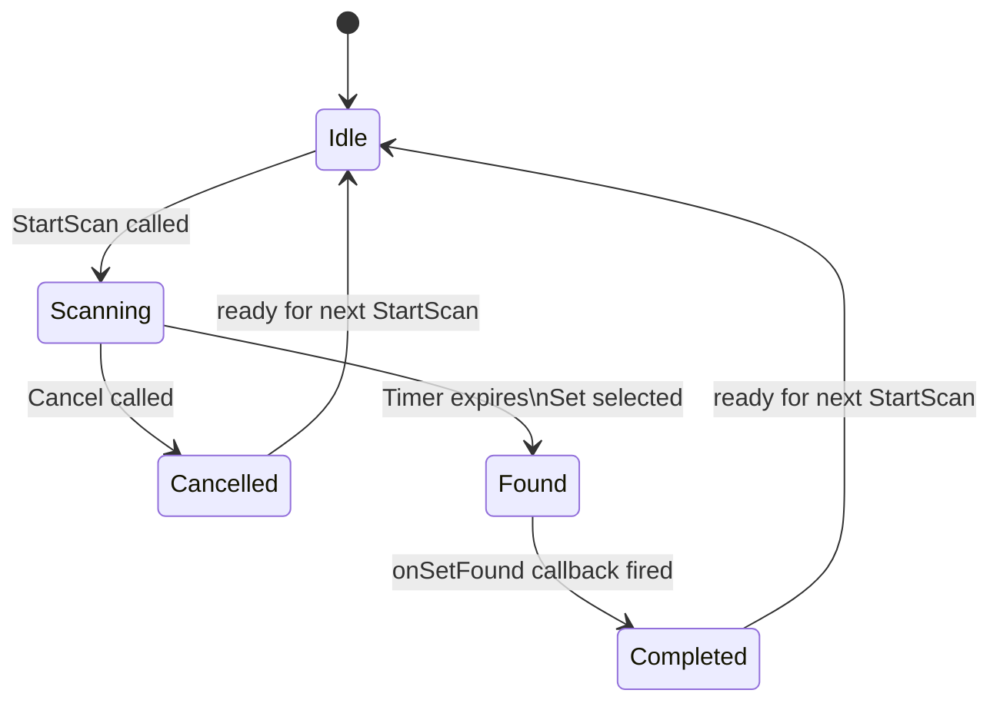

The AI opponent in SET: 3D Edition needs to feel like a fair, human-like competitor — not a scripted cheater that always wins, and not a pushover that never poses a challenge. This page describes the `IAIScanner` interface, the AI state machine, the four difficulty tiers, and the optional rubber-band assist feature that keeps matches competitive.

<Info>
**Pre-production notice.** SET: 3D Edition is in pre-production. The AI scanner design is specified but not yet implemented. All difficulty values, interface signatures, and config formats described here reflect the current design. The rubber-band assist toggle and false-start animation hint are **planned** features.
</Info>

---

## Scope: Single Player Only

AI opponents are active **only in Single Player game modes** — Solo vs AI, Campaign, and Practice (where no opponent is needed, so AI is disabled). Online Multiplayer uses human players only; the server never instantiates `IAIScanner`. If you find yourself referencing `IAIScanner` from any multiplayer code path, that is an architecture error.

---

## The IAIScanner Interface

```csharp
// Domain layer — zero Unity or Nakama dependencies
public interface IAIScanner
{
    /// <summary>
    /// Begin scanning the current board. The scanner starts an internal timer
    /// based on the difficulty tier. When the timer expires, it picks a Set
    /// (subject to miss rate) and calls onSetFound.
    /// </summary>
    /// <param name="boardCards">The cards currently visible on the board.</param>
    /// <param name="difficulty">The difficulty tier controlling delay and miss rate.</param>
    /// <param name="onSetFound">
    /// Callback invoked once with a valid three-card array.
    /// Called on the same thread as Tick(). Never called after Cancel().
    /// </param>
    void StartScan(IReadOnlyList<Card> boardCards,
                   AIDifficulty difficulty,
                   Action<Card[]> onSetFound);

    /// <summary>
    /// Cancel the current scan. The onSetFound callback will NOT be called.
    /// Safe to call when the scanner is already idle.
    /// </summary>
    void Cancel();

    /// <summary>
    /// Advance the scanner's internal timer. Called by GameSession each Update.
    /// Pass GameSession's own deltaTime (not Time.deltaTime directly) to keep
    /// the scanner decoupled from Unity for testing.
    /// </summary>
    void Tick(float deltaTime);
}

public enum AIDifficulty { Easy, Medium, Hard, Expert }
```

The interface is minimal by design. `GameSession` calls `StartScan` once after the board stabilises, calls `Tick` every frame with its own `deltaTime`, and calls `Cancel` whenever the board changes mid-scan. The scanner is not responsible for watching the board for changes — that is `GameSession`'s job.

---

## AI State Machine

The scanner moves through four internal states:



**Idle** — No scan in progress. `Tick` is a no-op.

**Scanning** — Timer counting down. The scanner has already called `FindAllSets` internally and stored the results (or it calls `FindAllSets` at expiry — see the performance note below). Every `Tick(deltaTime)` decrements the remaining delay. `Cancel()` transitions to `Cancelled` without firing the callback.

**Found** — Timer expired and a Set was selected (subject to miss rate). The callback fires synchronously in the same `Tick` call. `GameSession` receives the result and processes it as a `ClaimSelectedCommand`.

**Completed** / **Cancelled** — Transition back to `Idle` on the next `Tick` or after `Cancel` returns, ready for a new `StartScan`.

---

## Difficulty Configuration

Four tiers control three behavioural parameters:

| Tier | Min Delay | Max Delay | Miss Rate | False Start Rate |
|------|-----------|-----------|-----------|-----------------|
| Easy | 4.0 s | 8.0 s | 20 % | 10 % |
| Medium | 2.0 s | 4.0 s | 10 % | 5 % |
| Hard | 0.8 s | 2.0 s | 2 % | 2 % |
| Expert | 0.3 s | 0.8 s | 0 % | 1 % |

**Reaction delay** — When `StartScan` is called, the scanner picks a uniformly random delay from `[minDelaySec, maxDelaySec]`. The AI does nothing visible until this timer expires.

**Miss rate** — When the timer expires, if `System.Random.NextDouble() < missRate`, the AI "misses" its chance. In practice, this means it either submits a deliberately invalid Set (to simulate a wrong guess and trigger penalty feedback) or simply skips and waits for the next board change. The MVP implementation skips rather than submitting an invalid Set, unless the false-start path is active.

**False start rate (Planned)** — A brief animation hint that the AI is "considering" a card (the AI player token moves slightly toward a card) before pulling back. This is a purely visual effect controlled by the Presentation layer. The domain scanner fires a `FalseStartEvent` before resetting its timer; the view reacts to that event. This is a planned feature and not required for the first playable build.

---

## Configuration File

Difficulty parameters are loaded from a JSON config file, **not hard-coded**. This allows designers to tune balance without recompiling.

```json
{
  "Easy":   { "minDelaySec": 4.0, "maxDelaySec": 8.0, "missRate": 0.20, "falseStartRate": 0.10 },
  "Medium": { "minDelaySec": 2.0, "maxDelaySec": 4.0, "missRate": 0.10, "falseStartRate": 0.05 },
  "Hard":   { "minDelaySec": 0.8, "maxDelaySec": 2.0, "missRate": 0.02, "falseStartRate": 0.02 },
  "Expert": { "minDelaySec": 0.3, "maxDelaySec": 0.8, "missRate": 0.00, "falseStartRate": 0.01 }
}
```

At startup, `AIScanner` loads this file via the `ILocalSaveService` (or a direct `Resources.Load` for the initial build). If a tier key is missing from the file, the scanner falls back to `Medium` parameters and logs a warning. Hard-coded fallback values are acceptable for this fallback only — the config file must exist for shipped builds.

---

## Implementation Details

### Timer and Random

```csharp
public class AIScanner : IAIScanner
{
    private readonly System.Random _rng = new System.Random();  // non-deterministic seed
    private AIScannerConfig _config;

    private AIState          _state       = AIState.Idle;
    private float            _timerRemaining;
    private IReadOnlyList<Card> _boardSnapshot;
    private Card[][]         _foundSets;
    private Action<Card[]>   _onSetFound;

    public void StartScan(IReadOnlyList<Card> boardCards,
                          AIDifficulty difficulty,
                          Action<Card[]> onSetFound)
    {
        Cancel();  // clean up any in-progress scan

        var cfg = _config.Get(difficulty);
        float delay = (float)(_rng.NextDouble() * (cfg.MaxDelaySec - cfg.MinDelaySec)
                              + cfg.MinDelaySec);

        _timerRemaining = delay;
        _boardSnapshot  = boardCards;
        _onSetFound     = onSetFound;
        _state          = AIState.Scanning;

        // FindAllSets is fast (<1ms for 21 cards) — call it immediately
        // so we know whether any Sets exist before the timer fires.
        _foundSets = _validator.FindAllSets(boardCards).ToArray();
    }

    public void Tick(float deltaTime)
    {
        if (_state != AIState.Scanning) return;

        _timerRemaining -= deltaTime;
        if (_timerRemaining > 0f) return;

        // Timer expired — decide whether to claim
        var cfg = _config.Get(_currentDifficulty);

        if (_foundSets.Length == 0)
        {
            // No Sets exist; board will expand soon. Do nothing.
            _state = AIState.Idle;
            return;
        }

        if (_rng.NextDouble() < cfg.MissRate)
        {
            // AI misses this opportunity — reset to idle without claiming
            _state = AIState.Idle;
            return;
        }

        // Re-validate before claiming: board may have changed since StartScan
        var chosen = _foundSets[_rng.Next(_foundSets.Length)];
        if (!_validator.Validate(chosen).IsValid)
        {
            // Stale set — board changed, abort
            _state = AIState.Idle;
            return;
        }

        _state = AIState.Found;
        _onSetFound?.Invoke(chosen);
        _state = AIState.Completed;
    }

    public void Cancel()
    {
        _state      = AIState.Idle;
        _onSetFound = null;
        _foundSets  = null;
    }
}
```

<Note>
`AIScanner` uses `System.Random` with a non-deterministic seed (default constructor). AI decisions do not need to be reproducible across runs — only the Daily Challenge deck shuffle requires a fixed seed, and that is handled by `Deck`, not by the scanner.
</Note>

### How GameSession Drives the Scanner

`GameSession.Update(float deltaTime)` is called each frame by the Unity `MonoBehaviour` wrapper:

```csharp
// Inside GameSession
public void Update(float deltaTime)
{
    _aiScanner?.Tick(deltaTime);

    if (_rules.IsTimed)
    {
        _remainingTime -= deltaTime;
        if (_remainingTime <= 0f)
            TransitionTo(MatchState.MatchEnd);
    }
}
```

`GameSession` owns `deltaTime` — the scanner never calls `Time.deltaTime` directly. This is intentional: in unit tests, you can manually advance the scanner by calling `Update(4.5f)` without waiting real time.

### Board Stability: When to StartScan

The scanner starts only when the board has **stabilised** — that is, when `GameSession` enters `BoardIdle` after completing all refills and expansions. The sequence:

1. Valid Set claimed → `ValidSetAnim` → `RefillAnim` → board stabilised → `BoardIdle` → `StartScan`.
2. Expansion needed → `ExpandBoardAnim` → board stabilised → `BoardIdle` → `StartScan`.
3. Board changes while AI is scanning (player claims a Set) → `GameSession` calls `Cancel()` before the board mutation, then starts a new scan after the board re-stabilises.

---

## Rubber-Band Difficulty Assist (Planned)

<Warning>
**Planned feature.** Rubber-band difficulty adjustment is not yet implemented. The description below documents the intended design for a future sprint.
</Warning>

If the human player's Set count falls **3 or more behind** the AI, `GameSession` detects the gap and temporarily passes a softer `AIDifficulty` to `StartScan`. For example, if the match is configured at `Hard`, the session might pass `Easy` until the gap closes to 1.

```csharp
// GameSession internal helper — planned
private AIDifficulty GetEffectiveDifficulty()
{
    if (!_rules.RubberBandEnabled) return _rules.BaseDifficulty;

    int aiScore    = _players[_aiPlayerIndex].Score;
    int humanScore = _players[_humanPlayerIndex].Score;
    int gap        = aiScore - humanScore;

    if (gap >= 3) return AIDifficulty.Easy;    // AI intentionally slowed
    if (gap >= 1) return AIDifficulty.Medium;
    return _rules.BaseDifficulty;
}
```

The scanner itself has no knowledge of rubber-banding. It simply executes whatever `AIDifficulty` is passed to `StartScan`. All the logic for detecting the gap and choosing the adjusted tier lives in `GameSession`.

---

## Performance Notes

- `FindAllSets(21 cards)` completes in under 1 ms on the main thread — no threading is needed. The scanner runs entirely on the Unity main thread.
- `FindAllSets` is called once per `StartScan` call (not every `Tick`). Between calls to `StartScan`, the scanner simply decrements a float counter — zero CPU overhead.
- For MVP, there is no need for `IJob`, `Task`, `async/await`, or any background execution. If future board sizes or AI behaviour (e.g., multi-step lookahead) require it, the `Tick`-based interface already supports offloading: call `FindAllSets` on a background thread in `StartScan` and store the result when it arrives. The interface does not need to change.

---

## Implementation Checklist

<Steps>
  <Step title="Timer uses injected deltaTime, not Time.deltaTime">
    `AIScanner.Tick(float deltaTime)` must use the `deltaTime` parameter, not `UnityEngine.Time.deltaTime`. This decouples the scanner from Unity's frame loop and allows deterministic unit testing.
  </Step>
  <Step title="Cancel() stops the scan without firing onSetFound">
    After `Cancel()` returns, `_onSetFound` must be `null` and `_state` must be `Idle`. Write a unit test: call `StartScan`, then `Cancel`, then `Tick(100f)`. Assert that `onSetFound` was never called.
  </Step>
  <Step title="Miss rate applied correctly">
    When `_rng.NextDouble() < cfg.MissRate`, the scan ends without a claim. The callback is not called. The scanner returns to `Idle`. The AI will get another opportunity on the next `StartScan` (after the next board change).
  </Step>
  <Step title="Re-validate before calling onSetFound">
    Between `StartScan` and timer expiry, the board might change (player claimed a Set). Always call `ISetValidator.Validate(chosen)` immediately before invoking `onSetFound`. If the chosen Set is no longer valid, abort the claim and return to `Idle`.
  </Step>
  <Step title="Config loaded from ai_difficulty.json">
    Difficulty parameters must be loaded from the JSON config file at startup. Do not hard-code values in `AIScanner` except as a fallback for missing tiers.
  </Step>
  <Step title="Missing config tier falls back to Medium">
    If the config file exists but the requested tier key is missing, log a warning and use the `Medium` parameters. Do not throw or leave `_timerRemaining` at its default `0`.
  </Step>
  <Step title="No UnityEngine references in AIScanner">
    Place `AIScanner` in the same assembly definition as `SetValidator` — the one that excludes `UnityEngine`. The only Unity coupling is in `GameSession.Update`, which passes `Time.deltaTime` to `AIScanner.Tick`.
  </Step>
</Steps>

---

## Common Mistakes

<Warning>
**Calling FindAllSets on every Tick.**
`FindAllSets` for a 21-card board takes up to 1 ms. Calling it 60 times per second during a scan wastes ~60 ms per second of CPU time. Call it once at `StartScan` time and store the results.
</Warning>

<Warning>
**Firing onSetFound with stale cards after the board changes.**
If `Cancel()` was not called before a board mutation and the timer fires afterwards, the scanner may invoke `onSetFound` with cards that are no longer on the board. Always call `Cancel()` before any board mutation in `GameSession`, and always re-validate the chosen Set immediately before calling the callback.
</Warning>

<Warning>
**Hard-coding delay values instead of reading config.**
Tuning AI difficulty is a design and QA concern, not an engineering concern. Hard-coded values in source code require a recompile for every balance change. Load from `ai_difficulty.json` so designers can iterate without touching C#.
</Warning>

<Warning>
**Starting a new scan before the board has stabilised.**
Do not call `StartScan` from `RefillAnim` or `ExpandBoardAnim` states. The board is still changing. Wait until `GameSession` enters `BoardIdle` — that is the signal that the board is stable and the AI can begin thinking.
</Warning>

---

## Related Pages

<CardGroup cols={2}>
  <Card title="Card Model" href="/core-gameplay/card-model">
    The Card type and CardAttributes struct that AIScanner passes to SetValidator.
  </Card>
  <Card title="Set Validation" href="/core-gameplay/set-validation">
    FindAllSets and Validate — the two ISetValidator methods AIScanner depends on.
  </Card>
  <Card title="Board & Dealing" href="/core-gameplay/board-and-dealing">
    How the Board stabilises after refill and expansion, triggering a new AI scan.
  </Card>
  <Card title="Session Lifecycle" href="/core-gameplay/session-lifecycle">
    How GameSession drives AIScanner via Tick, StartScan, and Cancel across the full match lifecycle.
  </Card>
</CardGroup>
