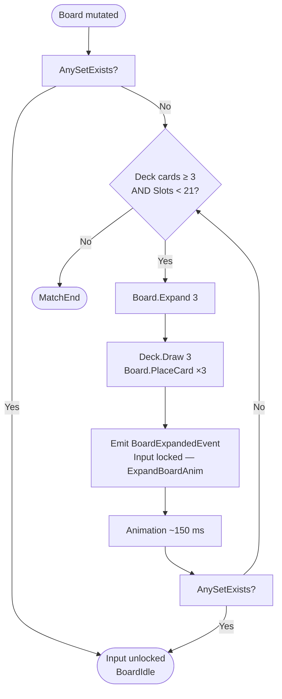

The `Board` is the physical state of the game — it is everything the player sees on screen. Understanding how it initialises, how empty slots are refilled after a valid Set, and how it expands when no Set exists is essential before implementing any visual layout or game-flow code.

<Info>
**Pre-production notice.** SET: 3D Edition is in pre-production. All class signatures, slot-index conventions, and flow decisions described here are based on the current design specification and may change before the first playable build.
</Info>

---

## Responsibilities and Boundaries

The `Board` entity is deliberately narrow in scope. Knowing what it does *not* own is as important as knowing what it does.

**Board IS responsible for:**
- Maintaining the ordered list of `CardSlot` values (positions and their occupants).
- Placing, removing, and querying cards by slot index.
- Tracking which slots are empty, so `GameSession` knows where to place new cards.
- Enforcing the maximum slot count (21) and throwing when that invariant would be violated.

**Board is NOT responsible for:**
- Drawing cards from the `Deck` — that is `GameSession`'s job.
- Validating Sets — that is `SetValidator`'s job.
- Deciding *when* to expand — that is `GameSession`'s job (triggered by `AnySetExists` returning `false`).
- Locking input during animations — that is `GameSession`'s job.

This separation keeps `Board` a simple, testable data structure and puts all orchestration logic in one place: `GameSession`.

---

## Core Types

```csharp
/// <summary>
/// A fixed position on the Board. May be empty (Card is null).
/// Slot.Index is a board-position index (0–20), NOT the Card's Id (0–80).
/// </summary>
public readonly struct CardSlot
{
    public int   Index { get; }   // position in the 4-column grid
    public Card? Card  { get; }   // null = empty slot
}

/// <summary>
/// The Board entity. Owns the slot list and enforces occupancy invariants.
/// GameSession is the only caller that mutates the Board.
/// </summary>
public sealed class Board
{
    private const int MinSlots = 12;
    private const int MaxSlots = 21;

    public IReadOnlyList<CardSlot> Slots { get; }   // always MinSlots..MaxSlots entries

    public Card? GetCard(int slotIndex);
    public void  PlaceCard(int slotIndex, Card card);  // throws if slot occupied
    public void  RemoveCard(int slotIndex);
    public IReadOnlyList<int> GetEmptySlots();
    public void  Expand(int additionalSlots);          // adds 3 at a time; throws if > MaxSlots
}
```

<Note>
`CardSlot` is a `readonly struct` — it is allocated on the stack and copied by value. With 21 slots at roughly 8–12 bytes each, the entire slot list fits in ~252 bytes. There is no heap pressure here.
</Note>

---

## Grid Layout and Slot Indices

The board always has exactly **4 columns**. The initial deal produces a **4 × 3 grid** (12 slots, indices 0–11):

```
Slot indices — initial 4 × 3 layout
┌────┬────┬────┬────┐
│  0 │  1 │  2 │  3 │  row 0
├────┼────┼────┼────┤
│  4 │  5 │  6 │  7 │  row 1
├────┼────┼────┼────┤
│  8 │  9 │ 10 │ 11 │  row 2
└────┴────┴────┴────┘
```

For any slot index `n`, the grid position is:
```
row = n / 4      (integer division)
col = n % 4
```

When the board **expands**, three new slots are appended to the end of the list:

| Expansion | New slots | Total slots | Grid |
|-----------|-----------|-------------|------|
| First | 12, 13, 14 | 15 | 4 × 4 (minus 1 slot) |
| Second | 15, 16, 17 | 18 | 4 × 4 + partial 5th row |
| Third | 18, 19, 20 | 21 | 4 × 5 + partial 6th row |

The `BoardView` (Presentation layer) maps slot indices to 3D world positions using the same `row = n / 4` formula. No other coordinate system should be used.

---

## Initial Deal

`GameSession` performs the initial deal at match start:

1. Call `Deck.Draw(12)` to draw the first 12 cards.
2. For each card at index `i` (0–11), call `Board.PlaceCard(i, card)`.
3. After all 12 cards are placed, call `SetValidator.AnySetExists(boardCards)`.
4. If no Set exists on the opening board (rare but legal), begin the expansion flow immediately.

The board starts with exactly 12 slots. `Board.Expand()` is **not called** during the initial deal — the constructor creates 12 empty slots, and `GameSession` fills them.

---

## Refill After a Valid Set

When a player claims a valid Set, the three claimed cards are removed from the board and replaced:

1. `GameSession` calls `Board.RemoveCard(slotIndex)` for each of the three claimed slots.
2. `GameSession` checks `Deck.CardsRemaining`. If the deck has ≥ 3 cards:
   - Call `Deck.Draw(3)` to get three new cards.
   - Call `Board.PlaceCard(slotIndex, newCard)` for each of the same three slot indices, preserving the positions the claimed cards occupied.
3. If the deck has 0 cards, the three slots stay empty. The board may end up with fewer than 12 occupied positions (which is legal).
4. After refill (or leaving slots empty), call `SetValidator.AnySetExists()` on the current board cards.

<Note>
Official SET rules state that refill cards go back into the **same positions** as the removed cards. Do not move cards to fill gaps. `Board.PlaceCard` is called with the original slot indices, not with fresh indices at the end of the list.
</Note>

---

## Expansion: No Set on the Board

Expansion is triggered when `AnySetExists` returns `false` after any board mutation.

**Expansion preconditions:**

| Condition | Action |
|-----------|--------|
| `AnySetExists == false` AND `Deck.CardsRemaining >= 3` AND `Slots.Count < 21` | Expand: deal 3 more cards |
| `AnySetExists == false` AND `Deck.CardsRemaining < 3` (0, 1, or 2 cards left) | End match immediately — no partial deal |
| `AnySetExists == false` AND `Slots.Count == 21` AND deck empty | End match |
| `AnySetExists == false` AND `Slots.Count == 21` AND deck has cards | End match (official rules: no further expansion beyond 21) |

**Expansion steps (when preconditions pass):**

1. `GameSession` calls `Board.Expand(3)` — appends three new empty slots to the end of `Slots`.
2. `GameSession` calls `Deck.Draw(3)` and places each card into the newly appended slots via `Board.PlaceCard`.
3. `GameSession` emits `BoardExpandedEvent` for the Presentation layer to show the "No Set — dealing 3 more cards" toast and play the deal animation (~150 ms).
4. Input remains locked (`MatchState.ExpandBoardAnim`) during the animation.
5. After the animation completes, `GameSession` calls `AnySetExists` again on the new board.
6. If still no Set and conditions allow, repeat from step 1.



---

## Board Invariants

`Board` must enforce the following invariants and throw named exceptions when they are violated. These are programming errors, not expected game events, so exceptions are the correct signal.

| Invariant | Enforced by | Exception thrown |
|-----------|-------------|------------------|
| Slot count is between 12 and 21 | `Expand()` validates before appending | `ArgumentOutOfRangeException` |
| `PlaceCard` on an already-occupied slot | `PlaceCard()` checks `Slot.Card != null` | `InvalidOperationException` |
| `PlaceCard` / `RemoveCard` with out-of-bounds index | Bounds check in both methods | `ArgumentOutOfRangeException` |
| `Expand()` with additionalSlots not equal to 3, or resulting count > 21 | `Expand()` validates the increment | `ArgumentOutOfRangeException` |

`RemoveCard` on an empty slot is a no-op (returns silently), not an exception — `GameSession` may call it during cleanup without knowing slot occupancy in advance.

---

## Implementation Checklist

<Steps>
  <Step title="Board initialises with exactly 12 empty slots">
    The `Board` constructor must create exactly 12 `CardSlot` values with `Card = null`. No card placement happens in the constructor — that is the responsibility of `GameSession` during the initial deal.
  </Step>
  <Step title="PlaceCard and RemoveCard enforce invariants">
    `PlaceCard` must throw `InvalidOperationException` if the target slot is already occupied. Both methods must throw `ArgumentOutOfRangeException` for invalid indices. Write unit tests for every exception path.
  </Step>
  <Step title="GetEmptySlots returns the correct indices">
    After removing three cards, `GetEmptySlots()` must return those exact three indices. `GameSession` relies on this list to know where to call `PlaceCard` for refill cards.
  </Step>
  <Step title="Expand appends exactly 3 slots, capped at 21">
    `Expand(3)` must append exactly three new empty `CardSlot` values. Any call that would push `Slots.Count` above 21 must throw `ArgumentOutOfRangeException` rather than silently truncating.
  </Step>
  <Step title="GameSession owns Deck draw and AnySetExists calls">
    `Board` must not reference `Deck` or `ISetValidator`. If you find yourself calling `Deck.Draw()` from inside `Board`, that code belongs in `GameSession`. This separation is what allows `Board` to be tested without a real deck or validator.
  </Step>
  <Step title="All operations are O(1) or O(n) for small n">
    `GetCard`, `PlaceCard`, and `RemoveCard` must all be O(1) (direct index access into the backing array). `GetEmptySlots` is O(n) where n ≤ 21 — acceptable.
  </Step>
</Steps>

---

## Common Mistakes

<Warning>
**Letting Board call SetValidator directly.**
`Board` is a pure data structure. It must not import `ISetValidator` or trigger any "no Set" check internally. All validation calls belong in `GameSession`, which is the only object that understands the full game context (deck state, match state, animation state).
</Warning>

<Warning>
**Forgetting AnySetExists after every board mutation.**
Every time a card is placed or removed — whether during refill, expansion, or initial deal — `GameSession` must call `AnySetExists`. Missing even one of these checks means the game can get stuck in a state where the board has no valid Set and nobody notices.
</Warning>

<Warning>
**Exceeding MaxSlots without throwing.**
If `Board.Expand()` silently allows 24 or 27 slots, `BoardView` will try to render cards at positions that have no 3D anchor, producing invisible or misplaced cards. Always throw `ArgumentOutOfRangeException` when the 21-slot cap would be breached.
</Warning>

<Warning>
**Refilling with new slot indices instead of original ones.**
After a valid Set claim, empty slots must be refilled at the same indices as the removed cards. Appending new cards at the end of the list (like an expansion) breaks the visual grid and violates the official rules.
</Warning>

---

## Related Pages

<CardGroup cols={2}>
  <Card title="Card Model" href="/core-gameplay/card-model">
    The Card and CardSlot types that Board stores and manages.
  </Card>
  <Card title="Set Validation" href="/core-gameplay/set-validation">
    AnySetExists and FindAllSets — called by GameSession after every Board mutation.
  </Card>
  <Card title="Session Lifecycle" href="/core-gameplay/session-lifecycle">
    How GameSession orchestrates Board.Expand, Deck.Draw, and AnySetExists into the full match state machine.
  </Card>
  <Card title="AI Opponents" href="/core-gameplay/ai-opponents">
    How AIScanner reads the Board's card list to find and claim Sets.
  </Card>
</CardGroup>
