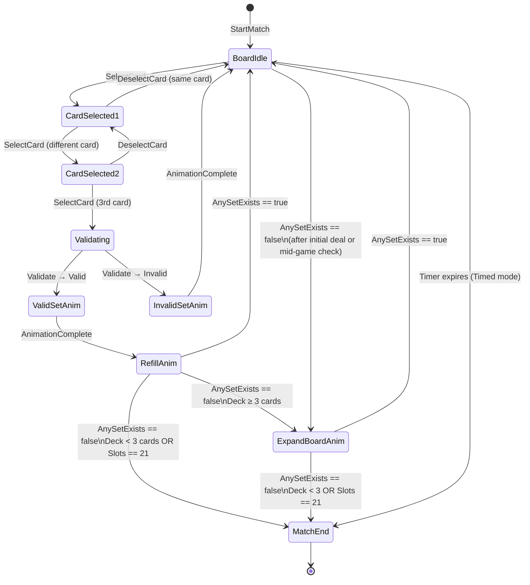

`GameSession` is the central orchestrator of a match in SET: 3D Edition. Every rule, every state transition, every score change, and every end-game condition flows through it. Nothing in the domain layer modifies game state except through `GameSession`. Understanding its structure — the commands it accepts, the states it moves through, and the events it emits — is the foundation for building or debugging any game-mode feature.

<Info>
**Pre-production notice.** SET: 3D Edition is in pre-production. All state machine transitions, command signatures, and event types described here reflect the current design specification. Online multiplayer's `WaitingForServer` sub-state and the Nakama integration path are **planned** and not yet implemented.
</Info>

---

## Two Interfaces, One Class

`GameSession` implements two interfaces that cleanly separate the direction of data flow:

```csharp
// Application layer — no Unity or Nakama dependencies

/// <summary>
/// Input side: things you send TO the session.
/// </summary>
public interface IMatchOrchestrator
{
    void StartMatch(GameRules rules, Player[] players, Deck initialDeck);
    void HandleCommand(IGameCommand command);
}

/// <summary>
/// Output side: things you receive FROM the session.
/// </summary>
public interface IGameStateProvider
{
    /// <summary>Complete state snapshot pushed after every state change.</summary>
    IObservable<GameStateSnapshot> StateStream { get; }

    /// <summary>Discrete domain events (SetClaimed, BoardRefilled, etc.).</summary>
    IObservable<MatchEvent> EventStream { get; }
}

public class GameSession : IMatchOrchestrator, IGameStateProvider
{
    public GameSession(ISetValidator validator, IAIScanner? aiScanner = null) { ... }
    // ...
}
```

Presentation-layer ViewModels subscribe to `StateStream` and `EventStream` via R3 observables. They never call methods on `GameSession` directly — they only push `IGameCommand` objects through `IMatchOrchestrator.HandleCommand`. This strict separation is what makes `GameSession` unit-testable without any Unity dependency.

---

## The MatchState Enum

`GameSession` is a finite state machine (FSM). At any moment, it is in exactly one of these states:

```csharp
public enum MatchState
{
    BoardIdle,          // No cards selected. Waiting for first selection.
    CardSelected1,      // Exactly one card selected.
    CardSelected2,      // Exactly two cards selected.
    Validating,         // Third card selected; validation in progress.
                        // In SP: instant. In MP (planned): includes WaitingForServer
                        // sub-state while the Nakama server processes the claim.
    ValidSetAnim,       // Valid Set confirmed; animation playing. Input LOCKED.
    InvalidSetAnim,     // Invalid Set confirmed; feedback playing. Input LOCKED.
    RefillAnim,         // Board refilling after valid Set. Input LOCKED.
    ExpandBoardAnim,    // Dealing 3 extra cards (no Set found). Input LOCKED.
    MatchEnd            // Game over. No further input accepted.
}
```

Four states are **input-locked**: `ValidSetAnim`, `InvalidSetAnim`, `RefillAnim`, and `ExpandBoardAnim`. While the session is in any of these states, `HandleCommand` silently discards incoming commands (logs a warning, does not throw).

<Note>
**`WaitingForServer` (online play, planned).** In the online multiplayer design, `Validating` encompasses an inner sub-state called `WaitingForServer`. When the player selects a third card, the session enters `Validating` and the claim is dispatched to the Nakama server. The session stays in `Validating / WaitingForServer` — cards highlighted, input locked — until the server broadcasts its verdict. The session then transitions to `ValidSetAnim` or `InvalidSetAnim` based on the server response. There is no separate top-level enum value for this sub-state; it is tracked internally by `OnlineMatchController`.
</Note>

---

## State Machine Transitions



Every arrow in this diagram corresponds to a method or event that `GameSession` processes inside `HandleCommand` or its internal helpers. There are no transitions that bypass `GameSession`.

---

## Commands (Input Into GameSession)

All input is modelled as command objects that implement `IGameCommand`. This makes the input pipeline testable: inject any command in a unit test and assert the resulting state.

```csharp
public interface IGameCommand
{
    PlayerId PlayerId { get; }
}

/// <summary>Player taps an unselected card to add it to the current selection.</summary>
public class SelectCardCommand : IGameCommand
{
    public PlayerId PlayerId { get; }
    public int      SlotIndex { get; }
}

/// <summary>
/// Player taps an already-selected card to remove it from the selection.
/// Transitions: CardSelected2 → CardSelected1, or CardSelected1 → BoardIdle.
/// </summary>
public class DeselectCardCommand : IGameCommand
{
    public PlayerId PlayerId { get; }
    public int      SlotIndex { get; }
}

/// <summary>
/// In Pass and Play mode, tapping the player's colour zone finalises the claim.
/// In standard Single Player and Online, claim is automatic on the 3rd SelectCard.
/// </summary>
public class ClaimSelectedCommand : IGameCommand
{
    public PlayerId PlayerId { get; }
}

/// <summary>
/// Internal command generated by animation systems when a transition animation
/// has finished playing. Not sent by player input.
/// </summary>
public class AnimationCompleteCommand : IGameCommand
{
    public PlayerId PlayerId => PlayerId.System;
    public MatchState CompletedState { get; }
}
```

<Note>
`AnimationCompleteCommand` is generated by the Presentation layer (e.g., a Unity Coroutine or DOTween callback) and fed back into `HandleCommand`. `GameSession` does not use `Time.deltaTime` or `WaitForSeconds` internally — it is entirely event-driven.
</Note>

---

## Events Emitted (Output From GameSession)

`EventStream` carries discrete, named domain events that describe *what happened*. Presentation-layer code subscribes to specific event types for animations, toasts, and audio cues.

| Event | When emitted | Key payload |
|-------|-------------|-------------|
| `SetClaimedEvent` | After every claim attempt (valid or invalid) | `PlayerId`, `CardIds[]`, `WasValid` |
| `BoardRefilledEvent` | After the board is refilled with new cards | Slot indices and new `CardId` values |
| `BoardExpandedEvent` | After 3 extra cards are dealt (no Set) | New slot indices and `CardId` values |
| `ScoreChangedEvent` | After score is incremented for a valid Set | `PlayerId`, new `Score` |
| `PenaltyAppliedEvent` | After a penalty is applied for invalid claim | `PlayerId`, `PenaltyMode`, effect amount |
| `MatchEndedEvent` | When the match terminates for any reason | `WinnerPlayerId`, `FinalScores[]` |

`StateStream` carries a `GameStateSnapshot` — a complete, immutable picture of the game at the moment of every state change. ViewModels use this to re-render the entire HUD without needing to subscribe to individual events.

---

## GameStateSnapshot

```csharp
/// <summary>
/// Immutable DTO. Pushed on StateStream after every state change.
/// Presentation layer must never cache mutable references from this object.
/// </summary>
public sealed class GameStateSnapshot
{
    public BoardSnapshot            Board                 { get; }
    public PlayerSnapshot[]         Players               { get; }
    public int                      DeckCount             { get; }
    public IReadOnlyList<int>       SelectedSlotIndices   { get; }
    public MatchState               CurrentState          { get; }
    public float?                   RemainingTimeSeconds  { get; }  // null if not timed
}
```

Every property is read-only. `BoardSnapshot` and `PlayerSnapshot` are also immutable DTOs. `GameSession` constructs a fresh snapshot after every state change and pushes it — it never reuses or mutates the previous snapshot.

---

## GameRules Value Object

`GameRules` is an immutable configuration object created before `StartMatch` is called. It never changes during a match.

```csharp
/// <summary>
/// Immutable match configuration. All fields are set at match creation and
/// are read-only for the lifetime of the session.
/// </summary>
public sealed class GameRules
{
    /// <summary>Starting slot count — 12, 15, or 18. Default: 12.</summary>
    public int         InitialBoardSize   { get; }

    /// <summary>Hard cap on board slots. Always 21 — cannot be changed per match.</summary>
    public int         MaxBoardSize       { get; }  // = 21

    /// <summary>Consequence for submitting an invalid Set.</summary>
    public PenaltyMode PenaltyMode        { get; }  // None | Time | Point

    /// <summary>When true, the match has a countdown timer.</summary>
    public bool        IsTimed            { get; }

    /// <summary>Countdown duration in seconds. Ignored when IsTimed == false.</summary>
    public float       TimeLimitSeconds   { get; }
}

public enum PenaltyMode { None, Time, Point }
```

`MaxBoardSize` is a **constant 21** — it is exposed as a property so that code consuming `GameRules` does not need to hard-code the magic number, but its value is always 21 and cannot be overridden. `InitialBoardSize` can be 12, 15, or 18 (matching the preset configurations in the data layer).

---

## Scoring and Penalties

Scoring logic lives inside `GameSession` (or a private `ScoringHandler` helper). The rules:

| Event | Effect |
|-------|--------|
| Valid Set claimed | `Player.Score += 1` |
| Invalid Set (PenaltyMode.None) | No effect on score |
| Invalid Set (PenaltyMode.Point) | `Player.Score = Math.Max(0, Player.Score - 1)` |
| Invalid Set (PenaltyMode.Time) | `RemainingTime -= GameRules.PenaltyTimeSeconds`; if ≤ 0 → `MatchEnd` |

Score never goes below 0. Timer reaching zero from a penalty triggers an immediate `MatchEnd` transition, the same as the timer expiring naturally.

---

## Input Locking During Animations

Animation states (`ValidSetAnim`, `InvalidSetAnim`, `RefillAnim`, `ExpandBoardAnim`) all require locked input. The implementation is simple: `HandleCommand` checks the current state first.

```csharp
public void HandleCommand(IGameCommand command)
{
    if (IsLockedState(_state))
    {
        // Discard the command — log a warning for debugging, never throw
        Debug.LogWarning($"[GameSession] Command {command.GetType().Name} discarded " +
                         $"during locked state {_state}.");
        return;
    }

    // Route to the appropriate handler based on command type and current state
    switch (command)
    {
        case SelectCardCommand select:
            HandleSelectCard(select);
            break;
        case ClaimSelectedCommand claim:
            HandleClaim(claim);
            break;
        case AnimationCompleteCommand anim:
            HandleAnimationComplete(anim);
            break;
    }
}

private static bool IsLockedState(MatchState state) => state is
    MatchState.ValidSetAnim    or
    MatchState.InvalidSetAnim  or
    MatchState.RefillAnim      or
    MatchState.ExpandBoardAnim or
    MatchState.MatchEnd;
```

Commands are **discarded**, not queued. Queueing introduces latency, ordering bugs, and the risk of replaying a stale command after the board has changed. Players learn quickly that tapping during an animation has no effect.

---

## Online Multiplayer (Planned)

<Warning>
**Planned feature.** Online multiplayer using Nakama is not yet implemented. The architecture described below is the target design.
</Warning>

In online play, `Validating` state has an inner sub-state: `WaitingForServer`. The flow:

1. Player selects three cards → `GameSession` enters `Validating`.
2. `OnlineMatchController` (Infrastructure layer) sends a claim message to the Nakama server.
3. `GameSession` waits — cards remain visually highlighted but input is locked.
4. The Nakama server validates the claim authoritatively and broadcasts a result to all clients.
5. `OnlineMatchController` receives the result and injects an `ApplyServerStateCommand` into `GameSession.HandleCommand`.
6. `GameSession` transitions to `ValidSetAnim` or `InvalidSetAnim` based on the server's verdict.

`GameSession` itself never imports `Nakama` or touches a WebSocket. The entire networking path is isolated in `OnlineMatchController` (Infrastructure), which only communicates with `GameSession` via `IGameCommand`.

---

## Full Match Lifecycle Walkthrough

The following table traces a complete single-player match from start to finish:

| # | Action | State Before | State After | Events Emitted |
|---|--------|-------------|-------------|----------------|
| 1 | `StartMatch()` called | — | `BoardIdle` | `BoardRefilledEvent` |
| 2 | Player taps card 0 | `BoardIdle` | `CardSelected1` | *(snapshot pushed)* |
| 3 | Player taps card 5 | `CardSelected1` | `CardSelected2` | *(snapshot pushed)* |
| 4 | Player taps card 10 | `CardSelected2` | `Validating` → `ValidSetAnim` | `SetClaimedEvent` (valid), `ScoreChangedEvent` |
| 5 | ValidSet animation ends | `ValidSetAnim` | `RefillAnim` | *(snapshot pushed)* |
| 6 | Refill completes, Set exists | `RefillAnim` | `BoardIdle` | `BoardRefilledEvent` |
| 7 | Player submits invalid triple | `BoardIdle` | `Validating` → `InvalidSetAnim` | `SetClaimedEvent` (invalid), `PenaltyAppliedEvent` |
| 8 | Invalid animation ends | `InvalidSetAnim` | `BoardIdle` | *(snapshot pushed)* |
| 9 | Deck empties; no Set after refill | `RefillAnim` | `MatchEnd` | `MatchEndedEvent` |

---

## Implementation Checklist

<Steps>
  <Step title="HandleCommand is O(1) — no blocking">
    Every branch of `HandleCommand` must complete in constant time. Never call `Thread.Sleep`, `await`, or any synchronous I/O inside `HandleCommand`. The session must remain responsive at all times.
  </Step>
  <Step title="Input discarded during locked states">
    Commands received during `ValidSetAnim`, `InvalidSetAnim`, `RefillAnim`, `ExpandBoardAnim`, or `MatchEnd` must be silently discarded. Log a warning. Do not throw, do not queue.
  </Step>
  <Step title="AnySetExists called after every board mutation">
    After every call to `Board.PlaceCard`, `Board.RemoveCard`, or `Board.Expand`, `GameSession` must call `ISetValidator.AnySetExists()`. Missing even one call allows the game to get stuck.
  </Step>
  <Step title="End-game condition checked after every state transition">
    After every state change, verify the end-game conditions: deck empty + no Set, board at 21 + no Set, or timer ≤ 0. Any one of these must immediately transition to `MatchEnd` and emit `MatchEndedEvent`.
  </Step>
  <Step title="StateStream emits on every state change">
    Every state transition — including selecting individual cards — must push a new `GameStateSnapshot` to `StateStream`. ViewModels depend on every push to re-render correctly.
  </Step>
  <Step title="EventStream emits distinct domain events">
    `EventStream` must emit `SetClaimedEvent`, `BoardRefilledEvent`, `ScoreChangedEvent`, etc. as discrete events — not bundled with the snapshot. Animation and audio systems subscribe to specific event types.
  </Step>
  <Step title="No UnityEngine or Nakama references">
    The `GameSession` class must compile in a pure .NET context. Add an assembly definition with a reference whitelist that excludes `UnityEngine` and `Nakama` assemblies.
  </Step>
  <Step title="Fully unit-testable with mocked dependencies">
    `GameSession`'s constructor accepts `ISetValidator` and `IAIScanner`. In tests, inject mock implementations. Write tests that send a sequence of `SelectCardCommand` objects and assert the resulting state and emitted events.
  </Step>
</Steps>

---

## Common Mistakes

<Warning>
**Allowing input during animation states.**
The most common bug in early implementations: a player taps quickly and a second claim starts before the first animation finishes, corrupting board state. Always check `IsLockedState` at the top of `HandleCommand` before any other logic.
</Warning>

<Warning>
**Forgetting AnySetExists after every board change.**
It is easy to remember the check after refill but forget it after expansion, or after the initial deal. Centralise the "mutate board → check AnySetExists → possibly expand or end match" logic into a single private method (`ProcessBoardAfterMutation`) and call only that method from every place that changes the board.
</Warning>

<Warning>
**Emitting mutable objects on StateStream.**
If `GameStateSnapshot` contains any mutable reference type (e.g., a `List<int>` that the session later modifies), all subscribers will see the mutation retroactively. Every object pushed to `StateStream` must be fully immutable at the moment of emission. Use `IReadOnlyList`, immutable arrays, or structs for all snapshot fields.
</Warning>

<Warning>
**Calling GameSession methods from multiple threads.**
Nakama network callbacks arrive on a background thread. Never call `HandleCommand` from a background thread. Use a `MainThreadDispatcher` (or Unity's `UnitySynchronizationContext`) to marshal all incoming server messages to the main thread before injecting them into `GameSession`.
</Warning>

---

## Related Pages

<CardGroup cols={2}>
  <Card title="Card Model" href="/core-gameplay/card-model">
    The Card and CardAttributes types that GameSession manipulates through Board and Deck.
  </Card>
  <Card title="Set Validation" href="/core-gameplay/set-validation">
    ISetValidator — the domain service GameSession calls on every claim and board mutation.
  </Card>
  <Card title="Board & Dealing" href="/core-gameplay/board-and-dealing">
    How Board manages card slots, and how GameSession drives refill and expansion.
  </Card>
  <Card title="AI Opponents" href="/core-gameplay/ai-opponents">
    How IAIScanner integrates with GameSession's Update loop and command pipeline.
  </Card>
</CardGroup>
