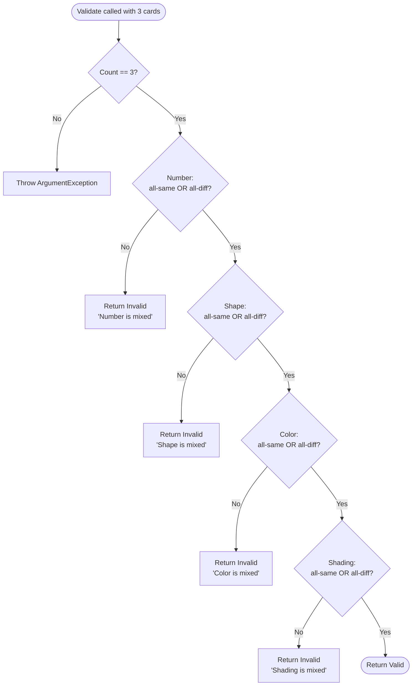

`SetValidator` is the most critical domain service in the game. Every player claim, every AI decision, every board-expansion check flows through it. A bug here does not just corrupt one feature — it corrupts every game mode, local and online, simultaneously. Read this page before touching any claim or board-management code.

<Info>
**Pre-production notice.** SET: 3D Edition is in pre-production. The interfaces and implementation sketches below reflect the current design specification. The determinism requirement (bitwise-identical results on client and server) is a hard constraint that must be respected from the first commit.
</Info>

---

## The Rule

A **Set** is exactly three cards where, for **each** of the four attributes individually, the three values are either **all the same** or **all different**. Two cards sharing a value while the third card has a different value — "mixed" — makes the entire triple invalid, regardless of how the other attributes look.

| Number | Shape | Color | Shading | Valid? |
|--------|-------|-------|---------|--------|
| 1 1 1 | ◇ ◇ ◇ | R G P | S S S | ✅ All-same / all-different |
| 1 2 3 | ◇ ~ ○ | R G P | S T O | ✅ All-different on every attribute |
| 1 1 2 | ◇ ◇ ~ | R G P | S T O | ❌ Number is mixed (1, 1, 2) |
| 1 2 3 | ◇ ~ ○ | R R G | S T O | ❌ Color is mixed (R, R, G) |

The validator checks all four attributes **independently**. An attribute passes its check only if the triple is all-same or all-different — never a mix of the two.

---

## Interface Contract

```csharp
// Domain layer — zero Unity or Nakama dependencies
public interface ISetValidator
{
    /// <summary>
    /// Checks whether exactly three cards form a valid Set.
    /// Throws ArgumentException if threeCards.Count != 3.
    /// </summary>
    SetResult Validate(IReadOnlyList<Card> threeCards);

    /// <summary>
    /// Returns every valid Set (trio) that exists among the supplied cards.
    /// boardCards may contain 3–21 cards.
    /// </summary>
    IReadOnlyList<Card[]> FindAllSets(IReadOnlyList<Card> boardCards);

    /// <summary>
    /// Returns true as soon as one valid Set is found. Faster than FindAllSets
    /// for the "does any Set exist?" board check.
    /// </summary>
    bool AnySetExists(IReadOnlyList<Card> boardCards);
}

/// <summary>
/// Immutable result of a single Validate() call.
/// </summary>
public readonly struct SetResult
{
    public bool    IsValid       { get; }
    public string? InvalidReason { get; }  // e.g. "Color is mixed" — null when valid

    public SetResult(bool isValid, string? reason)
    {
        IsValid       = isValid;
        InvalidReason = reason;
    }
}
```

`SetValidator` (the concrete implementation) is a **stateless singleton** — it holds no instance state and every method is a pure function. Inject it via `ISetValidator` into `GameSession` and any test that exercises claim logic.

---

## Implementing Validate()

```csharp
public SetResult Validate(IReadOnlyList<Card> threeCards)
{
    if (threeCards == null || threeCards.Count != 3)
        throw new ArgumentException("Exactly 3 cards are required.", nameof(threeCards));

    var a = threeCards[0].Attributes;
    var b = threeCards[1].Attributes;
    var c = threeCards[2].Attributes;

    if (!IsValidAttribute(a.Number,  b.Number,  c.Number))
        return new SetResult(false, "Number is mixed");
    if (!IsValidAttribute(a.Shape,   b.Shape,   c.Shape))
        return new SetResult(false, "Shape is mixed");
    if (!IsValidAttribute(a.Color,   b.Color,   c.Color))
        return new SetResult(false, "Color is mixed");
    if (!IsValidAttribute(a.Shading, b.Shading, c.Shading))
        return new SetResult(false, "Shading is mixed");

    return new SetResult(true, null);
}

/// <summary>
/// Returns true if x, y, z are all equal OR all different.
/// Mixed (exactly two the same) returns false.
/// </summary>
private static bool IsValidAttribute<T>(T x, T y, T z) where T : Enum
{
    bool allSame = x.Equals(y) && y.Equals(z);
    bool allDiff = !x.Equals(y) && !y.Equals(z) && !x.Equals(z);
    return allSame || allDiff;
}
```

The method returns on the **first failing attribute** and names it in `InvalidReason`. During development and hint display this string is useful; in production builds `InvalidReason` can be omitted or replaced with an enum code.

<Note>
`IsValidAttribute<T>` uses generic `Enum` constraints so the same helper works for all four attribute types. If profiling later reveals that the generic constraint boxes the enum values, replace the generic with four concrete overloads taking `int` (cast each enum to `int` at the call site). The logic is identical.
</Note>

---

## Implementing FindAllSets()

`FindAllSets` enumerates every unique 3-card combination from the supplied list and returns those that pass `Validate`.

```csharp
public IReadOnlyList<Card[]> FindAllSets(IReadOnlyList<Card> boardCards)
{
    if (boardCards == null) throw new ArgumentNullException(nameof(boardCards));

    var results = new List<Card[]>();
    int n = boardCards.Count;

    for (int i = 0; i < n - 2; i++)
    for (int j = i + 1; j < n - 1; j++)
    for (int k = j + 1; k < n;     k++)
    {
        var trio = new[] { boardCards[i], boardCards[j], boardCards[k] };
        if (Validate(trio).IsValid)
            results.Add(trio);
    }

    return results;
}
```

**Combination counts by board size:**

| Board cards | C(n, 3) combinations |
|-------------|----------------------|
| 3 | 1 |
| 6 | 20 |
| 9 | 84 |
| 12 | 220 |
| 15 | 455 |
| 18 | 816 |
| 21 | 1,330 |

Even at the maximum 21 cards, 1,330 calls to `Validate` (each ~8 enum comparisons) complete in well under 1 ms on any mobile CPU. No threading, caching, or bitwise trickery is required for MVP.

---

## Implementing AnySetExists()

`AnySetExists` uses the same loop but **short-circuits** the moment it finds one valid Set. Never replace it with `FindAllSets().Count > 0` — that enumerates every combination unnecessarily.

```csharp
public bool AnySetExists(IReadOnlyList<Card> boardCards)
{
    if (boardCards == null) throw new ArgumentNullException(nameof(boardCards));

    int n = boardCards.Count;

    for (int i = 0; i < n - 2; i++)
    for (int j = i + 1; j < n - 1; j++)
    for (int k = j + 1; k < n;     k++)
    {
        var trio = new[] { boardCards[i], boardCards[j], boardCards[k] };
        if (Validate(trio).IsValid)
            return true;           // ← short-circuit
    }

    return false;
}
```

`AnySetExists` is called by `GameSession` after **every single board mutation** — after every refill, after every expansion, after the initial deal. Keeping it fast is not optional.

---

## Validation Logic Flowchart



---

## Performance Requirements

<Info>
These are **hard requirements** — not aspirational targets. The game must meet them on the minimum supported Android device.
</Info>

| Method | Max Time | Context |
|--------|----------|---------|
| `Validate()` | < 10 µs | Called on every player and AI claim |
| `FindAllSets(21 cards)` | < 1 ms | AI scan and hint system |
| `AnySetExists(21 cards)` | < 1 ms | Called after every board mutation |

**No allocations in the hot path.** The `trio` array inside both loop bodies allocates. For MVP this is acceptable (the garbage collector handles it), but if profiling shows pressure, switch to a fixed-size three-element `Span<Card>` or pass indices rather than constructing arrays.

**Determinism.** `SetValidator` must produce bit-for-bit identical results when run on the client and on the Nakama server. This means:
- No floating-point arithmetic.
- No `DateTime`, `Guid`, or other platform-dependent values.
- No randomness.
- Enum comparisons only — which are integer comparisons under the hood.

---

## Test Cases

Write unit tests covering at minimum the following scenarios. The `Expected` column is the result of calling `Validate()`.

| # | Number | Shape | Color | Shading | Expected |
|---|--------|-------|-------|---------|----------|
| 1 | 1 1 1 | ◇ ◇ ◇ | R R R | S S S | ✅ Valid (all-same on every attribute) |
| 2 | 1 2 3 | ◇ ~ ○ | R G P | S T O | ✅ Valid (all-different on every attribute) |
| 3 | 1 1 1 | ◇ ~ ○ | R G P | S T O | ✅ Valid (mixed same/different, each attribute consistent) |
| 4 | 1 1 2 | ◇ ~ ○ | R G P | S T O | ❌ Invalid — "Number is mixed" |
| 5 | 1 2 3 | ◇ ~ ○ | R R G | S T O | ❌ Invalid — "Color is mixed" |
| 6 | 1 2 3 | ◇ ~ ○ | R G P | S S O | ❌ Invalid — "Shading is mixed" |
| 7 | 1 2 3 | ~ ~ ○ | R G P | S T O | ❌ Invalid — "Shape is mixed" |
| 8 | 2 2 2 | ○ ○ ○ | P P P | T T T | ✅ Valid (all-same, edge values) |

Also test:
- `Validate` with `threeCards.Count == 2` throws `ArgumentException`.
- `AnySetExists` on a board of 3 cards that form a Set returns `true` without visiting any second combination.
- `FindAllSets` on the same 3-card board returns a list of length 1.

---

## Implementation Checklist

<Steps>
  <Step title="Throws on wrong count">
    `Validate` must throw `ArgumentException` when `threeCards.Count != 3`. Do not silently return invalid — callers must know they passed bad input.
  </Step>
  <Step title="All four attributes checked">
    Verify that the implementation checks `Number`, `Shape`, `Color`, and `Shading` independently. It is easy to paste the four checks and accidentally omit one (e.g., checking `Color` twice and skipping `Shading`).
  </Step>
  <Step title="InvalidReason identifies the attribute">
    `SetResult.InvalidReason` must name the specific attribute that failed (e.g., `"Color is mixed"`), not a generic `"Invalid Set"`. This powers the hint system and debugging.
  </Step>
  <Step title="FindAllSets handles all board sizes">
    Test with board sizes 3, 6, 9, 12, 15, 18, and 21. The triple-loop bounds must correctly produce C(n, 3) unique combinations with no duplicates.
  </Step>
  <Step title="AnySetExists short-circuits">
    Instrument `Validate` with a call counter in a unit test. On a board whose first valid Set is at combination index 3, `AnySetExists` must call `Validate` no more than 4 times (one fail, one fail, one fail, one success — returns).
  </Step>
  <Step title="No UnityEngine references">
    The entire `SetValidator` class must compile without referencing `UnityEngine`. Place it in an assembly definition that excludes Unity references. This ensures the same binary can run inside the Nakama server handler.
  </Step>
  <Step title="No heap allocations in hot path (stretch goal)">
    For MVP the `trio` array allocation per combination is acceptable. When performance profiling begins, replace it with index-based passing: pass `(boardCards[i], boardCards[j], boardCards[k])` directly into an internal overload that takes three `Card` parameters.
  </Step>
</Steps>

---

## Common Mistakes

<Warning>
**Checking only three attributes instead of four.**
The most common bug: a copy-paste error that checks `Color` twice and never checks `Shading` (or vice versa). Write a unit test specifically for a triple that is invalid only on `Shading` — this will catch the omission immediately.
</Warning>

<Warning>
**Replacing AnySetExists with FindAllSets().Count > 0.**
`FindAllSets` always enumerates all combinations. For a 21-card board with a Set near the end, `AnySetExists` may short-circuit after 50 checks instead of completing all 1,330. `AnySetExists` is called after every board mutation; the difference accumulates quickly.
</Warning>

<Warning>
**Using reference equality on Cards.**
`if (card == otherCard)` with a plain `class` compares heap addresses, not attribute values. Always compare Cards using `.Equals()` or ensure the `==` operator is overloaded. If you write `boardCards.Contains(targetCard)` and `Card` lacks a proper `Equals` override, containment checks silently fail.
</Warning>

<Warning>
**Allocating inside the inner validation loop.**
Creating a `new[]` array inside every iteration of a triple-nested loop is fine for MVP, but do not add further allocations (e.g., `new List`, `new SetResult` as a class). Keep `SetResult` a `readonly struct` so it lives on the stack.
</Warning>

---

## Related Pages

<CardGroup cols={2}>
  <Card title="Card Model" href="/core-gameplay/card-model">
    The Card value object and CardAttributes struct that SetValidator operates on.
  </Card>
  <Card title="Board & Dealing" href="/core-gameplay/board-and-dealing">
    How AnySetExists drives refill and expansion decisions after every board change.
  </Card>
  <Card title="Session Lifecycle" href="/core-gameplay/session-lifecycle">
    How GameSession calls Validate() on every claim and AnySetExists() after every mutation.
  </Card>
  <Card title="AI Opponents" href="/core-gameplay/ai-opponents">
    How AIScanner uses FindAllSets() to select a Set to claim.
  </Card>
</CardGroup>
