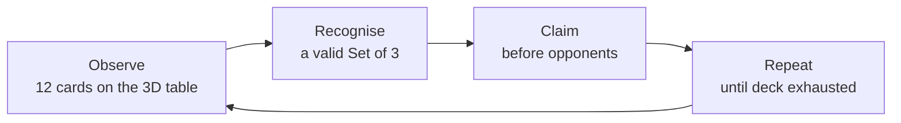

SET: 3D Edition is built on a single conviction from the project's vision document: *"transform a beloved analog pattern-recognition game into a premium, tactile digital board game — one where the tension of a real tabletop race is preserved, the strategic depth of pattern logic is celebrated, and every interaction feels physical, fair, and fast."* That sentence is not marketing copy; it is a technical directive that shapes every decision in the architecture, UI spec, and art direction. Understanding why this is a **digital board game** rather than a puzzle app is the single most important piece of context before reading anything else in these docs.

<Warning>
**Pre-production.** SET: 3D Edition is currently in pre-production. The concept, rules, and architecture are fully specified in the source documents, but no playable build exists yet. All features described on this page are **planned**.
</Warning>

## Why this page exists

A concept document explains the *why* behind the game — the vision, the intended player experience, and the deliberate scope boundaries. Without this framing, individual decisions in the architecture or UI spec can look arbitrary. With it, they become obvious: of course validation is server-authoritative (fairness pillar), of course cards lift off the table in 3D (tactility pillar), of course there are no power-ups (scope boundary).

## Vision statement

> **SET: 3D Edition transforms a beloved analog pattern-recognition game into a premium, tactile digital board game — one where the tension of a real tabletop race is preserved, the strategic depth of pattern logic is celebrated, and every interaction feels physical, fair, and fast, whether you're playing alone against AI, across the world against a stranger, or across the table from a friend.**

This is not a "card game skin on a puzzle engine." It is a digital board game in the fullest sense — built with the presentation quality, social infrastructure, and competitive integrity that the genre demands.

## Core loop

The fundamental loop never changes across any of the three game modes:

A single loop iteration takes 5–30 seconds depending on player skill and board difficulty. A full match lasts **5–12 minutes** — long enough to feel like a complete game, short enough to fit a commute or a coffee break.

## Why "digital board game" and not "puzzle app"

This distinction drives three concrete product decisions that run throughout the codebase:

<Tabs>
  <Tab title="Round Structure">
    Each Set claim is treated as a discrete **round event** — a clear beginning (cards selected), resolution (validation result), and scoring (score ledger update with animation). This is reflected in the `GameSession` state machine, which moves through `Validating → ValidSetAnim → RefillAnim` rather than just toggling a flag. The pacing feels deliberate, not frantic.
  </Tab>
  <Tab title="Social Scaffolding">
    Board games live and die by their social layer. Lobbies, rematches, leaderboards, friend play, and emotes are **core product infrastructure**, not bolt-ons. Nakama's matchmaker, leaderboards, and social primitives are wired directly into the architecture from day one — not added in a later sprint.
  </Tab>
  <Tab title="3D Table Presence">
    The 3D presentation exists specifically to sell the *feeling* of a physical board game — a mat, a deck, cards you can almost pick up. This is what distinguishes SET: 3D Edition from the flat, grid-based mobile puzzle games it could otherwise resemble. Cards hover, tilt slightly in idle, lift when selected, and fly to your score pile when claimed.
  </Tab>
</Tabs>

## Design pillars

These four pillars are not aspirational — they are hard constraints that the GDD, architecture, and Hard Boundaries documents enforce explicitly.

| Pillar | Description | Examples in the codebase |
|---|---|---|
| **Speed & Clarity** | Instant visual feedback, no lag between recognition and action | R3 reactive bindings update HUD the moment `ReactiveProperty<int>` changes; no polling in `Update()` |
| **Fairness** | Server-validated claims and AI that doesn't feel exploitative | Nakama's authoritative Match Handler is the single source of truth; AI uses configurable delays and miss rates, not perfect play |
| **Tactility** | 3D cards feel physical — flip, glow, snap | `CardRenderer` drives Z-axis lift, gold outline, 360° spin-to-score-pile animations keyed on `GameSession` events |
| **Accessibility** | Colorblind modes, shape-only modes, tutorials | Pattern/texture overlays, shape-assist icons, S/M/L card sizes, and text-to-speech are all in-scope for v1.0 |

## Target audience

- **Casual puzzle gamers (10+)** — fast sessions, satisfying feedback, gradual difficulty curve via Campaign Mode
- **Board game enthusiasts** — structured rounds, social features, competitive ranking
- **Family game night users** — Pass & Play mode for 2–8 players on a single device, no accounts required

## Platform and orientation

**Android is the primary (and only v1.0) platform.** Phones are the primary form factor; tablets receive an enhanced layout with larger cards and more breathing room.

| Context | Orientation |
|---|---|
| In-match Game Board | Landscape forced (mimics physical tabletop) |
| All menus and social screens | Portrait + landscape both supported |

## What sets this apart

Three architectural decisions combine to create something genuinely distinctive:

1. **Nakama server authority** — In online play, no client can ever win a contested claim through exploitation. The server runs the exact same `SetValidator` logic and resolves simultaneous claims by message timestamp.
2. **R3 reactive feel** — All state changes (board updates, opponent claims, AI decisions) propagate through a single reactive pipeline. Single Player, Pass & Play, and Multiplayer all feed into the *same* `GameSession` Observables; the Presentation layer never needs to know which mode is active.
3. **One pure rules engine across all modes** — `SetValidator` is a zero-dependency pure C# domain service. The same logic runs as the client's local validator, as the AI's decision engine, and (ported) as the server's authoritative checker. There is no risk of client/server rules drift.

## Scope non-goals (Hard Boundaries for v1.0)

The following items are **explicitly out of scope** at launch. Do not implement, prototype, or stub these unless a formal Change Request is approved:

<Accordion title="Out-of-scope features — click to expand">
- iOS, Web, or any platform beyond Android
- Story mode, narrative cutscenes, or character backstories
- Power-ups, boosters, or any gameplay-altering consumables
- VR/AR support
- Real-money gambling or entry fees for tournaments
- User-created tournaments or custom rule modifiers beyond the settings toggle set
- Local Bluetooth/Wi-Fi multiplayer (no internet required)
- Spectator mode
- Voice chat
- Replay / match recording system
- Localization (strings may be externalized for future translation, but no multi-language support ships in v1.0)
- Adaptive neural-network AI opponents (rule-based only)
- Foldable device reflow
</Accordion>

## Common mistakes

<Warning>
**Common mistake — adding "puzzle game" UX patterns:** Infinite lives, energy timers, level-select grids, and daily spin rewards are puzzle-game conventions. SET: 3D Edition is a digital board game: it uses match lobbies, score ledgers, and ranked MMR. If a proposed UX feature feels more at home in Candy Crush than in Ticket to Ride, it probably doesn't belong here.
</Warning>

## Related pages

<CardGroup cols={2}>
  <Card title="Complete SET Rules" icon="book" href="/game-design/rules">
    The exact rules implemented in code — deck, validation algorithm, board logic, and edge cases.
  </Card>
  <Card title="Game Modes" icon="gamepad" href="/game-design/modes">
    All three top-level modes and their sub-modes in detail: AI tiers, matchmaking, Pass & Play mechanics.
  </Card>
  <Card title="Accessibility" icon="universal-access" href="/game-design/accessibility">
    Planned colorblind mode, shape assist, card sizing, and screen-reader support.
  </Card>
  <Card title="Architecture Overview" icon="diagram-project" href="/architecture/overview">
    How Clean Architecture, R3, Nakama, and VContainer realize these design pillars in code.
  </Card>
</CardGroup>
