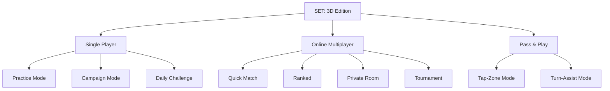

SET: 3D Edition ships with three top-level game modes, each targeting a different play context: solo study, competitive online, and living-room social. All three share the exact same core rules engine (`SetValidator`, `GameSession`, `BoardManager`) — the only difference is the *source* of input and whether a Nakama server or local logic acts as the authority. This "one engine, three modes" design is a core architectural principle, not an accident.

<Warning>
**Pre-production — all features on this page are Planned.** No game modes have been implemented yet. Mode designs may evolve before development begins. See the [Roadmap](/roadmap/overview) for the planned delivery phasing.
</Warning>

## Why this page exists

Understanding mode boundaries — what each mode allows, restricts, and configures — prevents engineers from accidentally coupling mode-specific logic into shared systems. For example, the Hint System should only be instantiated in Single Player modes; the Tap-Zone claim mechanic is Pass & Play only; server-timestamp resolution is Online only. This page is the reference for those boundaries.

## Modes at a glance



All modes run on the same `GameSession` state machine. The only variation is the input source (local touch, AI callback, or Nakama socket) and the validation authority (local `SetValidator` or Nakama Match Handler).

---

## Single Player modes <span style={{color: "#888", fontSize: "0.85em"}}>(Planned)</span>

Single Player is the first delivery phase. It requires no Nakama dependency — `OfflineNetworkService` (a no-op stub implementing the same `INetworkService` interface) is injected instead.

### Practice Mode

| Property | Value |
|---|---|
| **Opponent** | None |
| **Timer** | None |
| **Scoring** | Disabled |
| **Hints** | Unlimited |
| **Purpose** | Learn the rules; no pressure |

Practice Mode is always accessible from the menu. It is never blocked by progression, IAP, or ad state.

### Campaign Mode

A linear series of matches against AI opponents of increasing difficulty. Winning a match unlocks the next. There is no branching, no narrative, and no skill-based routing — linear progression only.

- Starting difficulty: Easy
- Progression: Easy → Medium → Hard → Expert
- No session timer; matches end by the standard deck-exhausted condition

### Daily Challenge

| Property | Value |
|---|---|
| **Board seed** | Fixed, deterministic, date-derived |
| **Timer** | No countdown — players race for *fastest completion* |
| **Scoring** | Time to clear the entire deck |
| **Leaderboard** | Global, via Nakama Leaderboards module |
| **Frequency** | New seed every calendar day |

The Daily Challenge uses the same shuffle algorithm as other modes but with a fixed seed derived from the current date. Every player worldwide sees the same board. Leaderboard ranking is by fastest full-deck clear time.

<Note>
The Daily Challenge seed must be deterministic and tamper-resistant. The server generates and authorises the seed; clients do not derive it locally.
</Note>

---

## AI difficulty tiers <span style={{color: "#888", fontSize: "0.85em"}}>(Planned)</span>

The AI opponent is a rule-based scanner — it calls `SetValidator.FindAllSets()` on the current board, waits a randomised delay, then submits a Claim. It does **not** use machine learning or any adaptive neural-network logic.

| Tier | Reaction delay (s) | Miss rate | False-start rate | Feel |
|---|---|---|---|---|
| **Easy (Novice)** | 4.0 – 8.0 | 20 % | 10 % | Beginner-friendly; often wrong |
| **Medium (Adept)** | 2.0 – 4.0 | 10 % | 5 % | Competitive for casual players |
| **Hard (Master)** | 0.8 – 2.0 | 2 % | 2 % | Fast; feels like a strong human |
| **Expert (Grandmaster)** | 0.3 – 0.8 | 0 % | 1 % | Near-instant; no mercy |

All delays are randomised uniformly within the stated range. If the board changes while the AI is waiting (because the player claimed a Set), the AI cancels its timer via `IAIScanner.Cancel()` and restarts the scan against the new board.

### Rubber-band assist <span style={{color: "#888", fontSize: "0.85em"}}>(Planned, toggle)</span>

If the player's Set count falls **3 or more** behind the AI's count, the `GameSession` temporarily shifts the AI to the next easier tier by passing a modified `AIDifficulty` to `AIScanner`. This is a configurable on/off toggle in match setup — it is not always active.

<Note>
Rubber-band assist is implemented entirely in `GameSession`; `AIScanner` itself is stateless with respect to difficulty adjustments. The session simply re-instantiates or reconfigures the scanner.
</Note>

### Hint system <span style={{color: "#888", fontSize: "0.85em"}}>(Planned — Single Player only)</span>

- Available in Practice Mode (unlimited) and vs-AI modes (limited charges)
- Default: **3 hints per match** (configurable in settings)
- A hint highlights **one card** that belongs to a valid Set on the current board — not the full Set
- If no Set exists when the player requests a hint, the hint is **not consumed** and a notification is shown
- Hints have no effect on scoring
- The `HintService` calls `SetValidator.FindAllSets()` then picks one card at random from the results

---

## Online Multiplayer modes <span style={{color: "#888", fontSize: "0.85em"}}>(Planned)</span>

Online modes require an active internet connection and use **Nakama as the server-authoritative backend**. The client never self-validates a Set in these modes; it sends raw card IDs and waits for the Nakama Match Handler to respond.

**Match size:** 2–4 players.

### Quick Match

Unranked. Matchmaking pairs available players without affecting MMR. No rating change. Fast queue — intended for casual play when players don't want to risk their ranking.

### Ranked

Affects the player's MMR (Elo-style rating). Matchmaker pairs players by current rating. Post-match results screen shows MMR change (`1204 → 1231 (+27)`). Ranked history is displayed on the Profile screen.

### Private Room

| Feature | Detail |
|---|---|
| **Room code** | Host generates a shareable 8-character code |
| **Player count** | 2–4 |
| **Rule config** | Host can set board size (12/15/18), penalty mode, and timed toggle before starting |
| **In-room chat** | Not available (out of scope for v1.0) |
| **Start condition** | Host taps Start; all players in lobby are included |

### Tournament Mode

- Server-scheduled bracket elimination
- Up to **8 players** per tournament bracket
- Brackets are created and managed server-side by Nakama's Tournament module
- **No user-created tournaments** — only server-scheduled events (v1.0 scope)
- No entry fees; no real-money prizes

### Simultaneous claims (online)

When two clients submit a Claim within the same server Tick (50 ms at 20 Hz):
1. The Nakama Match Handler compares message timestamps.
2. The **earlier timestamp wins**. Ties (exact same timestamp) are broken by **player ID** (deterministic, not random).
3. The first valid Claim is processed; the second Claim is validated against the **updated board** — if the cards were already removed, it is automatically invalid.

### Reconnect window

A disconnected player has **30 seconds** to reconnect. During the reconnect window, the match continues without that player. If the player does not reconnect within 30 seconds, they forfeit. Their accumulated score is preserved in the final results but they cannot win.

---

## Pass & Play (local multiplayer) <span style={{color: "#888", fontSize: "0.85em"}}>(Planned)</span>

Pass & Play is the "living room" mode — **2–8 players on a single Android device, fully offline**. No Nakama connection is required. Validation runs through the local `SetValidator` and `GameSession` using `OfflineNetworkService`.

### Tap-Zone Mode

The default claim mechanic for Pass & Play:

1. Any player selects 3 cards on the shared board.
2. To finalize a Claim, the player **taps their color-coded claim zone** at the screen edge.
3. The first complete claim (3 cards selected + zone tapped) that the system processes within the input debounce window wins.
4. On a successful claim, a **confetti burst** animates at the winning player's zone.

```
┌──────────────────────────────────────────────────────────────┐
│[⏸] 🔴P1:2  🔵P2:3  🟢P3:1  🟡P4:0         Deck: 30            │
├──────────────────────────────────────────────────────────────┤
│           TAP YOUR COLOR ZONE AFTER SELECTING CARDS           │
│   [🔴 P1 CLAIM]  [🔵 P2 CLAIM]  [🟢 P3 CLAIM]  [🟡 P4 CLAIM]  │
└──────────────────────────────────────────────────────────────┘
```

Claim zone buttons span the bottom edge and are sized for simultaneous multi-touch. Up to 8 zones are supported (scrollable row for 5–8 players).

### Turn-Assist Mode (optional toggle)

For younger or less experienced players: turns become sequential rather than race-based. Only the active player can select cards. The active player changes after each Claim attempt (valid or invalid). This toggle is set during Pass & Play setup and cannot be changed mid-match.

### Pass & Play HUD details

- Each player is assigned a unique color during setup (name + color picker)
- No login required; player names are local session only
- End-of-session summary shows fun stats ("Fastest Reflex," longest streak per player)

---

## Rule customisation options <span style={{color: "#888", fontSize: "0.85em"}}>(Planned)</span>

Hosts can configure the following before starting a Private Room or Pass & Play match. All other modes use fixed defaults.

| Option | Values | Default |
|---|---|---|
| **Board size** | 12 / 15 / 18 | 12 |
| **Penalty mode** | None / Time / Point | None |
| **Timed mode** | On / Off | Off |
| **Timer duration** | Configurable (e.g., 5 min) | 5 min |
| **Assist hints** | On / Off | Off |

### Penalty modes summary

| Mode | Effect |
|---|---|
| **None** | Invalid Claim has no consequence beyond deselecting cards |
| **Time** | −5 seconds from the global match clock (configurable amount). If clock hits ≤ 0, match ends. |
| **Point** | −1 from the claiming player's score (minimum 0) |

### Timer rules

- The timer is a **global match countdown** visible to all players in the HUD.
- In Single Player, the timer **pauses** when the Pause Menu is open.
- In Online Multiplayer, the timer **continues** while the game is live — pausing is not allowed mid-match. If a player disconnects, the timer continues for the remaining players.
- When the timer reaches 0, the match ends immediately. No further Claims are processed.

---

## Common mistakes

<Warning>
**Common mistakes when working with modes:**

1. **Instantiating `HintService` in multiplayer or Pass & Play** — Hints are Single Player only. The `GameSession` factory should not wire `HintService` for any other mode.

2. **Applying rubber-band assist in online matches** — Rubber-band assist is only valid in Single Player vs AI. There is no server-side rubber-band; the AI tier is fixed for the match.

3. **Using `SetValidator` to confirm a Claim in online play** — In Online Multiplayer, the client sends raw card IDs and waits for the server result. Client-side `SetValidator` is used only for hints and local prediction animations, never for the authoritative result.

4. **Forgetting the Tap-Zone step in Pass & Play** — Card selection alone does not submit a Claim in Pass & Play. The player must also tap their color-coded zone. Tests must cover the "3 cards selected, no zone tapped" state.

5. **Allowing user-created tournaments** — Only server-scheduled tournaments are in-scope for v1.0. Any UI that lets players create or configure their own tournament bracket is explicitly out of scope.
</Warning>

## Related pages

<CardGroup cols={2}>
  <Card title="Complete SET Rules" icon="book" href="/game-design/rules">
    The core rules that apply identically across every mode — deck, validation, board logic, end conditions.
  </Card>
  <Card title="Concept" icon="lightbulb" href="/game-design/concept">
    Why the three-mode structure exists and how each mode maps to a distinct player context.
  </Card>
  <Card title="Accessibility" icon="universal-access" href="/game-design/accessibility">
    Colorblind mode, shape assist, and other features that apply across all modes.
  </Card>
  <Card title="Architecture Overview" icon="diagram-project" href="/architecture/overview">
    How the "one engine, three modes" principle is realised via R3 Observables and the GameSession interface.
  </Card>
</CardGroup>
