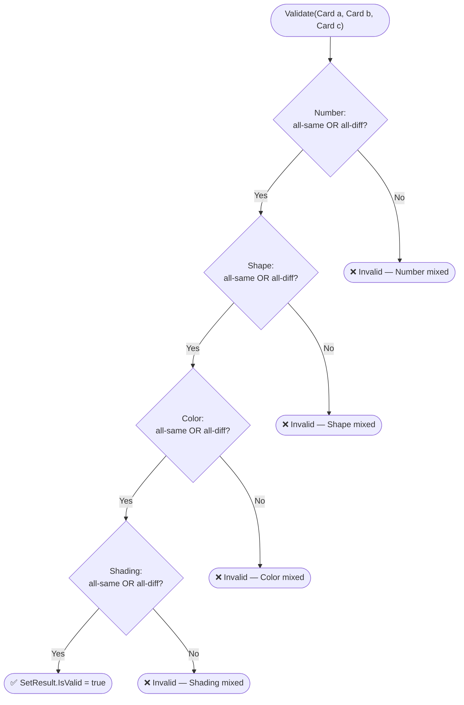
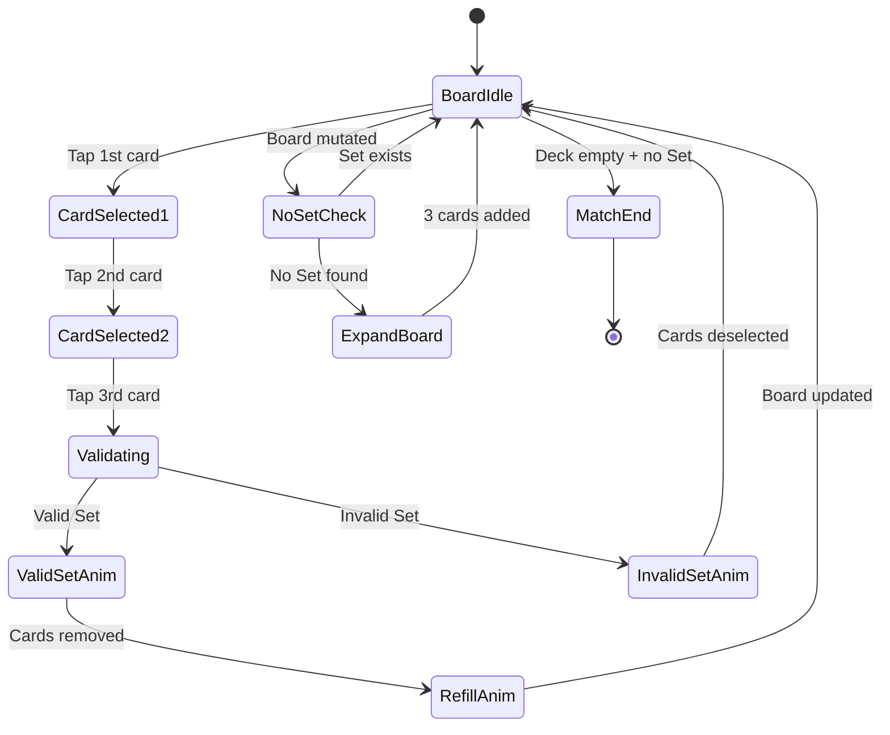

Every mode in SET: 3D Edition — Single Player, Online Multiplayer, Pass & Play — runs its rules through the same `SetValidator` domain service and the same `GameSession` state machine. There is no separate "multiplayer rules" or "AI rules." This page is the **single authoritative source** for all gameplay logic that engineers, QA testers, and the Nakama server-side Match Handler must implement identically. Any ambiguity found here should be raised and resolved before writing code, not after.

<Warning>
**Pre-production.** SET: 3D Edition is currently in pre-production. The rules on this page are fully specified, but none of the described systems have been implemented yet. All validator logic, board behaviour, and state machine transitions are **planned**.
</Warning>

## Why one authoritative rules document matters

If the client's local validator and the server's authoritative validator ever disagree, players will see their correct Sets rejected or their invalid Sets accepted — a fairness and trust disaster. Sharing a single rules spec (and identical test vectors) between the C# client domain layer and the server-side Match Handler prevents that drift from day one.

---

## The deck

The game uses a deck of **81 unique cards**. Each card is defined by exactly four attributes:

| Attribute | Value 1 | Value 2 | Value 3 |
|---|---|---|---|
| **Number** | 1 | 2 | 3 |
| **Shape** | Diamond | Squiggle | Oval |
| **Color** | Red | Green | Purple |
| **Shading** | Solid | Striped | Open |

Every combination of one value from each attribute exists exactly once. That is 3 × 3 × 3 × 3 = **81 cards**. There are no duplicates and no missing combinations.

**Shuffling:**
- In all modes except Daily Challenge: a non-deterministic random shuffle using a time-based seed.
- In **Daily Challenge**: a deterministic shuffle using a fixed, date-derived seed. The same seed produces the same board for every player globally on that calendar day.
- Algorithm: Fisher-Yates shuffle via `System.Random(seed)` in the `Deck` domain entity.

---

## The valid Set rule

This is the most important section on this page. Everything else in the game exists to support this rule.

<Note>
**The rule in one sentence:** For every one of the four attributes, the three cards must show either all the same value or all different values. Two matching and one different on any attribute = **invalid**.
</Note>

### Formal definition

A **Set** is a group of exactly 3 cards where, for **each** of the four attributes (Number, Shape, Color, Shading), the values across the three cards are:
- **All identical** across all three cards, **OR**
- **All distinct** across all three cards.

If any single attribute is "mixed" (two cards share a value and the third differs), the entire group is invalid — no exceptions.

### Examples

| Card A | Card B | Card C | Valid? | Reason |
|---|---|---|---|---|
| 1 Red Solid Diamond | 2 Green Solid Squiggle | 3 Purple Solid Oval | ✅ | Number: all diff. Shape: all diff. Color: all diff. Shading: all same. |
| 1 Red Solid Diamond | 1 Red Solid Diamond | 1 Red Solid Diamond | ✅ | All attributes all same (hypothetical — duplicates don't exist in the deck, but the rule holds). |
| 1 Red Solid Diamond | 2 Red Striped Squiggle | 3 Green Open Oval | ❌ | Color is mixed: Red, Red, Green — two same, one different. |

### Validation pseudocode

This is the exact algorithm implemented by `SetValidator` in the `Set.Core` domain assembly. Do not add shortcuts or early-exit tricks that could diverge from this definition.

```csharp
bool IsValidSet(Card a, Card b, Card c)
{
    return IsValidAttribute(a.Number,  b.Number,  c.Number)
        && IsValidAttribute(a.Shape,   b.Shape,   c.Shape)
        && IsValidAttribute(a.Color,   b.Color,   c.Color)
        && IsValidAttribute(a.Shading, b.Shading, c.Shading);
}

bool IsValidAttribute<T>(T x, T y, T z)
{
    bool allSame = x.Equals(y) && y.Equals(z);
    bool allDiff = !x.Equals(y) && !y.Equals(z) && !x.Equals(z);
    return allSame || allDiff;
}
```

`IsValidAttribute` is a pure function over any enum type — Number, Shape, Color, or Shading. It has no side effects and allocates nothing.

### Validation flowchart



**Performance requirement:** `Validate()` must complete in under 10 µs. `FindAllSets()` across a full 21-card board (1,330 combinations) must complete in under 1 ms on a mid-range mobile CPU. No heap allocations after the first call.

---

## Board layout and dealing

### Initial deal

At match start, 12 cards are drawn from the top of the shuffled deck and placed face-up in a **4 × 3 grid** (4 columns, 3 rows). Slot indices are assigned left-to-right, top-to-bottom: slot 0 is top-left, slot 11 is bottom-right. The grid always keeps **4 columns**; expansion adds rows.

```
Slot layout (4 columns × 3 rows):
┌────┬────┬────┬────┐
│  0 │  1 │  2 │  3 │
├────┼────┼────┼────┤
│  4 │  5 │  6 │  7 │
├────┼────┼────┼────┤
│  8 │  9 │ 10 │ 11 │
└────┴────┴────┴────┘
```

### Refill

Immediately after a valid Set is claimed and its three cards are removed, the empty slots are refilled in-place from the top of the Deck. Cards go back into the **same slot indices** the claimed cards occupied — the board does not compact or rearrange. If the Deck is empty, those slots remain empty.

### Expansion (no Set exists)

After every board mutation (initial deal, refill, or expansion), the system calls `AnySetExists()`. If no valid Set exists **and** the Deck has ≥ 3 cards remaining, a "No Set" notification is displayed briefly and 3 new cards are added. The grid always retains 4 columns; expansion appends additional rows:

| Board size before | After expansion | Grid layout |
|---|---|---|
| 12 cards | 15 cards | 4 columns × 3 full rows + 3 slots in a 4th row |
| 15 cards | 18 cards | 4 columns × 4 full rows + 2 slots in a 5th row |
| 18 cards | 21 cards (maximum) | 4 columns × 5 full rows + 1 slot in a 6th row |

**Maximum board size is 21 cards.** Once the board reaches 21 and no Set exists, the game ends immediately — even if the Deck still contains cards. Official SET rules state that no more cards can be added beyond 21.

If the Deck has fewer than 3 cards and no Set exists, the game also ends (no partial deal allowed).

---

## Game flow

### Real-time, simultaneous play

All players act at the same time — there is no turn order. Any player can tap cards and attempt to claim a Set at any moment.

### Card selection

- Tap a card to **select** it (visual: lifts on Z-axis, gold glow outline).
- Tap a selected card again to **deselect** it.
- The moment a third card is selected, the Claim is automatically submitted (local modes) or sent to the Nakama server (online mode).
- In **Pass & Play**, selecting 3 cards does not auto-submit; the player must additionally tap their color-coded claim zone at the screen edge.

### Claim resolution



**Input is locked** during all animation states (`ValidSetAnim`, `RefillAnim`, `InvalidSetAnim`, `ExpandBoard`). Any taps during a lock are silently discarded — not queued.

---

## Scoring

| Event | Score change |
|---|---|
| Valid Set claimed | **+1 point** |
| Invalid Set (Penalty Mode: None) | No change |
| Invalid Set (Penalty Mode: Point) | **−1 point** (minimum 0) |
| Invalid Set (Penalty Mode: Time) | **−5 seconds** from match clock (configurable) |

Score can never go below 0.

---

## Penalty modes

| Mode | Effect on invalid claim |
|---|---|
| **None** | Cards are deselected; no further consequence |
| **Time** | Player's remaining match clock reduced by 5 seconds (default, configurable). If clock reaches ≤ 0, the match ends. |
| **Point** | Player's score reduced by 1 (floor: 0) |

Penalties are applied immediately. In online multiplayer, the Nakama server broadcasts the penalty to all clients.

---

## End game

### End conditions

The match ends when **any one** of these conditions is true:

1. The Deck is empty **and** no valid Set exists on the Board.
2. The Board is at 21 cards and no valid Set exists (regardless of Deck size — no further cards can be added per official SET rules).
3. *(Timed mode)* The global match timer reaches 0.
4. *(Timed mode + Time penalty)* A time penalty reduces a player's clock to ≤ 0.

### Determining the winner

1. The player with the **most Sets collected** wins.
2. **Tie-breaker** (optional, configurable per match): the player with the fewest invalid attempts wins.
3. If still tied: a draw is declared.

In online multiplayer, the Nakama Match Handler calculates and broadcasts final results to all clients.

### Disconnects and forfeits

- A player who disconnects is considered to have forfeited. Their accumulated score is retained but they cannot win.
- Remaining players continue to play.
- If **all** opponents disconnect, the remaining player wins by default.
- **Reconnect window:** 30 seconds. After that, the disconnected player forfeits permanently.

---

## Edge cases

| Scenario | Correct behaviour |
|---|---|
| **Simultaneous Claims (Online)** | Nakama server resolves by message timestamp. If two claims arrive within the same server Tick (50 ms), the tie is broken by player ID (deterministic). The second claim is processed against the updated board — if those cards were already removed, the second claim is automatically invalid. |
| **Input during animation lock** | All taps are silently ignored. Not queued, not buffered. |
| **Board at 21 with no Set** | Match ends immediately. The Deck may still have cards — this is intentional per official SET rules. |
| **Deck has 1 or 2 cards, no Set on board** | Match ends. No partial expansion deal is performed. |
| **Expansion when Deck has exactly 3 cards** | Deal all 3. Board expands by 3. Then check `AnySetExists()` again. If still no Set and Deck is now empty, match ends. |
| **Slots remaining empty after refill** | When the Deck is empty after a valid Set, the three vacated slots stay empty. The board may have fewer than 12 occupied slots. `AnySetExists()` still runs across all occupied slots only. |
| **`AnySetExists()` call frequency** | Must be called after **every** board mutation: initial deal, refill, expansion. Never skip it. |

---

## Common mistakes

<Warning>
**Common mistakes when implementing the rules:**

1. **Skipping `AnySetExists()` after refill** — The most frequent bug. After cards are refilled, the board *might* have no valid Set (especially late-game with few cards). Always call `AnySetExists()` after every board mutation.

2. **Treating the 21-card limit as "add to 21, then check"** — The board stops expanding at 21. If the board is *already* at 21 and no Set exists, the game ends. You do not deal a further 3.

3. **Allowing partial expansion** — If `Deck.CardsRemaining < 3` and no Set exists, end the match. Do not deal 1 or 2 cards.

4. **Rearranging slots during refill** — New cards go into the **same slot indices** the claimed cards occupied. The board never compacts. Visual position = slot index.

5. **Client-side Set validation in multiplayer** — The client sends raw card IDs to the server and waits for the authoritative result. The client's local `SetValidator` is used only for hint calculation and optimistic prediction, never for the official score.
</Warning>

## Related pages

<CardGroup cols={2}>
  <Card title="Glossary" icon="book-open" href="/welcome/glossary">
    Precise definitions for Set, Board, Slot, Claim, Refill, Expansion, and all other domain terms.
  </Card>
  <Card title="Game Modes" icon="gamepad" href="/game-design/modes">
    How these rules apply across Single Player, Online Multiplayer, and Pass & Play — including mode-specific rule variants.
  </Card>
  <Card title="Session Lifecycle" icon="gear" href="/core-gameplay/session-lifecycle">
    Implementation of SetValidator, GameSession state machine, BoardManager, and Deck in the domain layer.
  </Card>
  <Card title="Card Model" icon="diagram-project" href="/core-gameplay/card-model">
    Match aggregate, Card value object, SetResult, and all domain invariants that enforce these rules at the code level.
  </Card>
</CardGroup>
