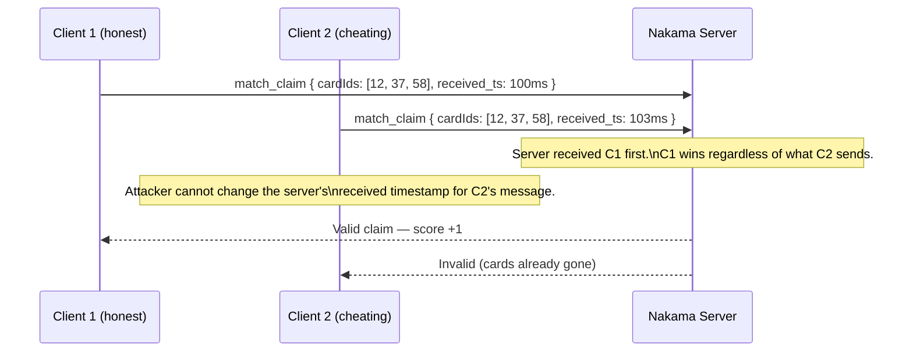
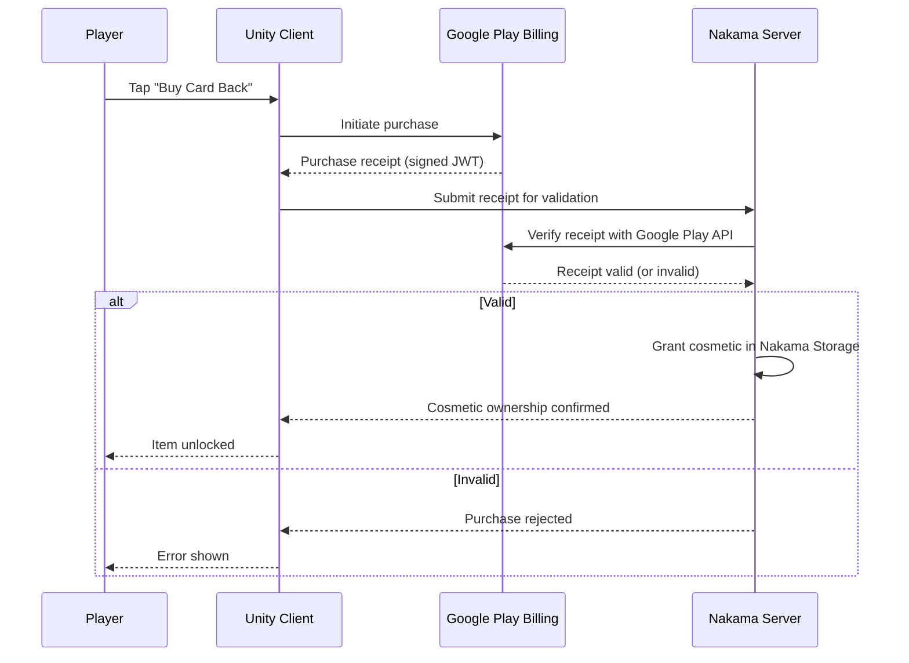

Competitive games attract manipulation. The architecture of SET: 3D Edition's online mode is designed so that cheating is **structurally impossible**, not merely detectable after the fact. A cheating client cannot influence Set validation results, cannot back-date a claim timestamp, cannot grant itself cosmetics, and cannot corrupt the leaderboard — because the server owns every one of those outcomes and the client is never asked to self-report them.

This page documents the specific mechanisms that enforce this, so that when you are implementing client features you understand which boundaries must never be crossed.

<Warning>
**Pre-production — Planned Feature.** All anti-cheat mechanisms, rate limiting, IAP validation, and Nakama integration described on this page are planned features for a game currently in pre-production. None of these systems are implemented yet.
</Warning>

---

## The Fundamental Defence

The most important security property of the system is also the simplest: **the client sends intent, not outcomes**.

When a player taps three cards, the client sends their IDs to the server. It does not send "these cards form a valid Set." It does not pre-validate and skip sending invalid claims. The server runs `SetValidator` on every claim independently of what the client thinks. The server's result is the result.

A modified client that injects a "valid" claim message for three cards that do not form a Set will receive the same "invalid" response from the server as an honest client would. There is nothing the client can send to change the server's validation outcome.

---

## What the Client Can and Cannot Do

| Client **Can** | Client **Cannot** |
|---|---|
| Select cards visually and highlight them | Call `SetValidator` to pre-check in multiplayer |
| Send a claim intent (card IDs) to the server | Modify board state locally in multiplayer |
| Show a "claiming…" UI state before confirmation | Decide claim resolution order |
| Receive and display server-broadcast state | Affect other players' scores or penalties |
| Play animations triggered by `ApplyServerState` | Grant itself cosmetic items |
| View leaderboard data fetched from the server | Submit leaderboard scores directly |

---

## Rate Limiting

Sending hundreds of claim messages per second does not help an attacker — it actively hurts them. The Nakama match handler applies a **per-player, per-tick rate limit** on incoming claim messages.

The processing model:

1. The server collects all client messages since the last tick.
2. For each player, it processes **at most one claim per tick** (50 ms window).
3. Excess claims are discarded — they do not queue up for future ticks.

A client that floods the server with `match_claim` messages will have all but one processed per tick, and that one will be validated on its merits. The flood provides zero advantage and wastes bandwidth.

The rate limit is configured in the Nakama match handler logic. When implementing the handler, ensure the rate-limit check runs **before** claim validation, so attackers cannot even reach the validator with excess messages.

---

## Simultaneous Claim Fairness

Simultaneous claims are resolved entirely by **server-received timestamp**. The only way for a player to win a contested claim is to send the message earlier — which means tapping faster. No client-side manipulation can backfill a timestamp on the server.

The only edge case — two messages with identical server-received timestamps — is resolved by **lower session ID**, a deterministic tiebreaker that is documented, tested, and consistent.

---

## Client-Side Save Integrity

Local save data (personal stats, settings, unlocked cosmetics for offline modes) is protected by an **HMAC signature with an obfuscated key**. On load, `LocalSaveService` verifies the signature. If tampering is detected:

1. The corrupted data is discarded.
2. Stats are reset to defaults.
3. Competitive data (scores, MMR, leaderboard positions) is **unaffected** — it is owned by the server, not the local save file.

The HMAC defence is a deterrent against casual save editing. It is not a cryptographic guarantee against a determined attacker with root access — but that does not matter, because the server owns all competitive data. A player can corrupt their local save to infinity without affecting their leaderboard position or opponents' matches.

---

## IAP Receipt Validation

Cosmetic items purchased via Google Play are not granted by the client. The flow is:

The client **never decides ownership**. Even if a client modifies its local save to mark a cosmetic as owned, the server-side Nakama Storage record is authoritative. The cosmetic will not appear on other players' devices or persist across reinstalls.

---

## Server-Side Data Ownership Table

| Data | Authoritative Owner | Notes |
|---|---|---|
| Set validation result | **Server** | Client never validates in multiplayer; server runs `SetValidator` |
| Claim resolution order | **Server** | Timestamp + deterministic tiebreaker (lower session ID) |
| Player scores per match | **Server** | Client displays only; cannot be self-reported |
| MMR and rank | **Server** | Updated by server post-match; client shows delta from payload |
| Cosmetic ownership | **Server** | IAP receipt verified server-side before Nakama Storage grant |
| Daily Challenge results | **Server** | Seed provided by server; leaderboard entry submitted to Nakama |
| Leaderboard positions | **Server** | Nakama leaderboard module; client cannot write directly |
| Local stats and settings | **Client** | HMAC-protected; competitive integrity unaffected if tampered |

---

## What Is Not In Scope for v1.0

The following anti-cheat features are **explicitly out of scope** for the initial release. Do not implement them:

- **Replay system for dispute resolution.** Disputes are handled by the server's authoritative log. A full replay viewer is a post-launch roadmap item.
- **Real-time anti-cheat scanning** (e.g., memory scanning, root detection). Structural authority is the primary defence; scanning adds complexity without changing the attack surface meaningfully for this game type.
- **Spectator mode for moderation.** Spectator mode itself is out of scope for v1.0 (per Hard Boundaries §3.1).

Any of these require a formal Change Request before engineering work begins.

---

## Hard Boundary Reminder

<Note>
**Server-authoritative for all multiplayer is a Hard Boundary.** Any change that introduces client-side Set validation in online modes — even temporarily, even "just for testing" — requires a formal change request reviewed by the Product Owner and Tech Lead before implementation. This is not a preference; it is a project constraint documented in the Hard Boundaries specification.
</Note>

---

## Implementation Checklist

- [ ] `IOnlineGameSession` has **no `ValidateSet` method** — only `SendClaim`. Verify this before writing any multiplayer game flow code.
- [ ] Rate limiting is configured in the Nakama match handler before the claim validation path
- [ ] `LocalSaveService` computes and verifies the HMAC signature on every load and save
- [ ] IAP receipt validation runs server-side via Google Play's verification API before any Nakama Storage grant
- [ ] Deterministic tiebreaker (lower session ID) for exact-millisecond simultaneous claims is implemented and covered by a server-side unit test
- [ ] Client-side cosmetic unlock UI reads from server-confirmed Nakama Storage, not from the local save file
- [ ] Leaderboard submissions go through the Nakama leaderboard module API, not a direct client write

---

## Common Mistakes

<Warning>
**Common Mistakes**

- **Adding a local `SetValidator` call in multiplayer "just for responsiveness."** Even if the result only drives a visual (e.g., a pre-emptive glow on the selected cards), you have now made the client's visual truth diverge from the server's true outcome. When the server sends a different result, the rollback is jarring. Use a neutral "claiming…" state instead.
- **Storing competitive scores only in the local save file.** If the server is the source of truth for MMR and leaderboard position, writing to the local save for "convenience" creates a split truth. On reinstall or account migration, the local data is gone. The server data persists.
- **Skipping rate limiting on claim messages.** Without rate limiting, a bot can send thousands of claims per second, saturating the tick's processing queue and causing server-side lag for all players in the match.
- **Granting cosmetic ownership on the client.** Even if you trust the purchase flow, a client-side grant is trivially bypassed with a local save edit. The server must always be the granting authority.
- **Assuming a valid-looking claim is valid.** The server must validate every claim from first principles using `SetValidator`, regardless of how plausible the claim looks. Never short-circuit server validation.
</Warning>

---

## Related Pages

<CardGroup cols={2}>
  <Card title="Authority Model" href="/multiplayer/authority-model">
    The IMultiplayerService contract, why Nakama was chosen, and the IOnlineGameSession interface design.
  </Card>
  <Card title="Match Lifecycle" href="/multiplayer/match-lifecycle">
    The full match flow including simultaneous claim resolution and post-match MMR updates.
  </Card>
  <Card title="Sync & Reconnect" href="/multiplayer/sync-and-reconnect">
    Full-state broadcasts, the client mirror model, and the 30-second reconnect window.
  </Card>
</CardGroup>
