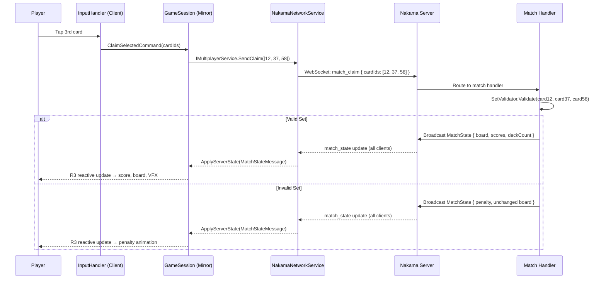

In SET: 3D Edition's online modes, no gameplay decision — Set validity, score change, or claim resolution order — is ever made by a client. Every competitive outcome flows from one source of truth: the **Nakama authoritative match handler** running on the server. This page explains why that design was chosen, how the client and server communicate, and what code contracts enforce the boundary so that client code can never accidentally break it.

<Warning>
**Pre-production — Planned Feature.** The Nakama integration, match handler, and all multiplayer systems described on this page are architectural specifications for a game currently in pre-production. None of the networking code is implemented yet. Implementation should follow this document as the blueprint.
</Warning>

---

## Why Server Authority?

In a real-time card game where two players can tap the same Set within milliseconds of each other, the client cannot be trusted to resolve claims fairly or correctly. Three problems arise if clients self-validate:

1. **Cheating is trivial.** A modified client can pre-validate a Set and send the result rather than the raw card IDs, guaranteeing a win on every contested claim.
2. **Race conditions are unresolvable.** Two clients seeing two different "first claim" results with no shared clock to arbitrate creates an unsolvable split-brain.
3. **State diverges.** Without a single broadcaster, clients accumulate subtle differences in board state, scores, or deck order that become corrupted game sessions.

Server authority eliminates all three: the server owns the canonical state, runs the validation, resolves ties by server-received timestamp, and broadcasts the result. Every client receives the same update.

---

## The Core Rule

<Tip>
**One sentence to internalise:** In multiplayer, the client sends **card IDs only**. It never calls `SetValidator` to decide whether those cards form a valid Set.
</Tip>

The Unity client collects the player's three card selections and fires a `match_claim` message over the Nakama WebSocket. The Nakama match handler runs `SetValidator` on the server, updates match state, and broadcasts the new `MatchState` to all connected clients. The client then receives that state update and applies it via `GameSession.ApplyServerState()`. The UI reacts automatically through the R3 reactive stream.

There is no shortcut path where the client checks first and sends only valid claims. That would still be a form of cheating enablement — an attacker could intercept the send and replay it with different IDs.

---

## Architecture

The diagram below shows every component involved in a single multiplayer claim, from the player's finger to the state broadcast that reaches all clients.



The client's `GameSession` is a **mirror** in multiplayer — it holds a copy of the server's state and applies updates atomically. It never computes state independently.

---

## Why Nakama Over Unity Netcode or Photon?

The project evaluated several networking options before choosing Nakama. The comparison below captures the reasoning:

| Concern | Unity Netcode / Photon | Nakama |
|---|---|---|
| Authoritative match validation | Requires custom relay or dedicated server setup | Built-in authoritative match handler (Go / TypeScript / Lua runtime) |
| Matchmaking | Not included; requires third-party or custom service | Native matchmaker with rating-based pooling |
| Leaderboards & tournaments | Not included | Native leaderboard and tournament modules |
| Cloud save / player profiles | Not included | Native storage engine (key/value per user) |
| Friends, parties, and invites | Not included | Built-in friends, groups, and party/lobby primitives |
| Auth | Not included | Device ID, Google Play Games, Sign in with Apple |
| Hosting model | Proprietary PaaS; per-MAU pricing at scale | Self-hostable (Docker) **or** Heroic Labs managed cloud |

**The key advantage:** Nakama replaces at least four previously separate infrastructure concerns — matchmaking, leaderboards, cloud save, and auth — with one coherent, self-hostable backend. There is no per-MAU pricing lock-in at scale, and the Heroic Labs managed cloud option reduces DevOps overhead during launch.

---

## Nakama Components Used

| Component | Role in SET: 3D Edition |
|---|---|
| **Match Handler** (TypeScript / Lua / Go) | Custom authoritative game loop; 20 Hz tick rate; runs `SetValidator`, resolves simultaneous claims, broadcasts `MatchState` |
| **Matchmaker** | Rating-based player pooling for Quick Match and Ranked modes |
| **Leaderboards** | Daily Challenge global scores; Ranked MMR tracking |
| **Storage Engine** | Cloud save for player profiles, cosmetic ownership, and match history |
| **Friends / Party** | Friends list, private room lobbies, and invite system |
| **Auth** | Device ID auth and Google Play Games Sign-in |

---

## Client-Side Interface Contract

The entire networking layer is hidden behind a single interface defined in the Application assembly. No gameplay or UI code ever imports a Nakama type directly:

```csharp
// Application assembly — zero Nakama dependencies
public interface IMultiplayerService
{
    /// <summary>Opens a WebSocket connection and joins the given match.</summary>
    Task ConnectAsync(string matchId);

    /// <summary>
    /// Sends a Set claim to the server. The client does NOT validate the Set locally —
    /// the server runs SetValidator and broadcasts the result.
    /// </summary>
    void SendClaim(int[] cardIds);

    /// <summary>Incoming server messages as a reactive stream.</summary>
    IObservable<ServerMessage> Messages { get; }

    /// <summary>Closes the WebSocket connection gracefully.</summary>
    void Disconnect();
}
```

The concrete `NakamaNetworkService` in the Infrastructure assembly implements `IMultiplayerService` using the Nakama .NET Client SDK. The Application layer depends only on the interface — it can be swapped for a mock during testing without any changes to game logic.

---

## The IOnlineGameSession Contract

The `IOnlineGameSession` interface, which `GameSession` implements when in multiplayer mode, is deliberately designed with **no `ValidateSet` method**:

```csharp
// Gameplay assembly
public interface IOnlineGameSession
{
    /// <summary>
    /// Sends a claim intent to the server. Result arrives via ApplyServerState().
    /// There is intentionally no ValidateSet() method on this interface.
    /// </summary>
    void SendClaim(int[] cardIds);

    /// <summary>
    /// Atomically applies a full MatchState snapshot received from the server.
    /// This is the ONLY write path for multiplayer state.
    /// </summary>
    void ApplyServerState(MatchStateMessage state);

    IObservable<GameState> GameStateStream { get; }
}
```

The absence of `ValidateSet` is not an oversight — it is the architecture's structural enforcement of server authority. A developer cannot accidentally add client-side validation because the interface does not expose the affordance.

---

## Risks and Mitigations

| Risk | Mitigation |
|---|---|
| Nakama match handler logic diverges from `Set.Core` client logic over time | Maintain a shared test-vector file; run identical unit test fixtures against both the C# `SetValidator` and the server-side implementation |
| Self-hosting Nakama introduces DevOps overhead during launch | Evaluate Heroic Labs managed cloud first; migrate to self-hosted only when scale justifies dedicated infra ownership |
| Poor mobile connectivity causes perceived unfairness | Client-side optimistic "claiming…" visual state + graceful rollback UX; server ACK confirms or rejects |
| Backend becomes single point of failure | Nakama supports horizontal scaling and persistence replication; evaluate for production deployment |

---

## Common Mistakes

<Warning>
**Common Mistakes**

- **Adding `SetValidator` calls to multiplayer client code "for responsiveness."** Even a call that only controls a visual (e.g., playing a pre-emptive valid-set animation) leaks outcome information before the server confirms it, and creates a confusing rollback experience when the server disagrees. Show a "claiming…" state instead.
- **Importing Nakama SDK types into the Application or Domain assembly.** `NakamaNetworkService` lives in the Infrastructure assembly. If you find yourself writing `using Nakama;` in a GameSession or ViewModel file, you've broken the dependency boundary.
- **Implementing `ValidateSet` on `IOnlineGameSession`.** The interface omits it on purpose. Adding it bypasses the authority model at the contract level.
</Warning>

---

## Related Pages

<CardGroup cols={2}>
  <Card title="Match Lifecycle" href="/multiplayer/match-lifecycle">
    The full flow from matchmaking queue to post-match results, including the in-match play loop.
  </Card>
  <Card title="Sync & Reconnect" href="/multiplayer/sync-and-reconnect">
    How the 20 Hz server tick, full-state broadcasts, and the 30-second reconnect window work.
  </Card>
  <Card title="Anti-Cheat" href="/multiplayer/anti-cheat">
    Rate limiting, server-side data ownership, and why the client cannot influence outcomes.
  </Card>
</CardGroup>
