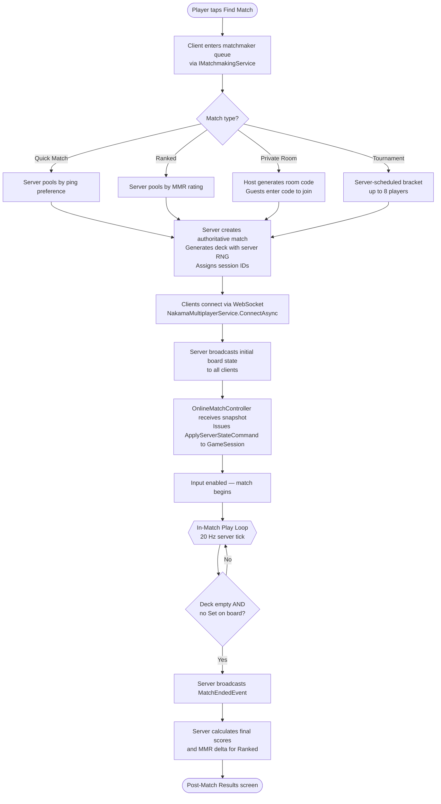
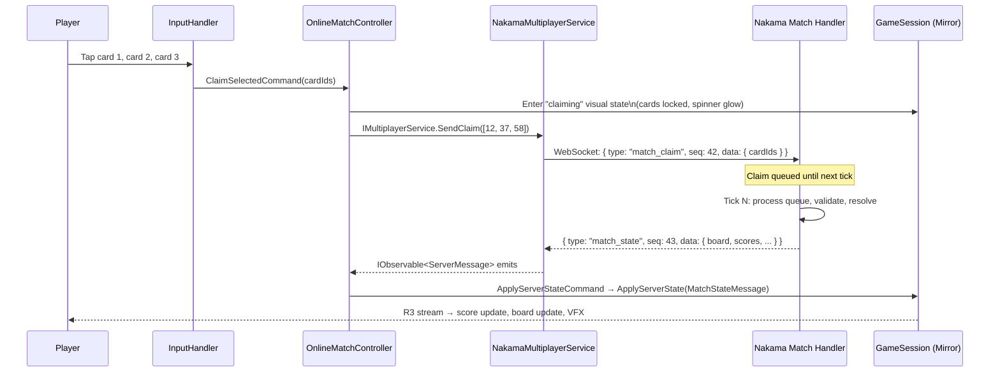
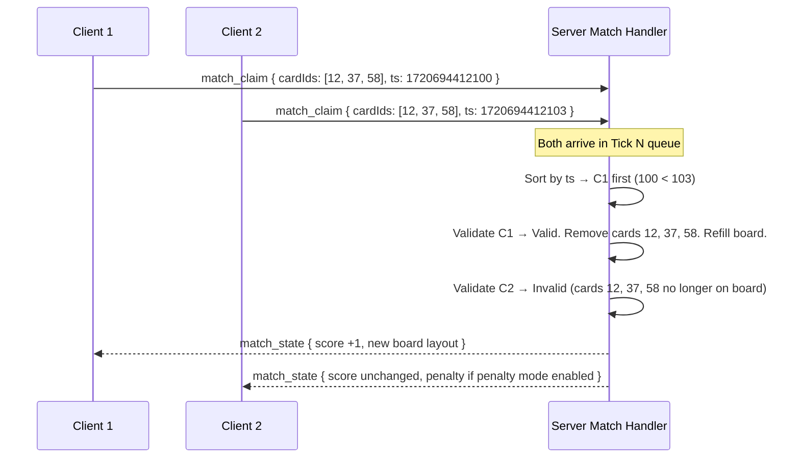

Building any part of the online multiplayer system in isolation is risky without a clear picture of how it fits the complete lifecycle. This page walks through every phase of an online match — from the moment a player taps **Find Match** to the Post-Match Results screen — so you know exactly which system owns each transition, what data flows across the boundary, and where the most common implementation mistakes occur.

<Warning>
**Pre-production — Planned Feature.** All multiplayer modes, matchmaking flows, and Nakama integration described on this page are planned features for a game currently in pre-production. None of these systems are implemented yet.
</Warning>

---

## Full Lifecycle at a Glance



---

## Phase 1 — Matchmaking

Players enter a queue via `IMatchmakingService`. The four queue types differ in how the server pairs players:

| Queue Type | Pairing Logic | Player Count | Notes |
|---|---|---|---|
| **Quick Match** | Ping preference; unranked | 2–4 | Fastest queue; no MMR impact |
| **Ranked** | Nakama matchmaker by MMR (Elo) | 2–4 | Updates MMR on match end |
| **Private Room** | Host generates code; guests enter it | 2–4 | Host configures rules (board size, timed toggle) |
| **Tournament** | Server-scheduled bracket | Up to 8 | Scheduled events only; no user-created brackets |

Online matches support **2–4 players**. Pass & Play supports 2–8 players on a single device, but that limit does not apply to online modes. Tournament mode allows up to 8 players in server-scheduled brackets only.

While queuing, the client shows the **Matchmaking Queue Modal**: a spinner, an estimated wait time, and a **Cancel** button that calls `IMatchmakingService.CancelQueue()`. The modal must be dismissible at any point before the match is created — if the server creates the match while the player is cancelling, the client must leave the match gracefully.

---

## Phase 2 — Match Setup

Once the server has paired enough players, it:

1. Creates an authoritative match instance in the Nakama match handler.
2. Generates and shuffles the 81-card deck using **server-side RNG** (not a seed sent to the client).
3. Deals the initial 12-card board.
4. Assigns each player a session ID (used as a tiebreaker for simultaneous claims).
5. Broadcasts the full initial `MatchState` — including all 12 card IDs and their positions — to every client over the WebSocket.

The client's `NakamaMultiplayerService` receives this snapshot and emits it on `IMultiplayerService.Messages`. The `OnlineMatchController` subscribes to `Messages`, translates the snapshot into an `ApplyServerStateCommand`, and `GameSession` applies it, transitioning into **mirror mode**. Input is disabled until the initial state is fully applied and the deal animation completes. This prevents any player from tapping cards before the board is guaranteed to be in sync.

<Tip>
Never enable player input until the client has received and applied the initial `MatchState` from the server. Enabling input on scene load before the first server snapshot arrives will cause card taps to reference an empty or stale board.
</Tip>

---

## Phase 3 — In-Match Play Loop

The server runs at **20 Hz (one tick every 50 ms)**. This rate was chosen to balance claim-resolution responsiveness against server CPU cost for a turn-like real-time card game — 50 ms latency is imperceptible to players. Each tick is the atomic unit of match progression.

### Client-Side Input Path



### Server-Side Tick

Each 20 Hz tick on the Nakama match handler:

1. **Collect** all client messages received since the last tick.
2. **Sort** by server-received timestamp (earliest first).
3. **Validate and resolve** claims in order. If a claim references cards that were removed by a prior claim in the same tick, it is automatically invalid.
4. **Run NoSetCheck** if the board was modified. If no Set exists and the deck has cards, deal three more.
5. **Broadcast** a complete `MatchState` snapshot to all connected clients.

### Network Message Format

Every message between client and server uses a `{type, seq, data}` JSON envelope:

```json
// Client → Server (claim intent)
{
  "type": "match_claim",
  "seq": 42,
  "data": { "cardIds": [12, 37, 58] }
}

// Server → Client (state broadcast after tick)
{
  "type": "match_state",
  "seq": 43,
  "data": {
    "board": [
      { "slot": 0, "cardId": 4 },
      { "slot": 1, "cardId": 17 },
      { "slot": 2, "cardId": 33 }
    ],
    "scores": { "playerA": 3, "playerB": 2 },
    "penalties": { "playerA": 0, "playerB": 1 },
    "deckCount": 51,
    "matchState": "InProgress",
    "serverTimestamp": 1720694412105
  }
}
```

The `seq` field allows the client to detect and discard out-of-order messages. The client always applies the **latest** `seq` it receives; it never applies an older snapshot on top of a newer one.

---

## Phase 4 — Simultaneous Claim Resolution

Simultaneous claims are the most nuanced part of the lifecycle. Here is the exact resolution algorithm:



**Exact-millisecond ties** (two messages with identical server-received timestamps) are broken deterministically by **lower session ID**. This is documented and tested — it is not arbitrary behaviour.

The client **must not** assume its claim succeeded based on its own validation. After calling `SendClaim`, the `OnlineMatchController` puts the UI into a "claiming…" visual state and waits for the server's `match_state` response. If the cards are gone by the time the server processes the claim, the response will carry no score change and potentially a penalty — the UI must handle this gracefully.

---

## Phase 5 — Match End

The match ends when the deck is empty **and** there is no valid Set remaining on the board. The server detects this after each NoSetCheck during tick processing.

1. Server broadcasts a `MatchEndedEvent` to all clients.
2. Server calculates the winner: **most Sets claimed**. Tiebreaker: **fewest invalid claim attempts**.
3. For **Ranked** matches, the server updates each player's MMR. The delta is included in the post-match payload.
4. All clients transition to the **Post-Match Results** screen, showing final scores, MMR delta (Ranked), and the share button.

### Forfeit and Disconnect

If a player disconnects, the server starts a **30-second reconnect window** (see [Sync & Reconnect](/multiplayer/sync-and-reconnect) for the full reconnect flow). If the window expires without the player rejoining, they **forfeit** the match. Their Sets are retained in the final score, but they cannot win.

---

## Latency Thresholds

| Condition | Client Action |
|---|---|
| RTT ≤ 150 ms | Normal play — no indicator |
| RTT > 150 ms | Ping indicator turns **yellow** in the HUD |
| RTT > 250 ms | "High latency" warning shown; disconnect recommendation displayed |
| Player disconnected | 30-second reconnect countdown overlay shown to all players |
| Reconnect window expires | Forfeit applied; match continues for remaining players |

These thresholds are Hard Boundaries from the project specification. They must not be raised without a formal change request.

---

## Implementation Checklist

Use this checklist when implementing each phase:

- [ ] Matchmaking flow triggers **before** the GameBoard scene loads — the scene must not appear until `ConnectAsync` succeeds and the initial `MatchState` is received
- [ ] Initial board state is received from the server before player input is enabled
- [ ] `OnlineMatchController` subscribes to `IMultiplayerService.Messages` and translates each `ServerMessage` into an `IGameCommand` for `GameSession`
- [ ] `SendClaim` immediately puts the UI into a "claiming…" visual state — do **not** play a success animation before receiving the server's confirmation
- [ ] `GameSession.ApplyServerState()` updates all state atomically — no partial updates mid-frame
- [ ] The "cards already gone" case (second simultaneous claimant) is handled: the UI shows the claim was invalid, not stuck in "claiming…"
- [ ] `seq` field is tracked and out-of-order messages are discarded
- [ ] Post-match screen shows MMR delta for Ranked matches
- [ ] Disconnect detection triggers the 30-second countdown overlay, not a silent spinner

---

## Common Mistakes

<Warning>
**Common Mistakes**

- **Playing the valid-Set animation before server confirmation.** The client does not know the outcome until `ApplyServerState` is called. Pre-emptive success animations create jarring rollbacks if the server rejects the claim.
- **Not handling the "cards already gone" case.** When two players claim the same Set and the second claimant's claim arrives after the board has changed, the server sends an invalid result. If the client only handles explicit "invalid Set" (wrong attributes) and not "invalid because cards are gone," the UI can get stuck or show the wrong feedback.
- **Enabling input before the initial `MatchState` is received.** The board does not exist yet on the client. Card taps will reference null or stale data.
- **Treating `SendClaim` as fire-and-forget.** The sequence number must be tracked, and the client must handle both confirmation and rejection for every claim it sends.
- **Having `GameSession` call `IMultiplayerService` directly.** All network orchestration goes through `OnlineMatchController`. The session receives `IGameCommand`s only.
</Warning>

---

## Related Pages

<CardGroup cols={2}>
  <Card title="Authority Model" href="/multiplayer/authority-model">
    Why the server validates every Set, and the interface contracts that enforce it.
  </Card>
  <Card title="Sync & Reconnect" href="/multiplayer/sync-and-reconnect">
    The 20 Hz tick model, full-state broadcasts, and the 30-second reconnect window.
  </Card>
  <Card title="Anti-Cheat" href="/multiplayer/anti-cheat">
    Rate limiting, server-side data ownership, and why the client cannot influence outcomes.
  </Card>
  <Card title="Session Lifecycle" href="/core-gameplay/session-lifecycle">
    How GameSession manages state transitions across all three game modes.
  </Card>
</CardGroup>
