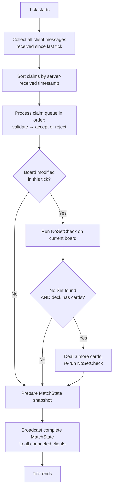
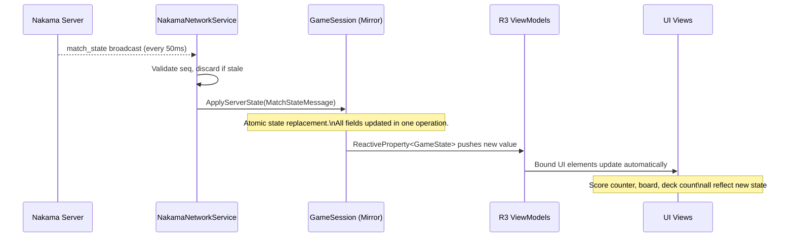
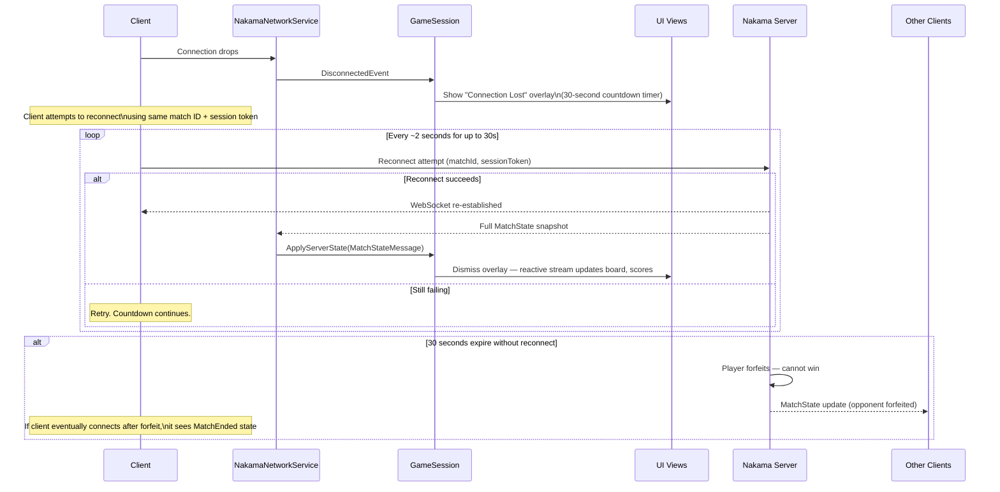

State synchronisation bugs and reconnection failures are the two most common sources of hard-to-reproduce multiplayer issues in real-time card games. A dropped packet causes a desync; a reconnect that replays stale state causes a worse one. This page describes the deliberate design choices that prevent both: a full-state broadcast model that makes dropped messages harmless, and a reconnection flow that restores the client to the exact server state in one atomic operation.

<Warning>
**Pre-production — Planned Feature.** The Nakama match handler, tick loop, reconnection flow, and all sync systems described on this page are planned features for a game currently in pre-production. None of these systems are implemented yet.
</Warning>

---

## The 20 Hz Server Tick

The Nakama match handler runs at **20 Hz — one tick every 50 milliseconds**. This rate was chosen to balance claim-resolution responsiveness against server CPU cost for a turn-like real-time card game, where 50 ms latency is imperceptible to players.

Each tick performs work in strict order:



<Tip>
The 50 ms tick period sets the **floor** for claim-resolution latency. A player's claim cannot be confirmed faster than one tick (50 ms) plus network round-trip time. Design all "claiming…" UI states with this in mind — they will always be visible for at least one tick period.
</Tip>

---

## Full State vs. Delta Updates

A key design decision: the server sends the **complete `MatchState` every tick**, not a diff of what changed.

**Why full-state?**

- **Dropped messages are self-healing.** If a client misses one broadcast, the next broadcast corrects it automatically. There is no dependency on receiving every packet in sequence.
- **No delta-reconstruction bugs.** Delta protocols require perfectly ordered delivery and a consistent baseline. When packets are dropped or reordered on mobile networks, delta reconstruction fails silently and produces corrupted state that is extremely hard to debug.
- **State is small enough.** A complete `MatchState` snapshot for a SET game is approximately **500 bytes** — well within WebSocket message budgets even at 20 Hz.

The rule is: **`ApplyServerState()` is the only write path for multiplayer game state on the client.**

---

## MatchState Broadcast Contents

Every 20 Hz broadcast includes the full picture needed to render the game correctly:

| Field | Type | Description |
|---|---|---|
| `board` | `CardSlot[]` | All 12–21 slots with their current card ID, or `null` for empty slots |
| `scores` | `Dictionary<string, int>` | Sets claimed per player (keyed by session ID) |
| `penalties` | `Dictionary<string, int>` | Invalid claim count per player |
| `deckCount` | `int` | Cards remaining in the deck |
| `matchState` | `MatchStateEnum` | `WaitingForPlayers`, `InProgress`, `NoSetExpanding`, `MatchEnded` |
| `serverTimestamp` | `long` | Unix milliseconds — used to detect and discard stale messages |
| `seq` | `int` | Monotonically increasing sequence number |

The client tracks the last applied `seq`. If a broadcast arrives with a lower `seq` than the last applied state, it is **discarded** — this prevents a delayed packet from overwriting a more recent state.

---

## Client Mirror Model

In multiplayer, the client's `GameSession` is a **read-only mirror** of the server state. It does not simulate game logic independently.



**Consequences of this model:**

- Even if the client drops three consecutive broadcasts, the fourth corrects it completely — no manual "catch-up" logic required.
- The client **must not** run `SetValidator` or update scores locally in multiplayer. Any local state computation creates a divergence that will conflict with the next `ApplyServerState` call.
- All animations and VFX are triggered by the reactive stream reacting to `ApplyServerState`, not by the `SendClaim` call itself.

---

## Latency Compensation

The server provides an immediate acknowledgement when a claim message is received — before the claim is processed in the next tick:

```json
// Server → Client (immediate ACK, before tick processing)
{
  "type": "claim_ack",
  "seq": 42,
  "transactionId": "a3f9c1"
}

// Server → Client (after tick: true result)
{
  "type": "match_state",
  "seq": 43,
  "data": { ... }
}
```

The client uses the ACK to show a "claiming…" visual state immediately, without waiting for the full tick to resolve. The worst-case delay for a confirmed result is **one tick period (50 ms) + network RTT**. For a game with p95 RTT of 150 ms, that means approximately 200 ms from tap to confirmed feedback — which is imperceptible as latency in a turn-like card game.

---

## Reconnection Flow

When a client loses its WebSocket connection, the server starts a **30-second reconnect window**. During this window, the match continues for all other players. The disconnected player's session is held open on the server.



### Reconnect Rules

| Scenario | Outcome |
|---|---|
| Reconnect within 30 seconds | Match resumes; full state applied via `ApplyServerState` |
| Reconnect window expires | Player forfeits; Sets claimed are retained in final score but player cannot win |
| All opponents disconnect | Remaining player wins by default; server broadcasts `MatchEndedEvent` |
| Player reconnects after forfeit | Client receives `MatchEnded` state; shown post-match screen |

### What Happens to State During Disconnect

The client **must not** attempt to continue simulating game state while disconnected. Input should be disabled. The `GameSession` stays in a `Disconnected` sub-state. When reconnection succeeds, `ApplyServerState` replaces everything — any local speculation would be overwritten anyway, and speculative state creates confusing UI artefacts.

---

## Online Pause Behaviour

Online pause is **not permitted** in multiplayer matches. This is a Hard Boundary.

The match timer continues running during any single player's disconnect. The reconnect window countdown is a server-side timeout, not a game pause. All other players continue playing at full speed. This prevents a player from gaining an advantage by deliberately disconnecting to "pause" a losing position.

If you are implementing the pause system, the `PauseCommand` must be gated by `IOnlineGameSession.IsMultiplayer` — if `true`, the pause request is silently ignored or disabled in the UI.

---

## Implementation Checklist

- [ ] Client disables all input immediately on `DisconnectedEvent` — do not allow speculative play while disconnected
- [ ] `ApplyServerState()` is the **single write path** for all multiplayer game state; no other code path modifies `GameSession` fields in multiplayer mode
- [ ] Reconnect uses the **same match ID and session token** — do not generate a new session, as the server uses the token to restore the existing player slot
- [ ] The 30-second countdown is shown as a **visible timer**, not just a spinner — players need to know how long they have
- [ ] After reconnect, all client state is correct without any additional "sync" calls — `ApplyServerState` on the full snapshot is sufficient
- [ ] `seq` tracking discards stale messages that arrive out of order after a reconnect
- [ ] Online pause requests are blocked at the UI layer — the pause button should not appear or be tappable in multiplayer

---

## Common Mistakes

<Warning>
**Common Mistakes**

- **Continuing to simulate locally after disconnect.** If the client keeps running `SetValidator` and updating the board while disconnected, the state it builds up will conflict with the server's `ApplyServerState` on reconnect, causing visual glitches and logic errors.
- **Using delta state updates.** It seems like an optimisation to send only what changed — but on mobile networks with packet loss, a missed delta causes permanent desync. The 500-byte full state is the correct trade-off for a game of this size.
- **Allowing pause in online matches.** This is a Hard Boundary. A disconnect-to-pause exploit is a trivial way to game the system in competitive matches.
- **Generating a new session token on reconnect.** The server holds the player's slot open using their original session token. A new token creates a new session and the server will treat the original slot as a continued disconnect, leading to an unrecoverable forfeit even if the player is back on the network.
- **Showing a spinner instead of a countdown during disconnect.** A spinner communicates "loading"; a countdown communicates "you have 30 seconds to reconnect before you forfeit." Players need the countdown to make informed decisions (e.g., give up and close the app vs. wait for WiFi to stabilise).
</Warning>

---

## Related Pages

<CardGroup cols={2}>
  <Card title="Authority Model" href="/multiplayer/authority-model">
    Why the server validates every Set, and the interface contracts that enforce it.
  </Card>
  <Card title="Match Lifecycle" href="/multiplayer/match-lifecycle">
    The full flow from matchmaking queue to post-match results, including the in-match play loop.
  </Card>
  <Card title="Anti-Cheat" href="/multiplayer/anti-cheat">
    Rate limiting, server-side data ownership, and why the client cannot influence outcomes.
  </Card>
</CardGroup>
