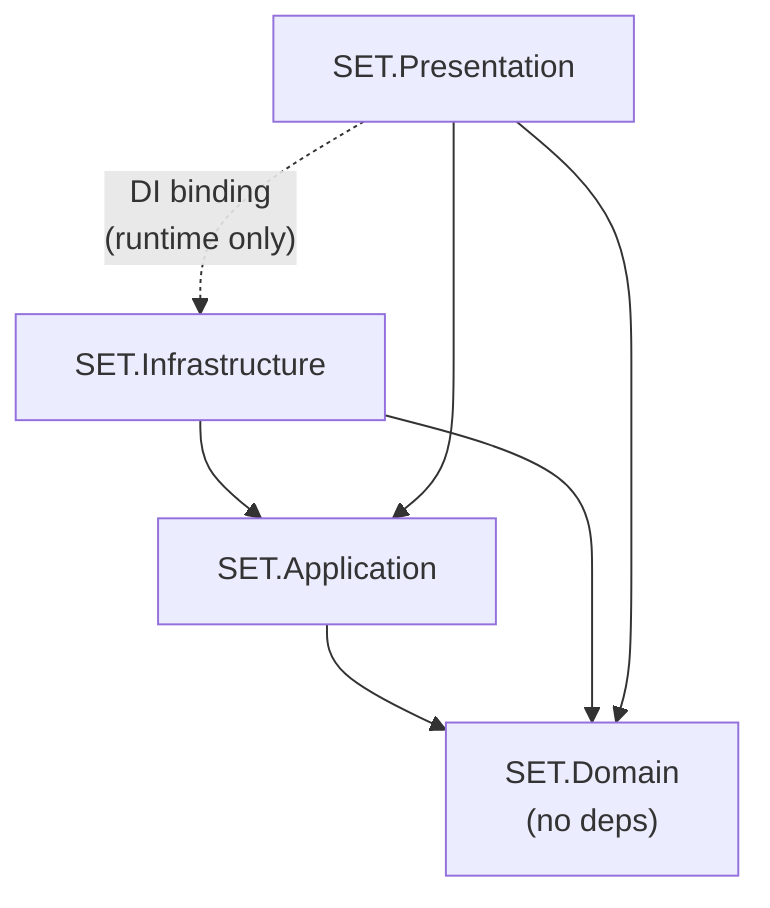

When you open the SET: 3D Edition project for the first time, you'll find a carefully structured folder hierarchy that maps one-to-one onto the project's Clean Architecture layers. This page walks you through every folder, every assembly definition, and every key scene so you can find what you're looking for in under five minutes.

## Why this page exists

Codebase disorientation is one of the most common sources of architecture violations. A developer who doesn't know where `ISetValidator` lives might accidentally implement validation logic in a MonoBehaviour. This tour prevents that by giving you a reliable mental map before you write a single line.

---

## Key responsibilities

This page owns three navigation outcomes for every contributor:

| Responsibility | Detail |
|---------------|--------|
| **Folder orientation** | Map every `Assets/_Project/` subfolder to its Clean Architecture layer |
| **Assembly literacy** | Explain which `.asmdef` references which, so contributors understand what will and won't compile together |
| **Quick-find reference** | Give a reliable answer to "where does X live?" for every major type and asset category |

---

## Top-level folder structure

Everything production-relevant lives under `Assets/_Project/`. Third-party libraries, tests, and editor tools each have their own top-level sibling folders to keep them cleanly separated from game code.

```
Assets/
├── _Project/
│   ├── Domain/         # Pure C# — entities, value objects, domain service interfaces
│   ├── Application/    # Use-cases, state machine, command handlers, app-level interfaces
│   ├── Infrastructure/ # Nakama adapters, local save, platform services (GPGS, audio)
│   ├── Presentation/   # Unity scenes, MonoBehaviour views, R3 ViewModels, VFX
│   ├── Data/           # JSON config files (ai_difficulty, game_rules_presets, etc.)
│   ├── Art/            # 3D models, textures, materials
│   ├── Audio/          # Sound files (named sfx_* / mus_*)
│   ├── Prefabs/        # Shared prefabs — Cards/, UI/, VFX/, Environment/
│   ├── Scenes/         # .unity scene files (Bootstrap, MainMenu, GameBoard, PostMatch)
│   ├── Resources/      # Minimal runtime loading — avoid unless unavoidable
│   └── UI/             # uGUI templates, TMP font assets, theme ScriptableObjects
├── _External/          # Third-party libraries: Nakama SDK, R3, VContainer
├── _Tests/
│   ├── EditMode/       # Unit tests — Domain and Application (no Unity lifecycle)
│   └── PlayMode/       # Integration tests — Presentation layer
└── _Editor/            # Editor scripts, asmdef validators, build tools
```

<Tip>
  Never modify anything inside `_External/`. Third-party packages belong to their respective package managers. If a package needs patching, raise it with the tech lead.
</Tip>

---

## The entry-point scene

**`Assets/_Project/Scenes/Bootstrap.unity`** is the only scene listed in Build Settings. It performs three jobs when it runs:

1. Instantiates the VContainer `LifetimeScope` that wires all dependency injection bindings.
2. Loads persistent manager objects (audio, platform services, local save).
3. Transitions additively into `MainMenu.unity`.

Every other scene (`GameBoard`, `PostMatch`) is loaded additively from within the game flow — never directly. Always use Bootstrap as your editor Play entry point.

---

## Assembly definition map

The project uses Unity Assembly Definition files (`.asmdef`) to enforce layer boundaries **at compile time**. If you reference a type from the wrong assembly, the project will not compile — this is intentional.

| Assembly | Path | References | Role |
|----------|------|-----------|------|
| `SET.Domain` | `_Project/Domain/` | **None** — pure C# | Entities, value objects, domain service interfaces |
| `SET.Application` | `_Project/Application/` | `SET.Domain` only | Use-cases, state machine, commands, application interfaces |
| `SET.Infrastructure` | `_Project/Infrastructure/` | `SET.Domain`, `SET.Application` | Nakama adapters, local save, platform services |
| `SET.Presentation` | `_Project/Presentation/` | `SET.Domain`, `SET.Application` | MonoBehaviours, views, R3 ViewModels — **never** Infrastructure |
| `SET.Editor` | `_Editor/` | All production assemblies | Editor-only tools and validators — excluded from builds |
| `SET.Tests.EditMode` | `_Tests/EditMode/` | Domain + Application (as needed) | Unit tests — no Unity lifecycle required |
| `SET.Tests.PlayMode` | `_Tests/PlayMode/` | Presentation + Domain + Application | Integration tests running in the Unity player |

The dependency graph looks like this:



`SET.Presentation` binds to `SET.Infrastructure` **only at runtime** through VContainer's DI container inside the Bootstrap scene. There is no compile-time reference — `Presentation` simply knows the interfaces defined in `Application`, and VContainer supplies the concrete implementations at startup.

---

## What lives in each layer

### Domain layer — `_Project/Domain/`

The innermost layer. Contains everything needed to represent and validate a game of SET, with zero external dependencies.

| Subfolder | Key types |
|-----------|-----------|
| `Entities/` | `Card`, `Board`, `CardSlot`, `Deck`, `Player`, `Match` *(aggregate root)* |
| `ValueObjects/` | `CardAttributes`, `GameRules`, `SetResult`, `CardId` |
| `Services/` | `ISetValidator`, `IAIScanner` *(pure C# interfaces)* |
| `Enums/` | `Number`, `Shape`, `Color`, `Shading`, `MatchState`, `PenaltyMode` |

`Match` is the **aggregate root** — code outside the Domain layer interacts with game state exclusively through `Match`'s public API, never by reaching into its child entities directly.

### Application layer — `_Project/Application/`

Orchestration logic. Depends only on `SET.Domain`.

| Subfolder | Key types |
|-----------|-----------|
| `Sessions/` | `GameSession` *(implements `IMatchOrchestrator` + `IGameStateProvider`)* |
| `Commands/` | `IGameCommand`, `SelectCardCommand`, `ClaimSelectedCommand`, `DeselectCardCommand` |
| `State/` | `GameStateSnapshot`, `MatchEvent` hierarchy, `PlayerSnapshot` |
| `Services/` | `IMultiplayerService`, `ILeaderboardService`, `ILocalSaveService`, `IAudioService`, `IInputHandler` |
| `Factories/` | `IMatchFactory`, `IDeckFactory` |

`GameSession` is the central state machine for a match. It receives `IGameCommand` objects, coordinates Domain entities, and pushes state changes out as R3 observables. It has **no knowledge** of Unity, Nakama, or the UI.

### Infrastructure layer — `_Project/Infrastructure/`

Implements the interfaces defined in Application using real external SDKs.

| Subfolder | Key types |
|-----------|-----------|
| `Nakama/` | `NakamaMultiplayerService`, `NakamaMatchmaker`, `NakamaLeaderboardService` |
| `LocalSave/` | `LocalSaveService` |
| `Platform/` | `PlatformService` *(Google Play Games Services)* |
| `Audio/` | `AudioService` |
| `Serialization/` | JSON converters, save-data DTOs |

All Nakama types (e.g., `IMatch`, `IApiUser`) are converted into plain domain DTOs before they cross the Infrastructure boundary into Application or Domain.

### Presentation layer — `_Project/Presentation/`

Everything Unity-dependent. Depends on Domain and Application, never Infrastructure.

| Subfolder | Key types |
|-----------|-----------|
| `Views/` | `CardView`, `BoardView`, `HudTopView`, `HudBottomView`, `ClaimZoneView` |
| `ViewModels/` | `MatchViewModel` and companions — R3 `ReactiveProperty<T>` wrappers |
| `Input/` | `TouchInputHandler` *(implements `IInputHandler`)* |
| `VFX/` | Animation controllers, particle triggers, material property drivers |
| `Bootstrap/` | VContainer composition root and bootstrapper |

MonoBehaviours in this layer are **thin views**. They bind UI elements to ViewModel properties and forward user input. They never contain game logic.

---

## Config files

Runtime configuration lives in `Assets/_Project/Data/` as plain JSON files:

| File | Purpose |
|------|---------|
| `ai_difficulty.json` | AI tier parameters — reaction delays, miss rates per difficulty level |
| `game_rules_presets.json` | Preset rule configurations (board size, penalty mode, timed toggle) |
| `cosmetics_catalogue.json` | Cosmetic item metadata for the store |
| `strings.json` | Localizable UI strings (English-only for v1.0; structure future-proofed) |

These files are loaded at runtime via `Resources.Load` or Addressables; parsing logic lives in `Infrastructure/Serialization/`.

---

## The golden rule

> **Dependencies always point inward.** Outer layers know about inner layers. Inner layers know nothing about outer layers.

If you're in the Domain layer and you're about to add `using SET.Application;` — stop. That reference goes the wrong direction. If you're in Presentation and you're about to add `using SET.Infrastructure;` — stop. Use the interface from Application instead, and let VContainer supply the implementation.

---

## Implementation checklist

Use this checklist when adding a new file to confirm it belongs in the right place:

- [ ] **New domain type?** File goes in `Assets/_Project/Domain/` (entity, value object, enum, or interface) with no external references
- [ ] **New application interface?** File goes in `Assets/_Project/Application/Services/` — Infrastructure implements it, Presentation consumes it
- [ ] **New Infrastructure class?** File goes in `Assets/_Project/Infrastructure/<Subsystem>/` — implement the Application interface, register in Bootstrap
- [ ] **New MonoBehaviour view?** File goes in `Assets/_Project/Presentation/Views/` with a paired ViewModel in `Presentation/ViewModels/`
- [ ] **New scene?** File goes in `Assets/_Project/Scenes/` — never inside a layer subfolder
- [ ] **New test?** EditMode tests for Domain/Application in `Assets/_Tests/EditMode/`; PlayMode integration tests in `Assets/_Tests/PlayMode/`
- [ ] **New config?** JSON config files go in `Assets/_Project/Data/`; parsed by Infrastructure serialization code

---

## Common mistakes

<Warning>
  **Common repo navigation mistakes:**

  - **Adding `using UnityEngine;` to Domain or Application** — these assemblies have no Unity reference and the compiler will reject it. If your type needs Unity, it belongs in Presentation (views, VFX) or Infrastructure (audio, platform services).
  - **Directly referencing `NakamaMultiplayerService` from Presentation** — Presentation only knows `IMultiplayerService`. The concrete class is invisible to it at compile time by design.
  - **Placing scene files inside `_Project/Presentation/Scenes/`** — all `.unity` files live in `_Project/Scenes/`, not inside the Presentation subfolder.
  - **Editing files inside `_External/`** — third-party packages should never be modified directly. Changes will be lost on the next package update.
  - **Writing tests in `PlayMode/` when `EditMode/` will do** — Domain and Application logic needs no Unity lifecycle. EditMode tests run faster and don't require entering Play mode.
</Warning>

---

## Related pages

<CardGroup cols={2}>
  <Card title="Prerequisites" icon="circle-check" href="/onboarding/prerequisites">
    Software, accounts, and setup steps before you open the project.
  </Card>
  <Card title="First Tasks" icon="list-check" href="/onboarding/first-tasks">
    Where to start contributing — Domain-layer work that needs no Unity runtime.
  </Card>
  <Card title="Architecture Layers" icon="layer-group" href="/architecture/layers">
    Deep dive into what each layer owns, forbids, and how they communicate.
  </Card>
  <Card title="Assembly Definitions" icon="puzzle-piece" href="/architecture/asmdefs">
    How `.asmdef` files enforce compile-time dependency rules.
  </Card>
</CardGroup>
