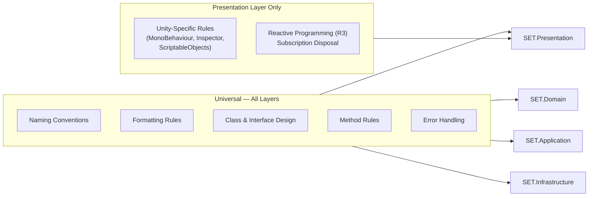

Consistent conventions mean any team member can open any file and understand it immediately — without hunting for what `m_val` means or why this class has a public field named `score`. These rules apply to every C# file in the project across all layers: Domain, Application, Infrastructure, Presentation, Editor, and Tests. They are enforced by `.editorconfig`, Roslyn analyzers, and CI. Deviation requires explicit tech-lead approval.

<Warning>
  These are not style suggestions — they are production requirements. CI treats analyzer violations as build errors. A PR that introduces a naming violation, a `#region`, or a public field on an entity **will not merge**.
</Warning>

The diagram below shows which convention categories apply to which architectural layers. Conventions marked in all layers are universal; those marked only in Presentation apply exclusively to Unity `MonoBehaviour` code.



---

## Naming Conventions

The table below is the single authoritative reference. When in doubt, check here before naming anything.

| Element | Convention | Example |
|---------|------------|---------|
| Namespace | `SET.<Layer>.<SubModule>` | `SET.Domain.Entities`, `SET.Application.Sessions` |
| Class / Struct | PascalCase, noun or noun phrase | `GameSession`, `CardAttributes` |
| Interface | PascalCase with `I` prefix | `ISetValidator`, `IGameStateProvider` |
| Method | PascalCase, verb phrase | `ValidateSet()`, `HandleCommand()` |
| Property | PascalCase | `PlayerScore`, `IsTimed` |
| Private field | `_camelCase` (underscore prefix) | `_selectedCards`, `_currentState` |
| Constant (`const` / `static readonly`) | PascalCase | `MaxBoardSize`, `DefaultSeed` |
| Enum type and values | PascalCase | `MatchState.BoardIdle`, `PenaltyMode.Point` |
| Parameter | camelCase | `int slotIndex`, `Card[] cards` |
| Local variable | camelCase | `var count = 0`, `var snapshot = ...` |
| Boolean member | `Is`, `Has`, or `Can` prefix | `IsValid`, `HasPenalty`, `CanClaim` |
| Audio clip assets | `sfx_` or `mus_` prefix | `sfx_valid_set.wav`, `mus_main_menu.ogg` |
| Prefab assets | `[Type]_[Description]` | `Card_Solid_Red`, `Button_Play` |
| Test class | `[ClassName]Tests.cs` | `SetValidatorTests.cs` |
| Test method | `MethodName_Scenario_ExpectedBehavior` | `Validate_AllDifferent_ReturnsValid` |

### Additional Naming Rules

- **No Hungarian notation.** Do not prefix member names with type hints (`m_`, `strName`, `bIsActive`).
- **`var` usage:** Use `var` when the declared type is obvious from the right-hand side (`var validator = new SetValidator()`). Use an explicit type when it adds clarity (`ISetValidator validator = ...`).
- **Well-known abbreviations only.** `AI`, `MMR`, `UI`, `HUD`, `ID` are fine. Invent no new abbreviations.
- **Descriptive, not clever.** `CalculateScore()` rather than `Calc()`. Names should communicate intent without requiring a comment.

---

## Formatting Rules

All formatting is enforced by the project `.editorconfig`. The key settings are reproduced here for reference.

```ini
[*.cs]
indent_style              = space
indent_size               = 4
end_of_line               = lf
charset                   = utf-8
trim_trailing_whitespace  = true
insert_final_newline      = true
csharp_new_line_before_open_brace = all   # Allman brace style
csharp_new_line_before_else    = true
csharp_new_line_before_catch   = true
csharp_new_line_before_finally = true
```

**Manual rules that `.editorconfig` cannot fully enforce:**

- **Brace style — Allman.** Opening brace always on its own line. No Egyptian/K&R braces.
- **Blank lines.** One blank line between methods. One blank line between logical groups inside a method. Never two consecutive blank lines.
- **Line length.** Soft limit: 140 characters. Hard limit: 180 characters. Split long chains, parameter lists, or LINQ queries at logical points.
- **`using` statements.** Organised inside the namespace declaration: `System.*` first, then external packages (R3, Nakama, VContainer), then project namespaces (`SET.*`). Remove all unused `using` statements — the IDE will flag them.

### The `#region` Ban

<Warning>
  `#region` directives are **banned** everywhere in this codebase. If you feel the urge to add a region, that is a signal the class is too large. Extract a new class instead.
</Warning>

---

## Class and Interface Design

| Rule | Detail |
|------|--------|
| **One class per file** | Exceptions: small related enums or nested `record` types used only by the enclosing class |
| **Seal by default** | Mark classes `sealed` unless they are explicitly designed as base classes. Document the inheritance contract when `sealed` is omitted. |
| **Records for immutable DTOs** | Use `record` or `record struct` for value objects and data transfer objects (`GameStateSnapshot`, `CardAttributes`). They get structural equality for free. |
| **Interface segregation** | Interfaces must be small and role-focused (`IStateProvider`, `ICommandHandler`). A class that needs to be both should implement two interfaces. No "God interfaces." |
| **Value object immutability** | Value objects must be immutable and implement `IEquatable<T>`. Mutation creates a new instance. |
| **No public fields** | All public data is exposed through properties. Never use a public field on any entity or DTO, regardless of layer. |
| **Abstract classes** | Use only when shared, meaningful state or behaviour makes an interface impractical. Prefer composition over inheritance. |

---

## Method Rules

Writing small, focused methods is the single most effective thing you can do to keep the codebase navigable.

| Rule | Limit / Guidance |
|------|-----------------|
| **Length** | 30–40 lines maximum. An exhaustive `switch` over all `MatchState` values is the documented exception. |
| **Parameters** | Maximum 3. If a method needs 4 or more parameters, introduce a parameter object (a simple `record` or `struct`). |
| **Return null** | Never return `null` from a method. Return an empty collection, use the Try-pattern (`bool TryGet(out T result)`), or `Optional<T>`. |
| **`out` and `ref`** | Avoid `ref`. Use `out` only in Try-pattern methods. |
| **CQS — Command/Query Separation** | A method either changes state (command, returns `void` or `Task`) or returns data (query, no side effects). Not both. This makes behaviour predictable and testable. |

---

## Error Handling

| Rule | Guidance |
|------|---------|
| **Exceptions are for programming errors** | Use exceptions for truly unrecoverable situations: an invariant that should never be violated, a null argument that signals a bug. Never throw to signal a normal user action. |
| **Domain errors are return types** | `SetValidator.Validate()` returns a `SetResult` with `IsValid` and `Reason` — it does not throw. If a Set is invalid, that is not exceptional; it is routine. |
| **Infrastructure errors** | Catch exceptions from Nakama, file I/O, and platform APIs at the Infrastructure boundary. Convert them into domain-friendly types (`MatchErrorEvent`, `SaveFailedResult`) before they cross into Application code. |
| **No catch-all handlers in inner layers** | `catch (Exception e)` is only acceptable at the very top level (e.g., an unhandled exception logger in the Bootstrap). Inside Domain or Application code it is forbidden. |
| **Dispose everything** | Every `IDisposable` must be disposed. Use a `using` statement for scoped resources and `CompositeDisposable` for reactive subscriptions in ViewModels and MonoBehaviours. |

---

## Unity-Specific Rules

These rules apply to the **Presentation layer** — any code that references `UnityEngine`.

<Info>
  If you find yourself writing `using UnityEngine;` in a file inside `SET.Domain` or `SET.Application`, stop. You are about to break the most important architectural boundary in the project.
</Info>

**MonoBehaviours are thin views.** A MonoBehaviour in this project:
- Binds UI elements (Text, Button, Image) to ViewModel observable properties
- Routes touch/pointer events to an injected input handler
- Manages the lifetime of its `CompositeDisposable` in `OnDestroy()`
- Contains **no** game logic, state machines, scoring, or AI code

**Inspector references.** Use `[SerializeField] private` for all Unity-object references wired in the Inspector. Never use a `public` field to link components.

**Forbidden Unity APIs in non-Presentation code:**

| API | Why Banned | Alternative |
|-----|------------|-------------|
| `GameObject.Find` | Hidden coupling, breaks if hierarchy changes | DI injection or explicit wiring |
| `FindObjectOfType` | Scans entire scene at runtime, brittle | DI container |
| `GetComponent` across unrelated objects | Creates invisible dependency graph | Inject via constructor |
| `SceneManager.LoadScene` (synchronous) | Freezes the main thread | `LoadSceneAsync` with additive loading |
| Coroutines in Domain/Application | Cannot propagate errors, hard to cancel | `UniTask` with `CancellationToken` |

**ScriptableObjects.** Acceptable for static configuration (AI difficulty config, audio mixer references). Treat them as read-only at runtime — never write to a `ScriptableObject` field after initialisation.

---

## Reactive Programming (R3)

| Rule | Guidance |
|------|---------|
| **Store subscriptions** | Always assign `Subscribe(...)` return values to a field of type `CompositeDisposable`. Call `Dispose()` on that bag in `OnDestroy()` or the class `Dispose()` method. |
| **`DistinctUntilChanged`** | Apply on ViewModel properties before binding to UI. Prevents redundant re-renders when the value hasn't actually changed. |
| **Cross-thread safety** | All Nakama callbacks arrive on a background thread. Always route them back to the main thread with `.ObserveOnMainThread()` before touching Unity objects or updating ViewModels. |
| **Subjects in Application only** | Use `Subject<T>` to produce event streams only in the Application layer (`GameSession`). In ViewModels, transform existing observables with operators — don't create new subjects. |
| **Error handling in pipelines** | An unhandled exception inside a `Subscribe` handler can terminate the observable sequence. Use `.Catch()` or guard transformations so errors are surfaced, not silently swallowed. |

---

## Common Mistakes That Fail Review

The following mistakes appear frequently enough to call out explicitly. All of them will block a PR:

1. **Public field on an entity.** `public int Score;` on `Player` — replace with a property and an `AddScore(int delta)` method.
2. **More than 3 parameters without a parameter object.** Introduce a `MatchConfig` record rather than passing 5 arguments.
3. **`#region` anywhere.** Remove it and split the class if it feels cluttered.
4. **`catch (Exception)` inside Domain or Application code.** Catch specific exceptions at the Infrastructure boundary only.
5. **Forgetting to dispose a `CompositeDisposable`.** Memory leaks and test pollution will follow.
6. **Polling in `Update()`.** Use R3 reactive streams. `Update()` in a View MonoBehaviour is for visual interpolation only.

---

## Related Pages

<CardGroup cols={2}>
  <Card title="Approved Patterns & Anti-Patterns" icon="diagram-project" href="/standards/patterns">
    Which design patterns are adopted and which are explicitly banned with required replacements.
  </Card>
  <Card title="Testing Standards" icon="flask" href="/standards/testing">
    Unit test naming, AAA structure, coverage targets, and CI integration.
  </Card>
  <Card title="PR Checklist" icon="circle-check" href="/standards/pr-checklist">
    The complete merge-gate checklist that enforces these conventions at review time.
  </Card>
  <Card title="Roadmap Overview" icon="map" href="/roadmap/overview">
    High-level project timeline and phase dependencies.
  </Card>
</CardGroup>
