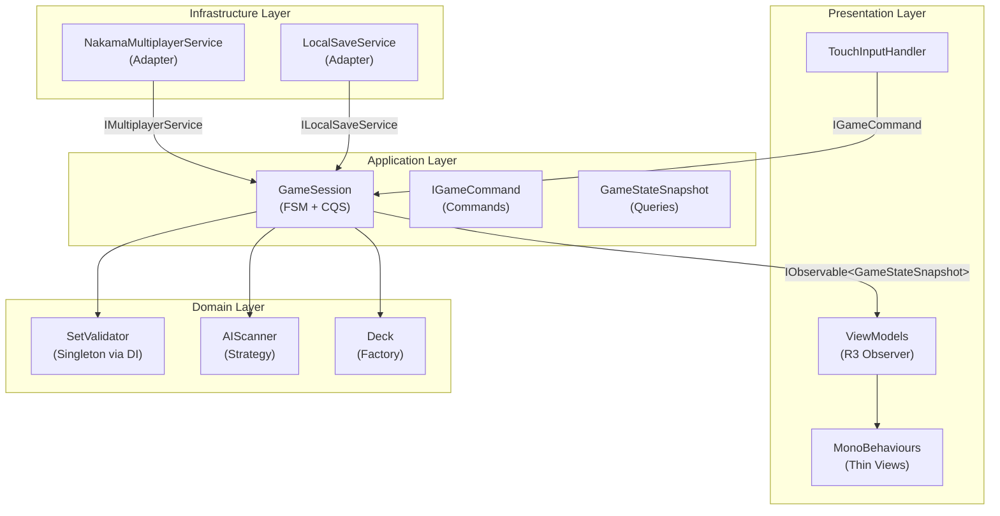

Every non-trivial architecture decision has been made once, documented here, and is now the law. This catalogue exists so the same question is never debated twice, and so a reviewer has a canonical reference when flagging a violation. Consistent patterns reduce cognitive overhead: once you know how `GameSession` is wired, you know how every session-like class is wired.

<Warning>
  Any **banned pattern** introduced into the codebase must be explicitly justified in the PR description and approved by the technical lead. There are no quick exceptions, no "just this once."
</Warning>

The diagram below shows how the adopted patterns interact at runtime. Dependencies flow inward — outer layers depend on inner layers via interfaces, never the reverse.



---

## Adopted Patterns

| Pattern | Where Used | Key Benefit |
|---------|-----------|-------------|
| Clean Architecture Layering | Every feature | Dependency inversion; inner layers are testable without Unity or Nakama |
| Constructor Injection (VContainer) | All classes | No hidden coupling; dependencies are visible and mockable |
| Command / Query Separation | Input flow + state reads | Commands fire-and-forget; queries return immutable snapshots |
| Reactive State (R3 Observer) | Application → Presentation | No polling; multi-mode UI unified behind a single observable stream |
| Finite State Machine | `GameSession` match lifecycle | Explicit, guarded transitions; invalid command sequences are silently ignored |
| Strategy (AI Difficulty) | `AIScanner` | Behaviour is config-driven and swappable at runtime without modifying clients |
| Object Pooling | `MatchEvent` instances | Reduces GC pressure in the hot path (state changes happen continuously) |
| Adapter (SDK Wrapping) | Nakama, Google Play Games | Inner layers are completely isolated from third-party types and API changes |
| Singleton via DI | `SetValidator`, `AudioService` | Shared stateless services without static access or global state |
| Factory | `IMatchFactory`, `IDeckFactory` | Complex object creation with guaranteed valid initial state |

---

## Pattern Detail: Clean Architecture Layering

The project is split into four concentric layers. Dependencies flow **inward only** — outer layers know about inner layers, never the reverse.

| Layer | Contents | Allowed Dependencies |
|-------|----------|---------------------|
| **Domain** | Entities (`Card`, `Board`, `Player`), value objects, `ISetValidator`, `IAIScanner` | None — pure C# |
| **Application** | `GameSession`, state machine, command handlers, infrastructure interfaces | Domain only |
| **Infrastructure** | Nakama SDK adapter, `LocalSaveService`, `AudioService`, platform services | Application + Domain |
| **Presentation** | MonoBehaviours, Views, R3 ViewModels, `TouchInputHandler` | Application + Infrastructure interfaces |

**Why this matters in practice:** `SetValidator` has no `using UnityEngine;`. This means you can run the entire game loop in a unit test in milliseconds with no Unity process. It also means the domain logic can be ported cleanly to the Nakama server side as the authoritative reference.

**Review checklist:**
- [ ] No `using UnityEngine;` in `SET.Domain` or `SET.Application`
- [ ] No `using Nakama;` in `SET.Domain` or `SET.Application`
- [ ] Infrastructure classes implement interfaces declared in Application or Domain
- [ ] `SET.Presentation` does not import `SET.Infrastructure` directly — only through interfaces

---

## Pattern Detail: Constructor Injection (VContainer)

All dependencies are declared as constructor parameters and injected by VContainer at startup. No class creates its own dependencies with `new ConcreteClass()` (except in factories, which exist precisely to own that responsibility).

```csharp
// Application layer — GameSession declares what it needs
public sealed class GameSession : IMatchOrchestrator
{
    private readonly ISetValidator _validator;
    private readonly IAIScanner _aiScanner;

    public GameSession(ISetValidator validator, IAIScanner aiScanner)
    {
        _validator = validator;
        _aiScanner = aiScanner;
    }
}
```

```csharp
// Bootstrap scene — VContainer composition root
builder.Register<ISetValidator, SetValidator>(Lifetime.Singleton);
builder.Register<IAIScanner, AIScanner>(Lifetime.Transient);
builder.Register<IMatchOrchestrator, GameSession>(Lifetime.Transient);
```

**Review checklist:**
- [ ] No `new ConcreteClass()` inside Application or Domain methods
- [ ] All injected fields are interface types, not concrete types
- [ ] All DI bindings are in the Bootstrap scene — no scattered registration

---

## Pattern Detail: Command / Query Separation (CQS)

User input and AI decisions become **commands** — immutable value objects sent to `GameSession.HandleCommand()`. They have no return value. State is read separately as **queries** — `GameSession` exposes an `IObservable<GameStateSnapshot>` that pushes a new immutable snapshot after every state change.

```csharp
// Commands — immutable records, no return value
public sealed record SelectCardCommand(int SlotIndex) : IGameCommand;
public sealed record ClaimSelectedCommand(PlayerId ClaimantId) : IGameCommand;
public sealed record RequestHintCommand : IGameCommand;

// Query — immutable snapshot pushed after each state change
public sealed record GameStateSnapshot(
    MatchState State,
    IReadOnlyList<CardSlotSnapshot> Board,
    IReadOnlyList<PlayerSnapshot> Players,
    int RemainingDeckCount
);
```

**Review checklist:**
- [ ] Commands are immutable records — no mutable properties
- [ ] No command type has a return value (use `IObservable<MatchEvent>` for async feedback)
- [ ] Queries return read-only data — no mutable domain objects leak through a snapshot

---

## Pattern Detail: Finite State Machine (GameSession)

`GameSession` uses an explicit `MatchState` enum and a guarded `HandleCommand` switch. Any command received in the wrong state is silently discarded — no exceptions, no corrupted state.

```csharp
private void HandleCommand(IGameCommand cmd)
{
    switch (_state)
    {
        case MatchState.BoardIdle when cmd is SelectCardCommand select:
            SelectCard(select.SlotIndex);
            _state = MatchState.CardSelected1;
            break;

        case MatchState.CardSelected2 when cmd is ClaimSelectedCommand claim:
            ValidateAndResolveClaim(claim.ClaimantId);
            // state transitions to Validating, then Valid or Invalid
            break;

        // All other command/state combinations: fall through and discard
    }
}
```

<Info>
  If you find yourself adding an `else` branch that does something when the state is wrong, stop. The FSM is supposed to silently discard invalid inputs. If a bad state is reached, log a warning — don't try to recover ad hoc.
</Info>

**Review checklist:**
- [ ] Every valid transition is explicitly listed in the switch
- [ ] Input is blocked (discarded) during animation lock states
- [ ] `AnySetExists()` is called after every board mutation
- [ ] End-game condition is checked after every state transition

---

## Pattern Detail: Adapter (Wrapping External SDKs)

Nakama, Google Play Games Services, and any other third-party SDK lives entirely inside `SET.Infrastructure`. The Application layer declares the interface; the Infrastructure layer implements it.

```csharp
// Declared in SET.Application — no Nakama types
public interface IMultiplayerService
{
    Task ConnectAsync(string matchId, CancellationToken ct);
    void SendClaim(int[] cardSlotIds);
    IObservable<ServerStateMessage> Messages { get; }
}

// Implemented in SET.Infrastructure — the only class with `using Nakama;`
public sealed class NakamaMultiplayerService : IMultiplayerService
{
    private readonly IClient _nakamaClient;
    // ... converts Nakama types to domain DTOs internally
}
```

**Review checklist:**
- [ ] No Nakama types (`IMatch`, `IMatchState`, `ISocket`) appear in Application or Domain assemblies
- [ ] Adapter methods are thin wrappers; domain logic stays in `GameSession`
- [ ] The interface is defined in the layer that *consumes* it, not the layer that implements it

---

## Banned Anti-Patterns

Every entry in this table has been considered and explicitly rejected. If you recognise one of these in existing code, open a refactor ticket — don't extend it.

| Anti-Pattern | Why Banned | Required Replacement |
|--------------|------------|----------------------|
| **Service Locator** | Hides dependencies; callers can't see what a class needs; breaks test isolation | Constructor injection via VContainer |
| **Static Mutable State** | Causes ordering bugs; impossible to unit-test in parallel; incompatible with deterministic replay | Inject state as a dependency, or confine it inside an aggregate root |
| **MonoBehaviour Game Logic** | Couples logic to Unity lifecycle; impossible to test without a running Unity process; encourages `Update()` polling | Pure C# classes in Domain/Application + thin View MonoBehaviours |
| **`FindObjectOfType` / `GameObject.Find`** | Creates invisible runtime coupling; breaks silently when scene hierarchy changes | DI injection or explicit wiring in the Bootstrap |
| **Polling in `Update()`** | Wastes CPU every frame; creates order-of-execution bugs | R3 reactive streams — subscribe once, react on change |
| **Magic Strings** | Typo-prone; no compile-time safety; silent failures at runtime | Enums, constants, `nameof()`, or `ScriptableObject` keys |
| **God Class** | Violates Single Responsibility; impossible to test one concern without loading all others | Separate `GameSession` (orchestration), domain services, and ViewModels |
| **UnityEngine / Nakama in Domain or Application** | Violates Clean Architecture; makes the game loop untestable; ties server-shareable logic to client SDKs | Abstractions (interfaces) + dependency inversion |
| **Public Fields on Mutable Entities** | Breaks encapsulation; no invariant can be enforced on a public field | Properties with private setters + mutating methods (`AddScore`, `ApplyPenalty`) |
| **Coroutines for Game Logic** | No error propagation; difficult to cancel; can't be awaited cleanly | `UniTask` with `CancellationToken` for async work; R3 chains for reactive sequences |

---

## Pattern Decision Matrix

When you are unsure which pattern to reach for, use this table.

| Situation | Recommended Pattern |
|-----------|---------------------|
| Need to separate UI from game logic | Clean Architecture layering + Presentation/Application split |
| Multiple interchangeable algorithms (AI difficulty, scoring) | Strategy (or config-driven `AIScanner`) |
| Complex object needs valid initial state | Factory (`IMatchFactory`, `IDeckFactory`) |
| Isolate a third-party SDK | Adapter + interface defined in Application |
| UI must react to state changes | Observer via R3 reactive streams |
| Match lifecycle needs strict ordering | Finite State Machine in `GameSession` |
| Short-lived objects in a hot path | Object Pooling (`MatchEvent`, `CardSlotSnapshot`) |
| Shared stateless service | Singleton lifetime in VContainer — never a static field |
| Class needs a testable dependency | Constructor Injection |

---

## Related Pages

<CardGroup cols={2}>
  <Card title="Coding Conventions" icon="code" href="/standards/conventions">
    Naming, formatting, and class design rules that complement these patterns.
  </Card>
  <Card title="Testing Standards" icon="flask" href="/standards/testing">
    How to test pattern-compliant code with NSubstitute mocks.
  </Card>
  <Card title="PR Checklist" icon="circle-check" href="/standards/pr-checklist">
    The review checklist that enforces pattern compliance before merge.
  </Card>
  <Card title="Phase Breakdown" icon="list-check" href="/roadmap/phases">
    Which phases introduce which patterns first.
  </Card>
</CardGroup>
