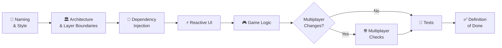

Every pull request is a promise that the change is correct, consistent, and complete. This checklist makes that promise concrete. It also makes reviews faster: a reviewer whose first job is ticking checklist boxes rather than catching the same naming violation for the tenth time can spend their attention on logic and design instead.

Work through every section before marking a PR as **Ready for Review**. A PR submitted with unchecked items will be returned immediately without a full review.

<Warning>
  If any item in this checklist cannot be ticked, the PR is not ready to merge. No exceptions are granted by "we'll fix it in a follow-up." The follow-up never comes.
</Warning>

The diagram below shows the gate sequence a PR must pass in order. Each gate depends on the previous one — a PR blocked at Architecture cannot be reviewed for Tests until the architectural violation is resolved.

---

## Naming & Style

<Check>Namespaces, class names, method names, and field names follow the [SET: 3D Edition Naming Conventions](/standards/conventions)</Check>
<Check>No `#region` directives anywhere in the changed files</Check>
<Check>No public mutable fields on any entity, value object, or DTO — only properties</Check>
<Check>All new classes are `sealed` unless they are explicitly documented as base classes</Check>
<Check>All boolean members use an `Is`, `Has`, or `Can` prefix (`IsValid`, `HasPenalty`, `CanClaim`)</Check>
<Check>Method length does not exceed ~40 lines (document any FSM exhaustive-switch exception)</Check>
<Check>No method accepts more than 3 parameters without a parameter object</Check>

---

## Architecture & Layer Boundaries

<Check>No `using UnityEngine;` in `SET.Domain` or `SET.Application` assemblies</Check>
<Check>No `using Nakama;` in `SET.Domain` or `SET.Application` assemblies</Check>
<Check>No `FindObjectOfType`, `GameObject.Find`, or `GetComponent` calls outside the Presentation layer</Check>
<Check>No static mutable fields anywhere in the Domain layer</Check>
<Check>Infrastructure classes implement interfaces declared in Application or Domain — not the other way around</Check>
<Check>`SET.Presentation` accesses Infrastructure only through injected interfaces, never by direct assembly reference</Check>

<Info>
  The fastest way to verify these rules: check the `.asmdef` dependency graph and grep for `using UnityEngine` in the Domain and Application folders. CI will also catch violations via the Roslyn analyzer.
</Info>

---

## Dependency Injection

<Check>No `new ConcreteClass()` inside Application or Domain methods (factories are the only exception)</Check>
<Check>All dependencies are injected as interface types via the constructor</Check>
<Check>Any new binding is registered in the Bootstrap scene's VContainer composition root</Check>
<Check>No service-locator calls (`ServiceLocator.Get<T>()`, `Container.Resolve<T>()` from inside a class) — resolution happens only at the composition root</Check>

---

## Reactive UI

<Check>No game state polling in any `Update()` method — use R3 reactive subscriptions</Check>
<Check>All `Subscribe(...)` return values are stored in a `CompositeDisposable` field</Check>
<Check>`CompositeDisposable` is disposed in `OnDestroy()` (for MonoBehaviours) or in the class's `Dispose()` method</Check>
<Check>`DistinctUntilChanged()` applied on ViewModel properties bound to UI elements</Check>
<Check>Any Nakama callback that touches Unity objects or ViewModel state is marshalled to the main thread via `.ObserveOnMainThread()`</Check>

---

## Game Logic

<Check>All match state changes go through `GameSession.HandleCommand()` — no direct mutation of `Board`, `Player`, or `Deck` from outside `GameSession`</Check>
<Check>`AnySetExists()` is called after every board mutation (card removal, card addition, board expansion)</Check>
<Check>End-game condition is evaluated after every state transition</Check>
<Check>Input events are **discarded** (not queued) while `GameSession` is in an animation lock state (`Validating`, `Refilling`, `MatchEnd`)</Check>
<Check>Penalty logic uses the `PenaltyMode` from `GameRules` — no hard-coded penalty values</Check>

---

## Multiplayer (complete only if this PR touches multiplayer code)

<Check>The client does **not** call `SetValidator.Validate()` on a multiplayer code path — claim validation is server-authoritative only</Check>
<Check>The client sends claim intent only: `SendClaim(cardSlotIds)` — not a pre-validated result</Check>
<Check>Server state is applied to `GameSession` only via `ApplyServerState()` — not via direct board mutation</Check>
<Check>Disconnect and reconnect scenarios handled: grace period countdown shown, full state sync on rejoin</Check>
<Check>No Nakama types (`IMatch`, `IMatchState`, `ISocket`) referenced outside `NakamaMultiplayerService`</Check>

---

## Tests

<Check>All new Domain and Application logic has corresponding unit tests in `SET.Tests.EditMode`</Check>
<Check>All new test methods follow the `MethodName_Scenario_ExpectedBehavior` naming pattern</Check>
<Check>All tests follow the Arrange-Act-Assert (AAA) structure with a blank line separating each section</Check>
<Check>All tests pass locally (`Run All Tests` in Unity Test Runner) before pushing</Check>
<Check>No tests are commented out or marked `[Ignore]` without a linked ticket number in a comment</Check>
<Check>Tests assert on observable behaviour (return values, emitted events, state snapshots) — not on internal call counts or implementation details</Check>

---

## Definition of Done (Per Feature)

A feature is not done until **every** item below is true. "Done" does not mean "the happy path works in my dev build."

<Check>Code compiles with zero errors and zero new warnings on the CI build server</Check>
<Check>All CI checks pass: `dotnet format`, Roslyn analyzer, unit tests (EditMode), integration tests (PlayMode)</Check>
<Check>At least one reviewer has approved the PR with no unresolved blocking comments</Check>
<Check>The [Hard Boundaries document](/roadmap/overview) confirms this feature is in scope for v1.0 — no out-of-scope work has been introduced</Check>
<Check>Every new public interface and every non-obvious public method has an XML-doc comment (`/// 
...`)</Check>
<Check>The PR description explains **what** changed and **why** — not just a list of files edited</Check>
<Check>If this feature introduces a new third-party SDK or package, the package version is pinned and documented</Check>

---

## Common Reasons PRs Are Returned

These are the most frequent violations. If you catch yourself doing any of these, fix them before submitting.

| Violation | Typical Symptom | Required Fix |
|-----------|----------------|--------------|
| Missing unit tests for new Domain logic | `SetValidator` change with no new test | Write the test first (red-green-refactor) |
| `using UnityEngine;` in an Application class | Analyzer error in CI | Move the logic to Presentation; inject via interface |
| Forgotten `CompositeDisposable.Dispose()` | Memory leak; subscriptions fire after scene unload | Add `OnDestroy()` / `Dispose()` with `_disposables.Dispose()` |
| Direct `Board` mutation from a ViewModel | State bypasses FSM; `AnySetExists()` never called | Route through `GameSession.HandleCommand()` |
| Public field on an entity | `public int Score;` on `Player` | Replace with a property and a mutating method |
| `Update()` polling for game state | Frame-rate-dependent bugs | Subscribe to `GameSession.StateStream` once |
| No PR description | Reviewer has no context | Write at least 3 sentences: motivation, what changed, how to test |

---

## Related Pages

<CardGroup cols={2}>
  <Card title="Coding Conventions" icon="code" href="/standards/conventions">
    The naming, formatting, and class design rules this checklist enforces.
  </Card>
  <Card title="Approved Patterns" icon="diagram-project" href="/standards/patterns">
    The architectural patterns and banned anti-patterns checked in the Architecture section.
  </Card>
  <Card title="Testing Standards" icon="flask" href="/standards/testing">
    Unit test naming, AAA structure, and coverage targets referenced in the Tests section.
  </Card>
  <Card title="Phase Breakdown" icon="list-check" href="/roadmap/phases">
    Per-phase Definitions of Done that feed into this checklist.
  </Card>
</CardGroup>
