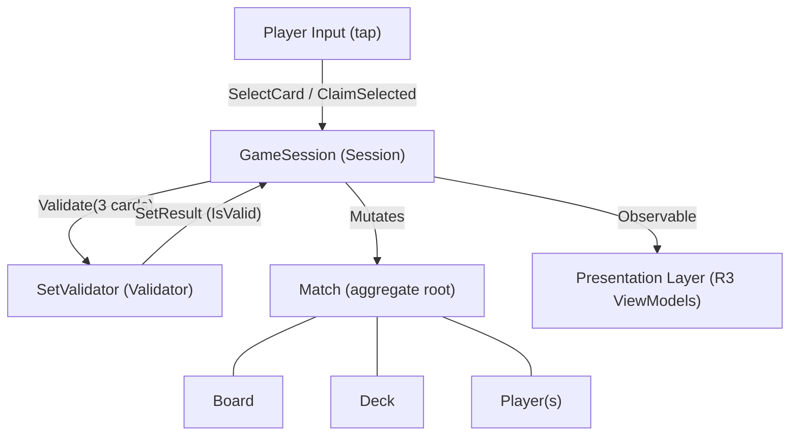

Every member of the team — engineer, designer, QA — uses the same vocabulary when discussing SET: 3D Edition. This is not a loose collection of metaphors; these terms map directly to classes, interfaces, and enums in the codebase. When a document says "Claim," it means the `ClaimSelected()` call on `GameSession`. When it says "Tick," it means one iteration of the Nakama server loop at 20 Hz. Reading this page once before diving into architecture or gameplay-systems docs will save you hours of confusion.

<Tip>
Bookmark this page. Architecture, gameplay-systems, and networking documents assume you already know these terms and will not define them inline.
</Tip>

## Why shared vocabulary matters

In a project with three distinct game modes, a domain layer, a presentation layer, and a server-side runtime, the same conceptual thing can easily get called different names by different people: "game" vs "match" vs "session," "board" vs "grid" vs "play area." Ambiguous language causes bugs — an engineer optimising the "session timer" and another fixing the "match timer" may not realise they are touching different systems until something breaks in production.

The terms below define the **ubiquitous language** of SET: 3D Edition. Use them exactly as written in code, pull-request descriptions, comments, and conversations.

## Glossary

| Term | Definition |
|---|---|
| **Set** | A group of exactly 3 cards satisfying the all-same/all-different rule for every attribute simultaneously. The word is capitalised ("Set") when referring to this specific valid group. |
| **Board** | The collection of face-up cards arranged in fixed slots in the 3D grid — 12 to 21 slots. Corresponds to the `Board` entity (an aggregate child of `Match`). |
| **Card** | An immutable combination of 4 attributes; one of 81 unique game pieces. `Card` is a value object — equality is determined by attribute values, not by reference. |
| **Attribute** | One of the four properties that define a card: Number, Shape, Color, or Shading. Each attribute has exactly 3 possible values. |
| **Slot** | A fixed position on the Board (identified by an integer index). A slot is either empty (`null`) or occupied by exactly one Card. The `CardSlot` struct holds `int Index` and `Card? Card`. |
| **Deck** | The ordered stack of cards not yet in play. Cards are drawn from the top. The Deck starts with all 81 cards (minus the initial deal) and is never replenished. |
| **Player** | A match participant identified by a unique `PlayerId`, with a mutable `Score` and `Penalties` count. |
| **Match** | The complete game session — it owns the Board, Deck, all Players, the GameRules, and the current MatchState. `Match` is the aggregate root in the domain model. |
| **Claim** | The action of a player submitting exactly 3 selected Cards for validation. Triggered automatically when a third card is selected (or by tapping the color-coded claim zone in Pass & Play). |
| **Session** | The runtime orchestrator of a Match. `GameSession` is the state machine class that processes input commands, drives AI timing, checks end conditions, and emits reactive state to the presentation layer. |
| **Validator** | The `SetValidator` domain service — a stateless, pure function that accepts 3 cards and returns a `SetResult`. It has zero side effects and zero Unity or Nakama dependencies. |
| **Refill** | The process of replacing removed cards by drawing from the Deck immediately after a valid Set is claimed. Newly drawn cards are placed in the same slots the claimed cards vacated. |
| **Expansion** | Adding 3 new cards to the Board (increasing slot count from 12 → 15, 15 → 18, or 18 → 21) because no valid Set exists and the Deck has ≥ 3 remaining cards. |
| **Penalty** | A consequence applied to a player who submits an invalid Set. The penalty mode is configured per match: `None` (no effect), `Time` (−5 s from the match clock), or `Point` (−1 score, minimum 0). |
| **AI Scanner** | The rule-based opponent simulation used in Single Player modes. It calls `SetValidator.FindAllSets()` on the current board, waits a randomised delay based on its difficulty tier, then submits a Claim via `GameSession`. |
| **Tick** | One iteration of the Nakama server-side Match Handler loop, running at 20 Hz (every 50 ms). Server timestamps within a Tick are used to deterministically resolve simultaneous Claims from different clients. |

<Note>
These terms reflect the actual class and method names in the codebase. If you see a discrepancy between this glossary and the code during development, update the glossary (and open a discussion) — the vocabulary and the code must stay in sync.
</Note>

## How these terms relate to each other

The diagram below shows how the core terms connect at runtime. An incoming player action travels from Input through `GameSession`, touches the `Validator`, and mutates the `Match` aggregate (Board, Deck, Players), which then emits reactive state back to the presentation layer.

## Common mistakes

<Warning>
**Common mistake — "Session" vs "Match":** In everyday speech people say "I was in the middle of a game/session." In this codebase, **Match** is the domain data (the cards, scores, rules) and **Session** (`GameSession`) is the runtime orchestrator that drives the Match through its state machine. They are different objects. Never access `Match` fields directly from the presentation layer; go through `GameSession`'s observable streams.
</Warning>

## Related pages

<CardGroup cols={2}>
  <Card title="Introduction" icon="house" href="/welcome/introduction">
    Project overview, tech stack, and design pillars.
  </Card>
  <Card title="Complete SET Rules" icon="book" href="/game-design/rules">
    Deck structure, the validation algorithm, board logic, and every edge case — all using this vocabulary.
  </Card>
  <Card title="Card Model" href="/core-gameplay/card-model" icon="diagram-project">
    How Card, Board, Deck, Player, and Match are implemented as entities and value objects in the domain layer.
  </Card>
  <Card title="Session Lifecycle" href="/core-gameplay/session-lifecycle" icon="gear">
    SetValidator, AIScanner, BoardManager, GameSession — the classes behind the terms above.
  </Card>
</CardGroup>
